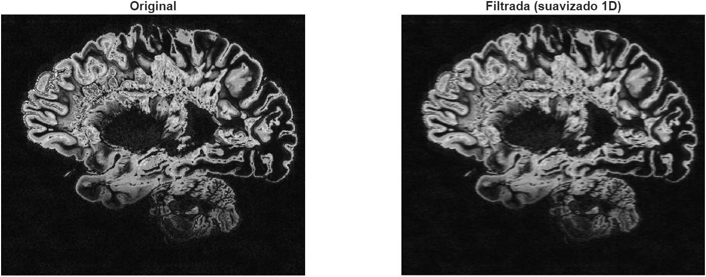
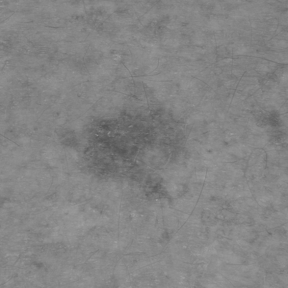
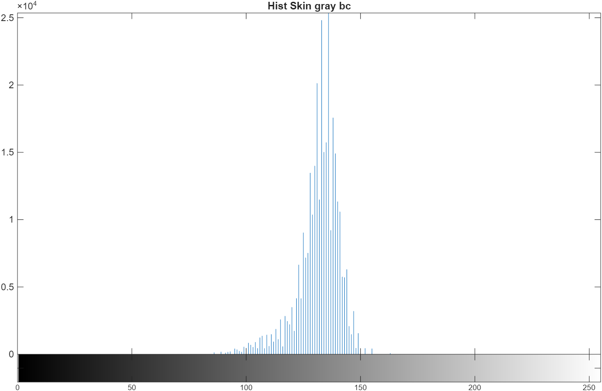
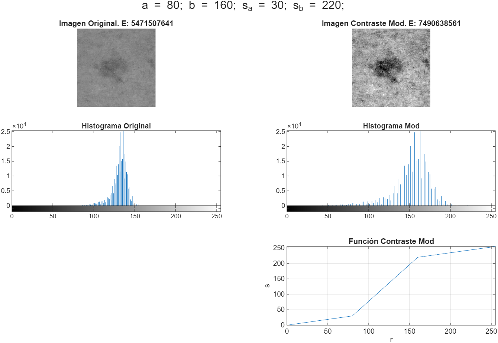
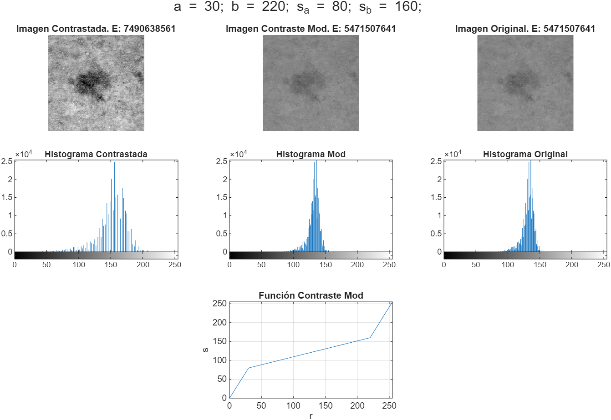
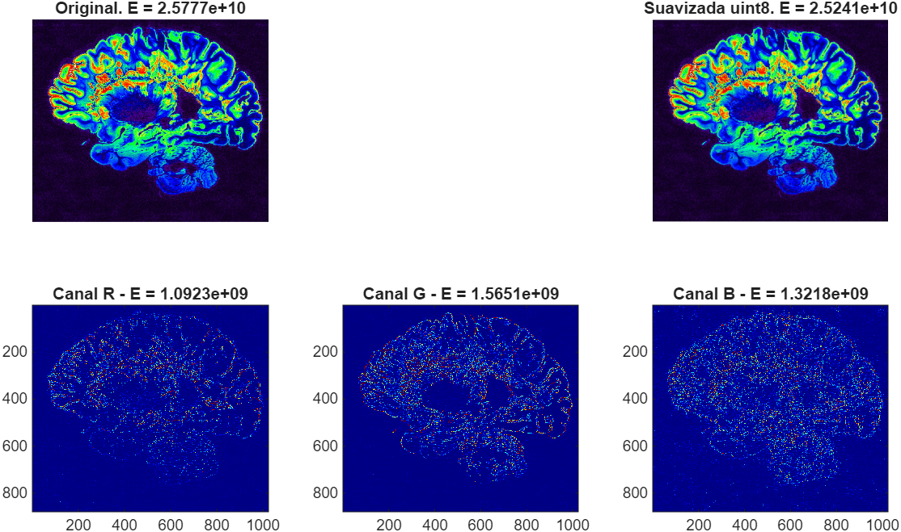
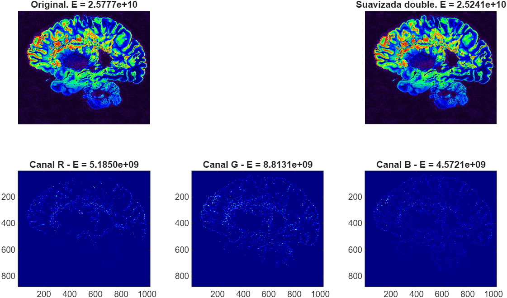
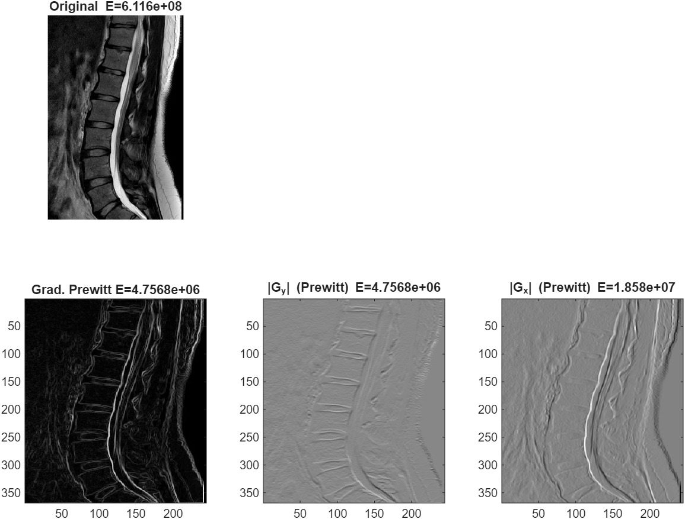

## Linear Filtering

Linear filtering (or linear spatial filtering) is a fundamental method in image processing where the output intensity of a pixel is determined by a **weighted sum** (a sum-of-products operation) of the pixel intensities in its immediate neighborhood, where the weights are defined by a small array called the **filter kernel** (or mask, template, or window).

``` splus
%% Cargar la imagen original
Irgb = imread('Imagenes_P2/MRI_pseudo_colored.jpg');
% Trabajando en blanco y negro
I = rgb2gray(Irgb);                 % o procesa cada canal por separado
Id = im2double(I);

% Kernel 7x7 con fila central [7 6 4 1 4 6 7] normalizada
row = [7 6 4 1 4 6 7];
C = sum(row);              % Suma de pesos = 35 > calc el mayor valor posible de y
w = zeros(7,7); 
w(4,:) = row / C;          % normalizado > divide cada peso entre 35

% Filtrado
If = imfilter(Id, w, 'replicate', 'same');  % corr = conv (máscara simétrica)

% Mostrar y guardar
figure;
subplot(1,2,1), imshow(I),  title('Original');
subplot(1,2,2), imshow(If), title('Filtrada (suavizado 1D)');
exportgraphics(gcf, 'results/ej4_0.png', 'Resolution',150);
```



### Ajuste de contraste por tramos

**Objetivo**: mostrar la aplicación principal de esta transformación el ajuste o realce de una imagen poco contrastada.

#### Realce de contraste

Paso 1: Creamos la funcion `modificarContraste.m`, que implemente la expresión general de ajuste de contraste por tramos.

``` splus
% Función: Modificar Contraste
% Definimos la función
function [ima_proc,s]=modificarContraste(ima,a,b,s_a,s_b)
    % Convertimos la imagen a double
    r_img = double(ima); % Vector imagen og
    % Número de niveles
    L = 256; % Asumimos uint8 (2^8 = 256)
    r = 0:L-1; % Vector r (niveles de gris)
    % Parámetros de la función por tramos
    alpha = s_a / a;
    beta  = (s_b - s_a) / (b - a);
    gamma = (L-1 - s_b) / (L-1 - b);
    % Vector de transformación
    s = zeros(1, L);
    % Función de tranformación
    for i = 1:L
        if r(i) < a
            s(i) = alpha * r(i);
        elseif r(i) > b
            s(i) = gamma * (r(i) - b) + s_b;
        else
            s(i) = beta * (r(i) - a) + s_a;
        end
    end
    % Aplicamos la tranformación
    ima_proc = uint8(s(r_img+1)); 
end
```

Paso 2: Cargamos la imagen

``` splus
% Obtenemos la Imagen y el VLT
[ima_og, ima_map]=imread("Imagenes_P2/Skin_gray_bc_560.tif");
L=size(ima_map, 1); % L=256 (8-bits)
% Es una imagen indexada con 3 canales y 256 niveles.
ima_gray = ind2gray(ima_og, ima_map);
```

|                      |                           |
|----------------------|---------------------------|
|  |  |

> Vemos que se trata de una imagen indexada con 256 niveles que está en escala de grises.\
> Podemos ver que la imagen tiene muy bajo contraste, esto se muestra en el histograma como un único pico estrecho y alto en los grises medios.

Paso 3: Aplicaremos la transformación de ajuste de contraste con parámetros:

`𝑎=80, 𝑏=160, 𝑠𝑎=30, 𝑠𝑏=220`

``` splus
%% Primera Parte: Aumentar Contraste

% Parámetros
a = 80; b = 160; s_a = 30; s_b = 220;

% Aplicamos la función
[ima_proc,s]=modificarContraste(ima_og,a,b,s_a,s_b);

% Obtenemos la Energía
E_og = calcularEnergia(ima_og);
E_mod = calcularEnergia(ima_proc);

% Mostrar resultados
figure;
subplot(3,2,1), imshow(ima_og, ima_map), title(['Imagen Original. E: ', num2str(E_og)]);
subplot(3,2,2), imshow(uint8(ima_proc), []), title(['Imagen Contraste Mod. E: ', num2str(E_mod)]);
subplot(3,2,3), imhist(ima_og), axis tight, title('Histograma Original');
subplot(3,2,4), imhist(uint8(ima_proc)), axis tight, title('Histograma Mod');
subplot(3,2,6), plot(0:(L-1), s); hold on; grid on; axis([0 255 0 255]);
title('Función Contraste Mod'); xlabel('r'); ylabel('s');
sgtitle('a = 80; b = 160; s_a = 30; s_b = 220;')
```

**Resultado:**



> Podemos ver que ha habido un aumento de contraste con respecto a la imagen original. En el histograma, la distribución de ambos es similar, sin embargo las barras están más separadas en la imagen con el contraste modificado, esto hace que sus pixeles esten representados en una zona más amplia de grises.

Paso 4: Revertir los cambios.

``` splus
%% Segunda Parte: Disminuir Contraste

% Parámetros
a = 30; b = 220; s_a = 80; s_b = 160;

% Aplicamos la función
[ima_proc_2,s_2]=modificarContraste(ima_proc,a,b,s_a,s_b);

% Obtenemos la Energía
E_mod_2 = calcularEnergia(ima_proc_2);

% Mostrar resultados
figure;
subplot(3,3,1), imshow(uint8(ima_proc), []), title(['Imagen Contrastada. E: ', num2str(E_mod)]);
subplot(3,3,2), imshow(ima_proc_2), title(['Imagen Contraste Mod. E: ', num2str(E_mod_2)]);
subplot(3,3,3), imshow(ima_og, ima_map), title(['Imagen Original. E: ', num2str(E_og)]);
subplot(3,3,4), imhist(uint8(ima_proc)), axis tight, title('Histograma Contrastada');
subplot(3,3,5), imhist(uint8(ima_proc_2)), axis tight, title('Histograma Mod');
subplot(3,3,6), imhist(ima_og), axis tight, title('Histograma Original');
subplot(3,3,8), plot(0:(L-1), s_2); hold on; grid on; axis([0 255 0 255]);
title('Función Contraste Mod'); xlabel('r'); ylabel('s');
sgtitle('a = 30; b = 220; s_a = 80; s_b = 160;')
```

**Resultado:**



> Podemos ver que la reversión es completa y no hay perdida aparente. Con lo que, para devolver una imagen estirada a su estado original basta con invertir los valores de la función porque estamos desplazando los valores *a* y *b* a los nuevos valores s<sub>a</sub> y s<sub>b</sub>. Esto hace que el grupo de valores que esté en ese rango se expanda o se contraiga para ajustarse a los nuevos límites que le hemos establecido. Sin embargo, si comprimieramos una imagen y posteriormente la estirasemos, esto no sería tan perfecto, porque al comprimir perdemos información y al estirar dejamos huecos en blanco.

------------------------------------------------------------------------

## Aplicación de filtros habituales con operadores locales lineales

### Suavizado con filtro de media

Paso 1: Definimos la funcion del calculo de Energía

``` splus
function E = calcularEnergia(img)
img=double(img);
E = sum(img(:).^2);
end
```

Paso 2: Cargamos la imagen

``` splus
% Obtenemos la Imagen
ima_og = imread('Imagenes_P2/MRI_pseudo_colored.jpg');
% Class = Double
ima_d = double(ima_og);
```

Paso 3: Filtramos y calculamos sus energias

``` splus
%% Definimos el filtro
w = (1/9)*ones(3);
% Aplicamos el filtro
ima_res_d = imfilter(ima_d, w);
ima_res_u = uint8(ima_res_d);

% Calculamos Energías
E_og = calcularEnergia(ima_og);
E_d = calcularEnergia(ima_d);
E_res_d = calcularEnergia(ima_res_d);
E_res_u = calcularEnergia(ima_res_u);

% Calculamos la diferencia de cuadrados
% Inicializamos la matriz de diferencias
diff_sq_d = (ima_d - ima_res_d).^2;
diff_sq_u = (ima_og - ima_res_u).^2;
```

Paso 4: Visualización por canal entre imagen original y filtrada

``` splus
% UINT8
figure;
subplot(2,3,1), imshow(ima_og), title(sprintf('Original. E = %.4e', E_og));
subplot(2,3,3), imshow(ima_res_u), title(sprintf('Suavizada uint8. E = %.4e', E_res_u));
names = {'R','G','B'};
for c = 1:3
    % Energía por canal
    E_c = calcularEnergia(diff_sq_u(:,:,c));
    % Visualización
    subplot(2,3,c+3);
    imagesc(diff_sq_u(:,:,c));
    colormap('jet');
    title(sprintf('Canal %s - E = %.4e', names{c}, E_c));
end
exportgraphics(gcf, 'results/ej5_1.png', 'Resolution',150);

% DOUBLE
figure;
subplot(2,3,1), imshow(ima_og), title(sprintf('Original. E = %.4e', E_og));
subplot(2,3,3), imshow(ima_res_d/255), title(sprintf('Suavizada double. E = %.4e', E_res_d));
for c = 1:3
    % Energía por canal
    E_c = calcularEnergia(diff_sq_d(:,:,c));
    % Visualización
    subplot(2,3,c+3);
    imagesc(diff_sq_d(:,:,c));
    colormap('jet');
    title(sprintf('Canal %s - E = %.4e', names{c}, E_c));
    % ['Canal ', num2str(c), ' - Energía = ', num2str(E_c)]
end
exportgraphics(gcf, 'results/ej5_2.png', 'Resolution',150);
```

**Resultado:**

 *Uint8 image*

------------------------------------------------------------------------

 *Double image*

**Observaciones:**

> El filtro de suavizado pretende reducir transiciones bruscas de intensidad, lo que se traduce en bordes finos. En estas imágenes podemos ver precisamente esos detalles (bordes, ruido, texturas finas) que fueron eliminados o atenuados. Cuando aislamos cada Canal es más fácil ver estas diferencias. Al trabajar en double, no se nota mucha diferencia entre la imagen original y suavizada, pero la hay (véase la energía). También se aprecia en las imágenes inferiores que el suavizado se da en los bordes de la figura. Sin embargo, cuando trabajamos en uint8, al ser enteros, las diferencias son más acusadas (aún así debemos separarlo en canales para verlo bien).
>
> Por otro lado, si nos fijamos en las diferencias de energía podemos observar que disminuye de la imagen original a la imagen filtrada. Esto ocurre porque al suavizar una imágen, tambien se reduce la variación total de intensidad, por lo que se disminuye su energia.

### Extracción de bordes

Cargamos la imagen:

``` splus
%% Cargar imagen
img = imread('Imagenes_P2/Hernia_disco.jpg');
img_double = im2double(img);    % Pasar a double
E_img  = calcularEnergia(img);  % Calcular energia
```

Paso 1: Obtener los bordes de la imagen utilizando los filtros de Prewitt 3x3.

``` splus
%% Definir los filtros de Prewitt
kx = [1, 1, 1; 0, 0, 0; -1, -1, -1]/6;
ky = [-1, 0, 1; -1, 0, 1; -1, 0, 1]/6;

% Aplicar los filtros de Prewitt a los ejes y combinar
edgesX = imfilter(img_double, kx);
edgesY = imfilter(img_double, ky);
edges = sqrt(edgesX.^2 + edgesY.^2);
```

Paso 2: Visualizar con sus energías y colores escalados

``` splus
% Calcular energias de los bordes + escalar a uint8 (* 255^2)
E_edgesX = calcularEnergia(edgesX) * 255^2;
E_edgesY = calcularEnergia(edgesY) * 255^2;
E_edges = calcularEnergia(edges) * 255^2;

% Mostrar la imagen original y los bordes detectados
figure;
subplot(2,3,1); imshow(img); title(sprintf('Original  E=%.5g', E_img));
subplot(2,3,4); imagesc(edges); colormap(gray); title(sprintf('Grad. Prewitt E=%.5g', E_edgesY));
subplot(2,3,5); imagesc(edgesX); colormap(gray); title(sprintf('|G_x| (Prewitt) E=%.5g', E_edgesX));
subplot(2,3,6); imagesc(edgesY); colormap(gray); title(sprintf('|G_y| (Prewitt) E=%.5g', E_edgesY));

exportgraphics(gcf, 'results/ej6.png', 'Resolution', 150);
```



**Observaciones:**

> Nótese que aplicamos el "Filtro X" al "Gradiente Y" y viceversa, y como podemos ver como el "Gradiente Y" extrae los bordes en posición horizontal y el "X" los bordes en posición vertical. Esto se debe a que estamos filtrando los bordes horizontales para obtener un gradiente vertical (y viceversa). Al juntar ambos gradientes obtenemos los bordes de la imagen. Es curioso como parte del fondo también se ve afectado.