## Modelado de histograma

### Modificar una VLT y representar sus histogramas

1.  Operaciones puntual de modificación de la VLT (Video Lookup Table) (imagen de entrada es indexada).

``` splus
%% Cargar imagenes Skin_gray_bw_560.tif y Skin_gray_bw_1120.tif
[ima560, map560] = imread('Imagenes_P2\Skin_gray_bw_560.tif');
[ima1120, map1120] = imread('Imagenes_P2\Skin_gray_bw_1120.tif');

L1 = size(map560, 1); 
L2 = size(map1120, 1);

%% Modificación del vector de valores de la imagen
r1 = [0:L1-1];
r2 = [0:L2-1];
C = [8,32,64,128];

for c = C
    s1 = min(r1 + c, L1-1);    
    ima_proc1 = uint8(s1(double(ima560 + 1)));

    % Mostrar y guardar imagen transformada
    f1 = figure;  ax1 = axes('Parent',f1);
    imshow(ima_proc1, map560, 'Parent', ax1);
    title(ax1, sprintf('Skin560 | c=%d', c));
    imwrite(ima_proc1, map560, sprintf('results/img_2a_%d.png', c));
    close(f1);

    % Mostrar y guardar histograma
    f2 = figure; ax2 = axes('Parent',f2);
    imhist(ima_proc1, map560); axis(ax2,'tight');
    title(ax2, sprintf('Hist Skin560 | c=%d', c));
    exportgraphics(f2, sprintf('results/img_2a_%d_hist.png', c), 'Resolution',150);
    close(f2);
end

for c = C
    s2 = min(r2 + c, L2-1);
    ima_proc2 = uint8(s2(double(ima1120) + 1));

    % imagen
    f3 = figure; ax3 = axes('Parent',f3);
    imshow(ima_proc2, map1120, 'Parent', ax3);
    title(ax3, sprintf('Skin1120 | c=%d', c));
    imwrite(ima_proc2, map1120, sprintf('results/img_2b_%d.png', c));
    close(f3);

    % histograma
    f4 = figure; ax4 = axes('Parent',f4);
    imhist(ima_proc2, map1120); axis(ax4,'tight');
    title(ax4, sprintf('Hist Skin1120 | c=%d', c));
    exportgraphics(f4, sprintf('results/img_2b_%d_hist.png', c), 'Resolution',150);
    close(f4);
end
```

**Results figure 560:**

|  |  |  |  |
|------------------|------------------|------------------|------------------|
|  |  |  | 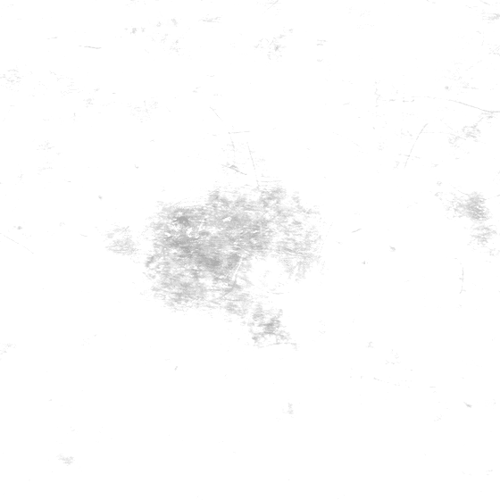 |
| 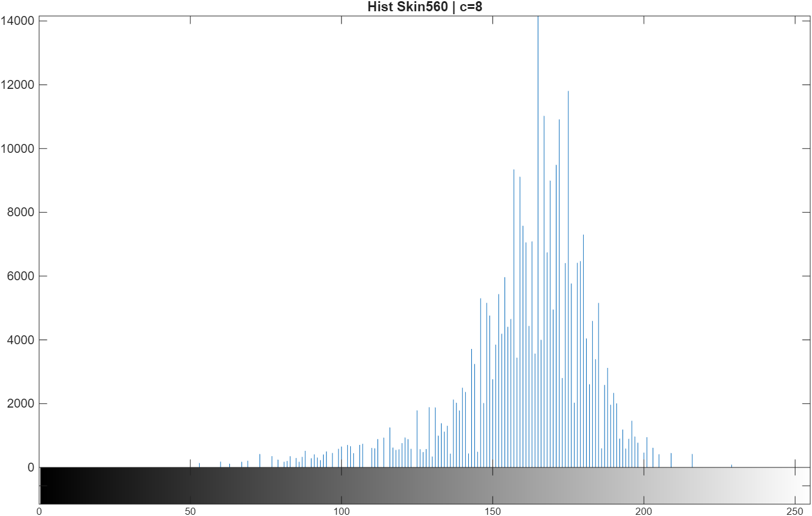 | 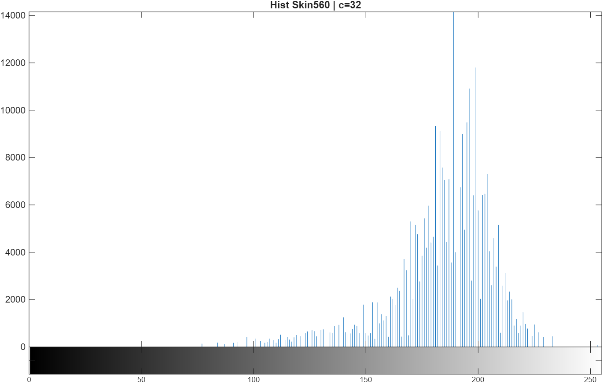 | 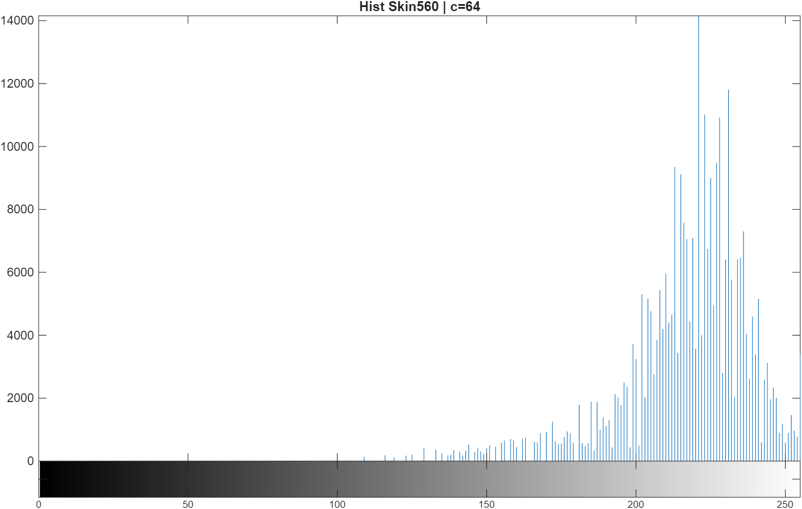 | 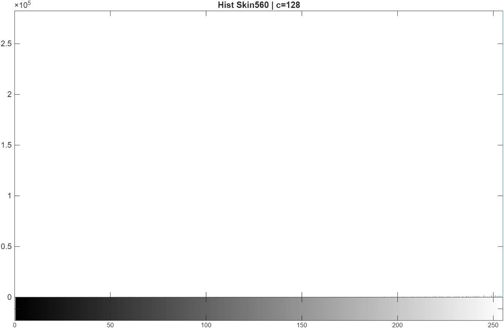 |

**Results figure 1120:**

|  |  |  |  |
|------------------|------------------|------------------|------------------|
|  | 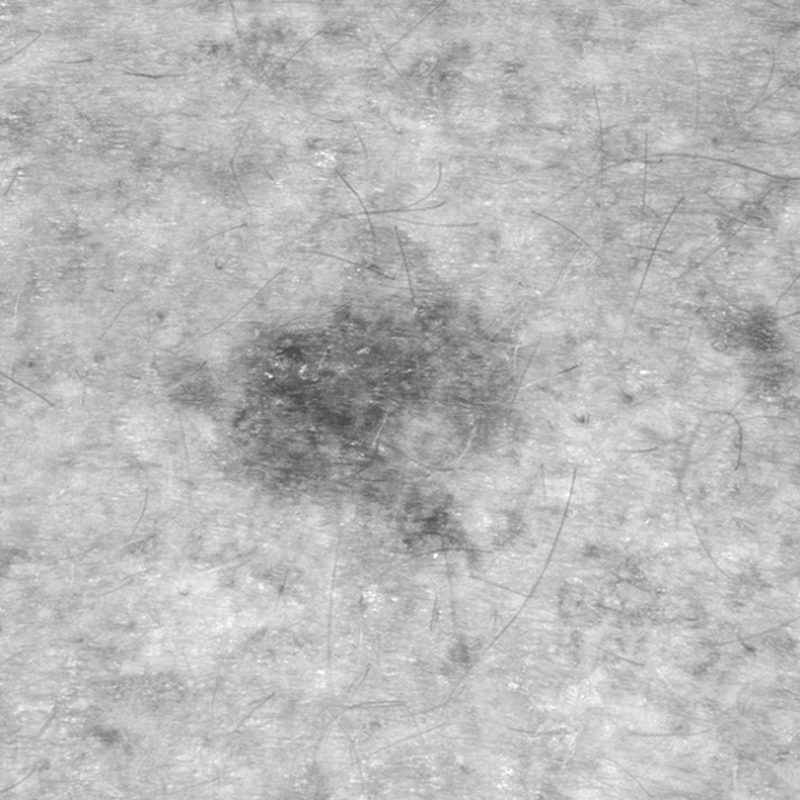 | 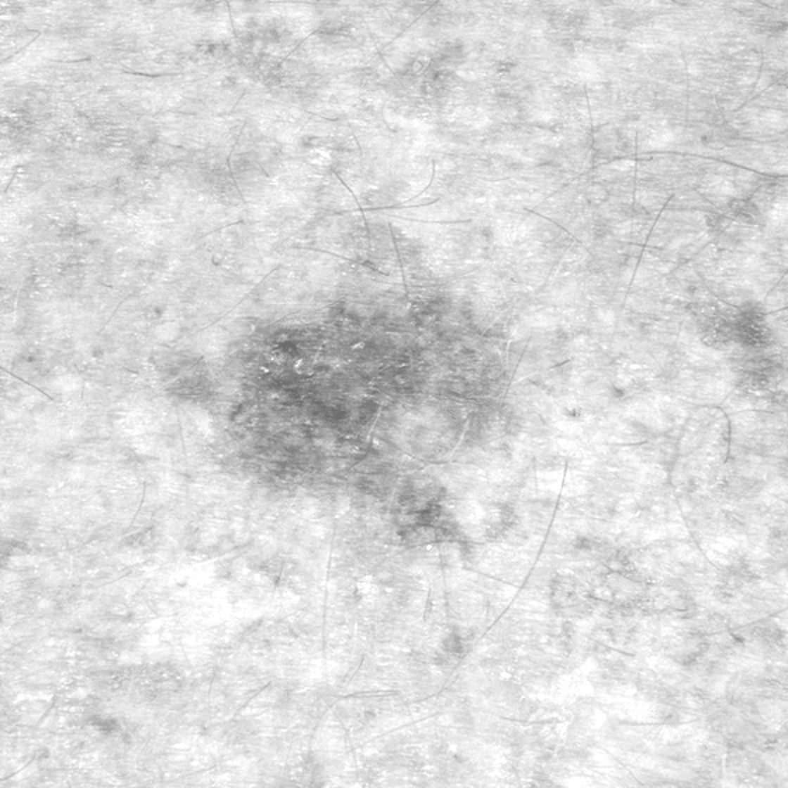 |  |
| 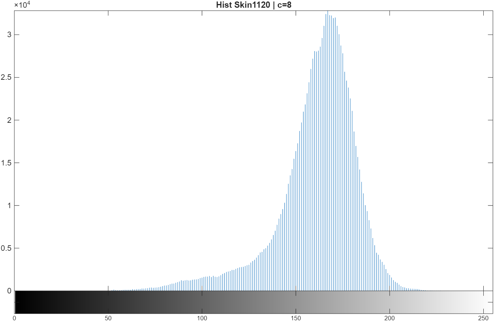 | 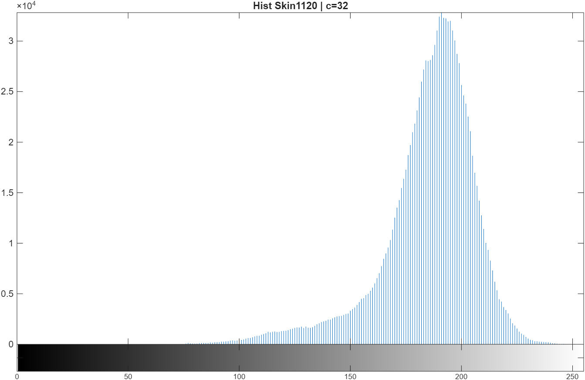 | 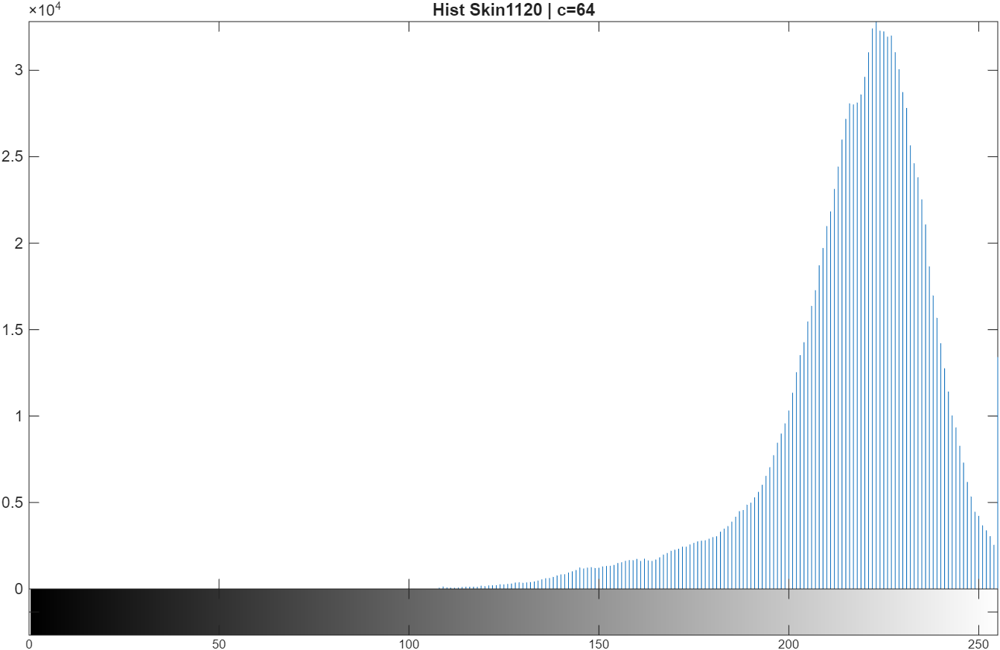 |  |

Podemos observar dos cosas:

1.  Las imágenes con dimensiones 560x560 tienen un histograma más discontinuo (con huecos) que las imágenes con 1120x1120. Esto ocurre porque contienen menos cantidad de pixeles.
2.  También vemos un desplazamiento del histograma hacia la derecha según aumentamos la c de la transformación. Esto ocurre porque la c indica el punto donde comienza la saturación. Inicialmente es el 8, y esto va aumentando a 32, 64 y 128, creando cada vez una imagen más saturada hasta que todo el histograma se encuentra en los valores de gris claro y blanco (255).

Con respecto al uso o no de `axis tight` para visualizar el histograma, se puede decir que usandolo se puede observar bien cuanto se elevan todos los valores, como vemos en la imagen superior de las imagenes a continuación:

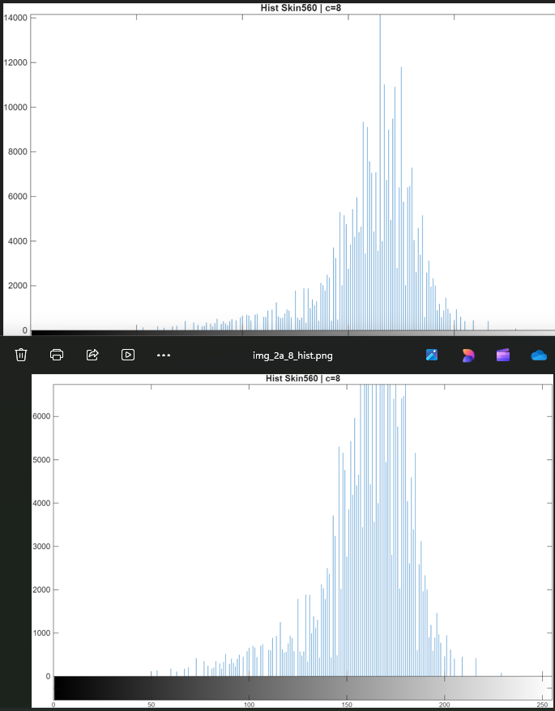

Sin embargo, como vemos en la imagen inferior se pierde algo de detalle en los valores de la zona intermedia ya que se reescalan. En mi opinión, en la imagen inferior se ve mejor la diferencia entre esos valores medios de grises, que en la otra que se han acortado.

### Estirando el histograma

Paso 1: Creamos la funcion `stretchimage.m`, para estirar un histograma:

``` {.MatLab .splus}
% Definimos la función
function [ima_stretch, s] = stretchimage(ima, nM, nm)
% STRETCHIMAGE  Estira el rango [m,M] -> [nm,nM] y satura fuera de ese intervalo.
% Devuelve ima_stretch (misma clase que ima si era uint8) y s (function handle).
%
% Uso: [Iout, s] = stretchimage(Iin, 255, 0)

    % convertir a double para cálculo (pero recordar la clase original)
    original_class = class(ima);
    ima_d = double(ima);

    m = min(ima_d(:));
    M = max(ima_d(:));

    if M == m
        % imagen constante -> salida constante nm
        s = @(px) nm * ones(size(px));
        ima_stretch_d = nm * ones(size(ima_d));
    else
        slope = (nM - nm) / (M - m);
        % function handle: operación elemento-a-elemento + saturación (clamp)
        s = @(px) min( max( ((double(px) - m) .* slope) + nm, nm ), nM );
        ima_stretch_d = s(ima_d);
    end

    % devolver en la misma clase que entró (si era uint8)
    if strcmp(original_class, 'uint8')
        ima_stretch = uint8(round(ima_stretch_d));
    else
        ima_stretch = ima_stretch_d;
    end
end
```

Paso 2: Cargamos la imagen y vemos su histograma:

``` splus
%% Cargar imagen Skin_gray_bc_560.tif, y visualizar con histograma
[ima, map] = imread('Imagenes_P2\Skin_gray_bc_560.tif');
L = size(map, 1);

figure; imshow(ima, map); title('Skin gray bc');
imwrite(ima, map, 'results/ej3_1.png');

figure; imhist(ima, map); axis tight
title('Hist Skin gray bc');
exportgraphics(gcf, 'results/ej3_1_hist.png', 'Resolution',150);
```

|                        |                             |
|------------------------|-----------------------------|
| 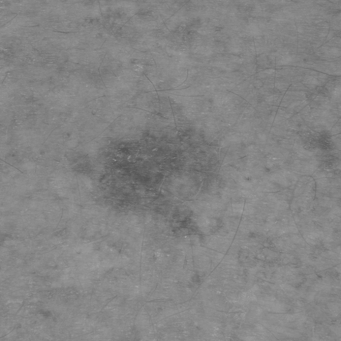 | 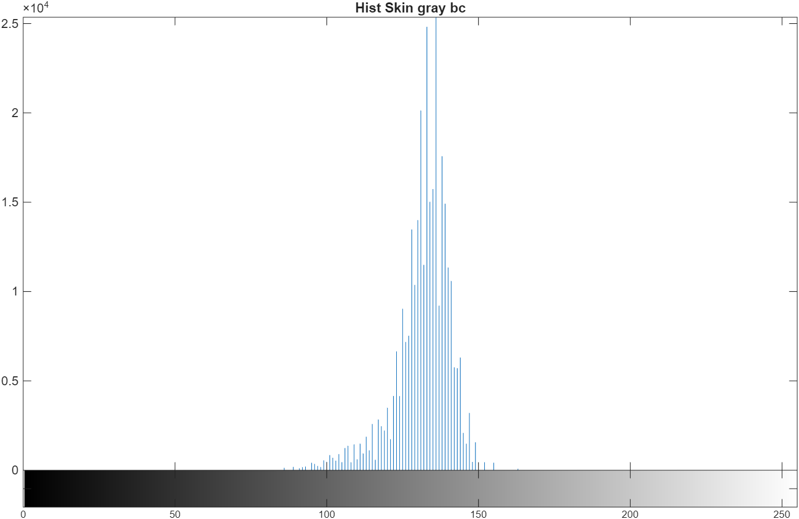 |

Paso 3: estiramos el histograma con *nm* = 0 y *nM* = 255:

``` splus
%% Estirado a 0–255 con la función stretchimage
[ima_stretch, s] = stretchimage(ima, 255, 0);

imshow(ima_stretch, map); title('Stretch 0–255');
exportgraphics(gcf, 'results/ej3_1_stretch.png', 'Resolution',150);

figure; imhist(ima_stretch, map); axis tight
exportgraphics(gcf, 'results/ej3_1_stretch_hist.png', 'Resolution',150);
```

|                                |                                     |
|--------------------------------|-------------------------------------|
| 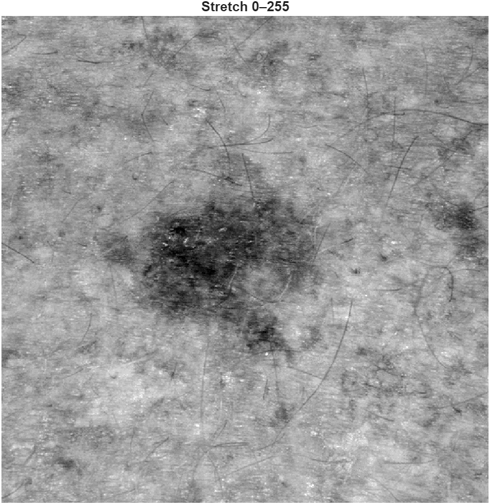 | 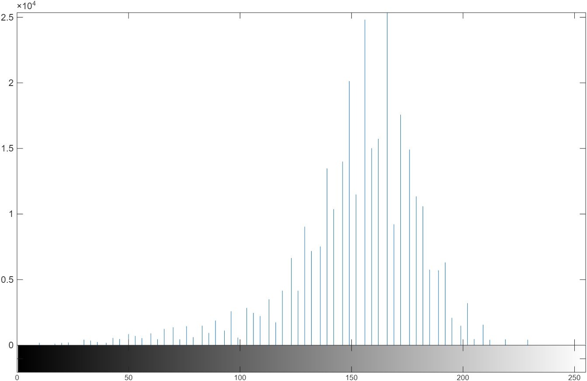 |

Paso 4: Observamos la funcion de transformación

Para **plotear la transformación** (T(r)) de `stretchimage` (ya tenemos el handle `s`), tenemos que evaluarla en (r=0..255) y dibujar (r) vs (T(r)). Por último, añadimos la recta identidad y marcamos (m) y (M).

``` splus
% Curva de transformación T(r)
r = 0:255;              % niveles de entrada
T = s(r);               % niveles de salida (usa tu handle s)

f = figure;
plot(r, T, '-', 'LineWidth', 1.5); hold on
plot(r, r, '--');                      % referencia y = x
xlabel('r (entrada)'); ylabel('s = T(r) (salida)');
title('Transformación de estirado 0–255');
xlim([0 255]); ylim([0 255]); axis square; grid on

% Marcas en m y M (de tu imagen)
m = double(min(ima(:)));
M = double(max(ima(:)));
xline(m, ':'); xline(M, ':');
legend('T(r)','y = x','m','M','Location','southeast');

exportgraphics(f, 'results/ej3_1_func.png', 'Resolution',150);
close(f);
```

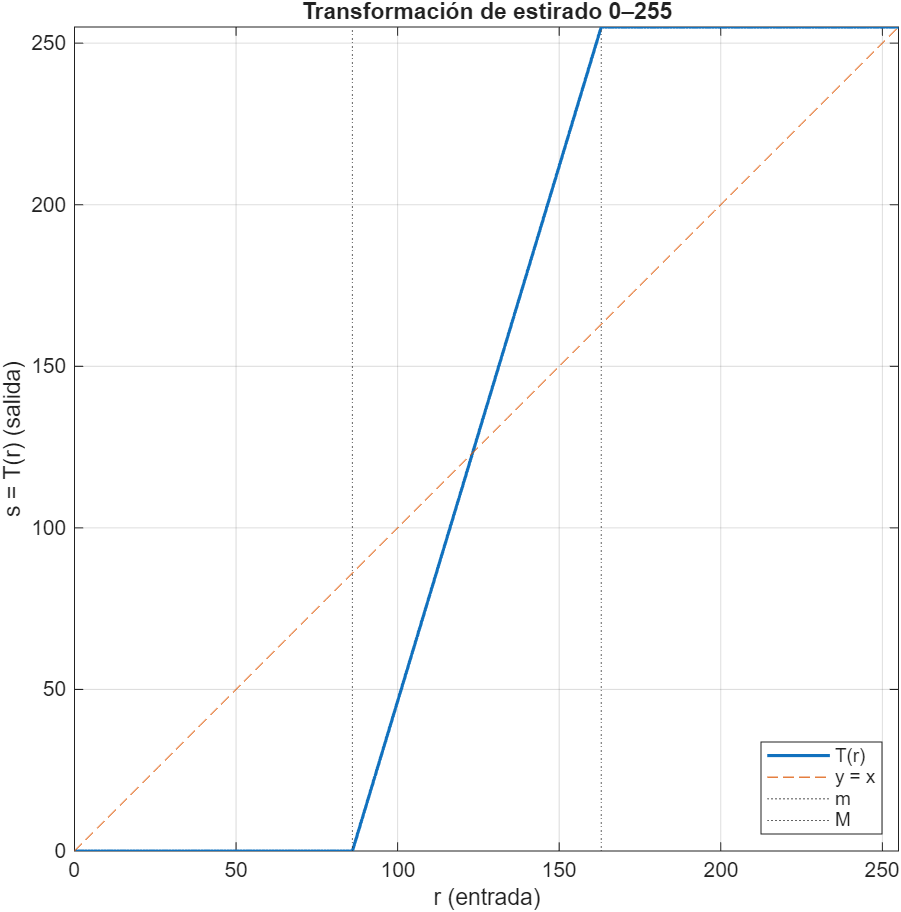

**Observaciones:**\
Las imágenes tienen cambios evidentes:

-   La imagen original tiene muy bajo contraste, los tonos de grises son similares y se observan poco las diferencias en las partes de la imagen. Por otro lado la imagen en la que hemos estirado el histograma muestra un contraste más alto, la lesion central ahora es mucho más evidente, ya que se observa más oscura, podemos ver los foliculos capilares de la piel y ciertas zonas con pigmentación más oscura y más clara que antes no eran evidentes.
-   En los histogramas, por otro lado, podemos ver que el de la imagen orgiginal consiste en un pico con la base muy estrecha, centrado en los grises medios (abarca desde el 85 al 165 de niveles de grises aproximadamente) y con las barras muy juntas. Mientras que el de la imagen que hemos alterado estirando el histograma, consiste en un pico con la base mucho más ancha, que comprende todos los niveles de grises desde 0 a 255 y sus barras están más separadas.

### Ecualizando el histograma

Paso 1: Creamos la funcion `equalizeimage.m`, para ecualizar un histograma:

``` splus
% Función: EcualizeImage
% Definimos la función
function [ima_eq,s] = equalizeimage(ima,nM,nm)
% EQUALIZEIMAGE - Ecualización de histograma
%   [ima_eq,s] = equalizeimage(ima,nM,nm)
%
% Entradas:
%   ima : imagen de entrada (uint8)
%   nM  : valor máximo del rango destino (ej. 255)
%   nm  : valor mínimo del rango destino (ej. 0)
%
% Salidas:
%   ima_eq : imagen ecualizada
%   s      : función de transformación (lookup table)

    % Asegurar tipo double para los cálculos
    ima_d = double(ima(:));
    L = nM - nm + 1;              % número de niveles (ej. 256)
    np = numel(ima_d);            % número total de píxeles

    % Histograma (np_k)
    h = imhist(uint8(ima), L);    % conteo de cada nivel

    % Probabilidad de cada nivel
    p_r = h / np;

    % Función de transformación (CDF reescalada)
    cdf = cumsum(p_r); 
    s = round(nm + (nM - nm) * cdf);

    % Aplicar la transformación: usar s como LUT
    ima_eq = s(ima_d + 1);        % +1 porque MATLAB indexa desde 1
    ima_eq = uint8(reshape(ima_eq, size(ima))); % devolver como imagen
end
```

Paso 2: ecualizamos el histograma con *nm* = 0 y *nM* = 255:

``` splus
%% Ecualización con la función equalize image
[ima_eq, s] = equalizeimage(ima, 255, 0);

imshow(ima_eq, map); title('Equalize 0–255');
exportgraphics(gcf, 'results/ej3_1_eq.png', 'Resolution',150);

figure; imhist(ima_eq, map); axis tight
exportgraphics(gcf, 'results/ej3_1_eq_hist.png', 'Resolution',150);
```

|                           |                                |
|---------------------------|--------------------------------|
| 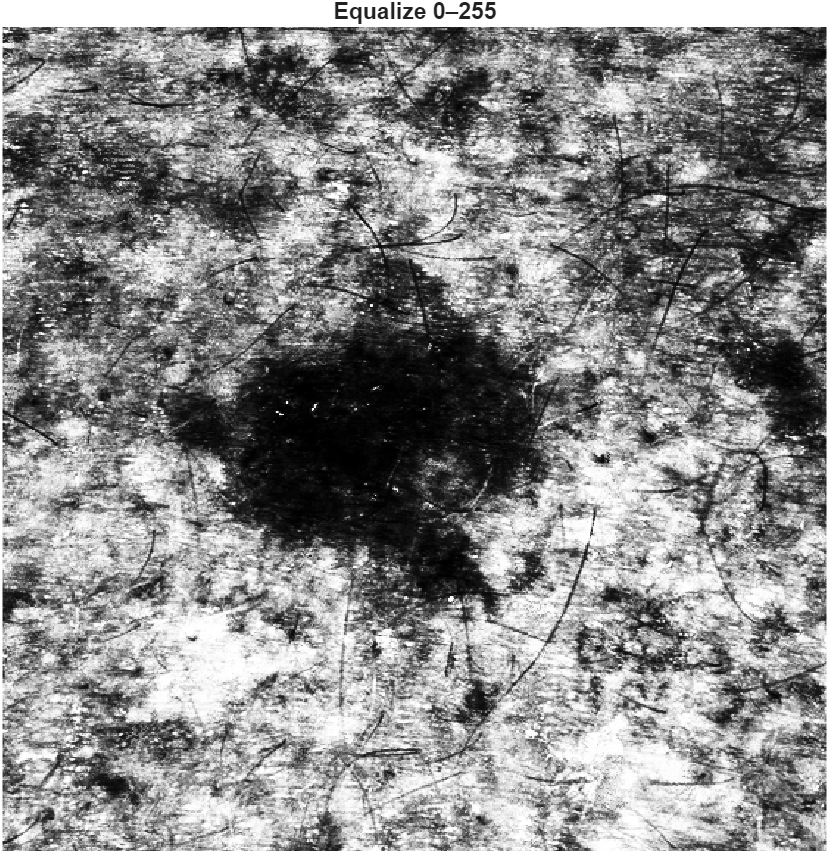 | 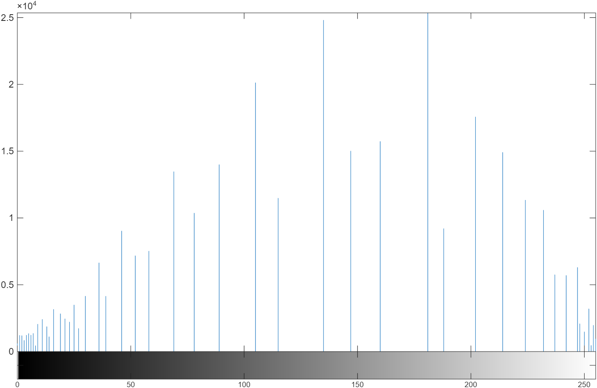 |

Paso 3: Observamos la función de transformación

``` splus
% Curva de transformación T(r)
r = 0:255;         
T = s(r + 1);           

f = figure;
plot(r, T, '-', 'LineWidth', 1.5); hold on
plot(r, r, '--');                      % referencia y = x
xlabel('r (entrada)'); ylabel('s = T(r) (salida)');
title('Transformación de equalización 0–255');
xlim([0 255]); ylim([0 255]); axis square; grid on

% Marcas en m y M (de tu imagen)
m = double(min(ima(:)));
M = double(max(ima(:)));
xline(m, ':'); xline(M, ':');
legend('T(r)','y = x','m','M','Location','southeast');

exportgraphics(f, 'results/ej3_1b_func.png', 'Resolution',150);
close(f);
```

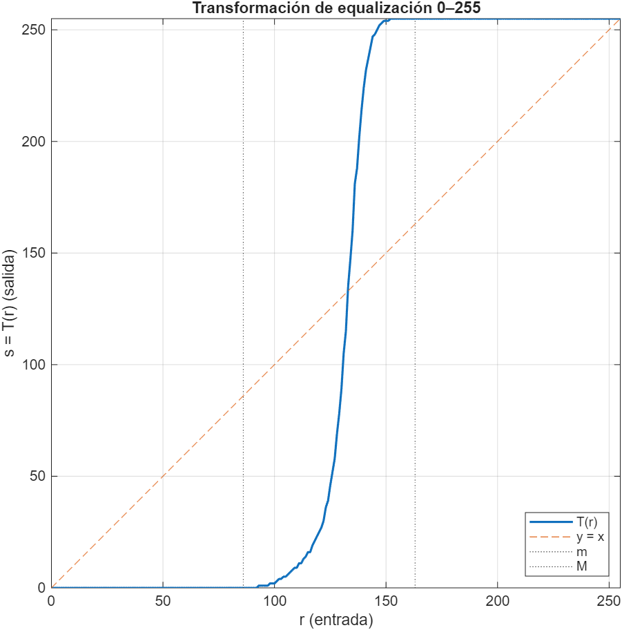

**Observaciones:**\
Ahora la imagen tiene un contraste muy alto entre claros y oscuros, causando un emborronamiento y que no se vean bien los detalles importantes de la misma. El histograma de la misma presenta muy pocos valores en los grises medios y la mayoría de los valores de grises están desplazados a los muy oscuros y muy claros.

Por otro lado, las principales diferencias entre las funciones son la forma sigmoidal de esta segunda y la brusquedad de su pendiente, lo cual ocasiona que haya un desplazamiento de los valores centrales de grises a los valores muy oscuros y muy claros.

### Ajuste de contraste por tramos

**Objetivo**: mostrar la aplicación principal de esta transformación el ajuste o realce de una imagen poco contrastada.

#### Realce de contraste

Paso 1: Creamos la funcion `modificarContraste.m`, que implemente la expresión general de ajuste de contraste por tramos.

``` splus
% Función: Modificar Contraste
% Definimos la función
function [ima_proc,s]=modificarContraste(ima,a,b,s_a,s_b)
    % Convertimos la imagen a double
    r_img = double(ima); % Vector imagen og
    % Número de niveles )
    L = 256; % Asumimos uint8 (2^8 = 256)
    r = 0:L-1; % Vector r (niveles de gris)
    % Parámetros de la función por tramos
    alpha = s_a / a;
    beta  = (s_b - s_a) / (b - a);
    gamma = (L-1 - s_b) / (L-1 - b);
    % Vector de transformación
    s = zeros(1, L);
    % Función de tranformación
    for i = 1:L
        if r(i) < a
            s(i) = alpha * r(i);
        elseif r(i) > b
            s(i) = gamma * (r(i) - b) + s_b;
        else
            s(i) = beta * (r(i) - a) + s_a;
        end
    end
    % Aplicamos la tranformación
    ima_proc = uint8(s(r_img+1)); 
end
```

Paso 2: Representamos la imagen (Skin_gray_bc_560.tif ) y su histograma:

``` splus
% Cargar imagen Skin_gray_bc_560.tif, y visualizar con histograma
[ima, map] = imread('Imagenes_P2\Skin_gray_bc_560.tif');
L = size(map, 1);

figure; imshow(ima, map); title('Skin gray bc');
imwrite(ima, map, 'results/ej4.png');

figure; imhist(ima, map); axis tight
title('Hist Skin gray bc');
exportgraphics(gcf, 'results/ej4_hist.png', 'Resolution',150);
```

|                      |                           |
|----------------------|---------------------------|
|  |  |

> Vemos que se trata de una imagen indexada con 256 niveles que está en escala de grises.\
> Podemos ver que la imagen tiene muy bajo contraste, esto se muestra en el histograma como un único pico estrecho y alto en los grises medios.

Paso 3: Aplique la transformación de ajuste de contraste con parámetros:

`𝑎=80, 𝑏=160, 𝑠𝑎=30, 𝑠𝑏=220`

Represente la imagen procesada, su histograma y la función de transformación.

``` splus
%% A imagen en grises uint8 (0..255) para trabajar con umbrales 0–255
ima_gray  = ind2gray(ima, map);        % double [0,1]
ima_gray8 = im2uint8(ima_gray);        % uint8 [0,255]

% Parámetros (0–255)
a = 80; b = 160; s_a = 30; s_b = 220;

% Aplicar contraste por tramos
[ima_proc, s] = modificarContraste(ima_gray8, a, b, s_a, s_b);

figure; imshow(ima_proc); title('Contraste modificado');
exportgraphics(gcf, 'results/ej4_contraste.png', 'Resolution',150);

figure; imhist(ima_proc); axis tight
title('Hist Img contraste modificado');
exportgraphics(gcf, 'results/ej4_contraste_hist.png', 'Resolution',150);

%% Curva de transformación T(r)
r = 0:255;           % niveles de entrada
T = s(r + 1);        % s es LUT → indexar con r+1

f = figure;
plot(r, T, '-', 'LineWidth', 1.5); hold on
plot(r, r, '--');                    % y = x
xlabel('r (entrada)'); ylabel('T(r) (salida)');
title('Transformación contraste por tramos');
xlim([0 255]); ylim([0 255]); axis square; grid on

exportgraphics(f, 'results/ej4b_func.png', 'Resolution',150);
close(f)
```

**Comparación de Resultados:**

|  |  |  |
|----------------------|-------------------------|-------------------------|
|    |  |  |
| 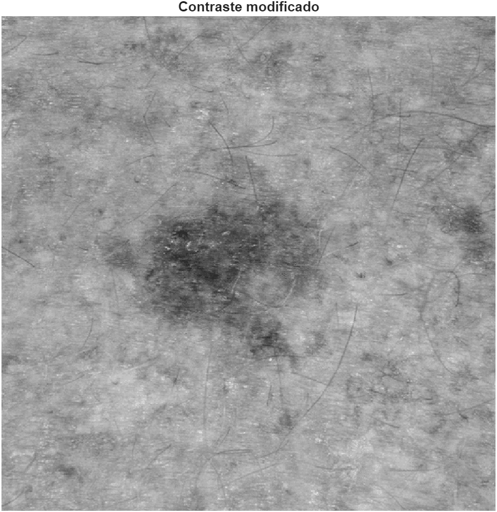 | 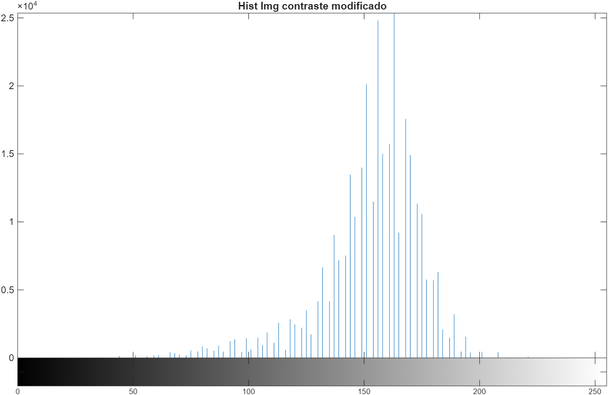 | 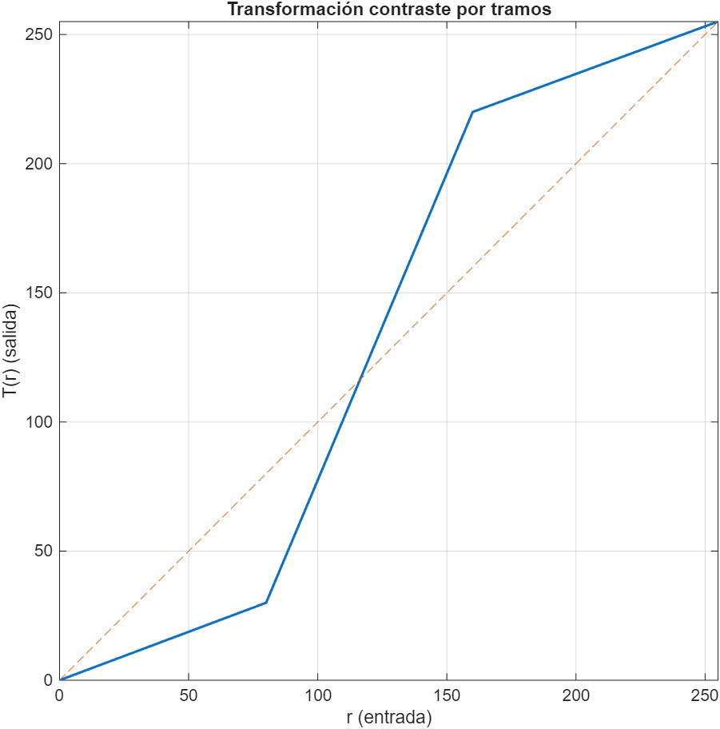 |

> Podemos ver que ha habido un aumento de contraste con respecto a la imagen original. En el histograma, la distribución de ambos es similar, sin embargo las barras están más separadas en la imagen con el contraste modificado, esto hace que sus pixeles esten representados en una zona más amplia de grises.

Paso 4: Revertir los cambios.
``` splus
% Aplicar reducción de contraste
a = 30; b = 220; s_a = 80; s_b = 160;
[ima_proc_reducido, s2] = modificarContraste(ima_proc, a, b, s_a, s_b);
figure; imshow(ima_proc_reducido); title('Contraste reducido');
exportgraphics(gcf, 'results/ej4_contraste_reducido.png', 'Resolution',150);

figure; imhist(ima_proc_reducido); axis tight
title('Histograma contraste reducido');
exportgraphics(gcf, 'results/ej4_contraste_reducido.png_hist.png', 'Resolution',150);

%% Representacion de la funcion
r = 0:255;           % niveles de entrada
T2 = s2(r + 1);        % s es LUT → indexar con r+1

f = figure;
plot(r, T2, '-', 'LineWidth', 1.5); hold on
plot(r, r, '--');                    % y = x
xlabel('r (entrada)'); ylabel('T(r) (salida)');
title('Transformación contraste por tramos');
xlim([0 255]); ylim([0 255]); axis square; grid on

exportgraphics(f, 'results/ej4_funcRevertir.png', 'Resolution',150);
close(f)
```

**Comparación de Resultados:**

|  |  |  |
|----------------------|-------------------------|-------------------------|
|  |  | |
| 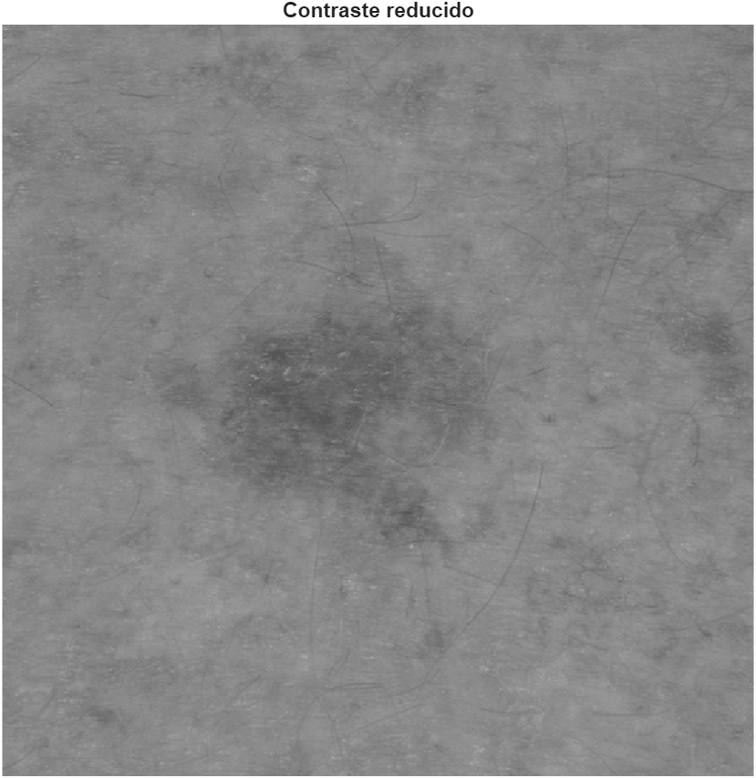 | 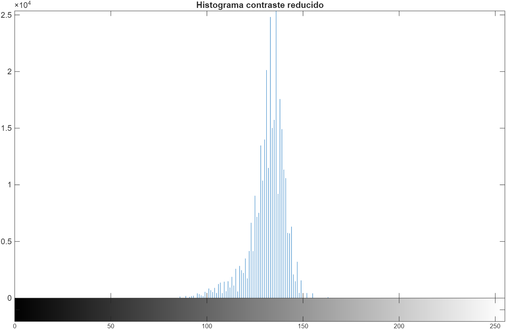 | 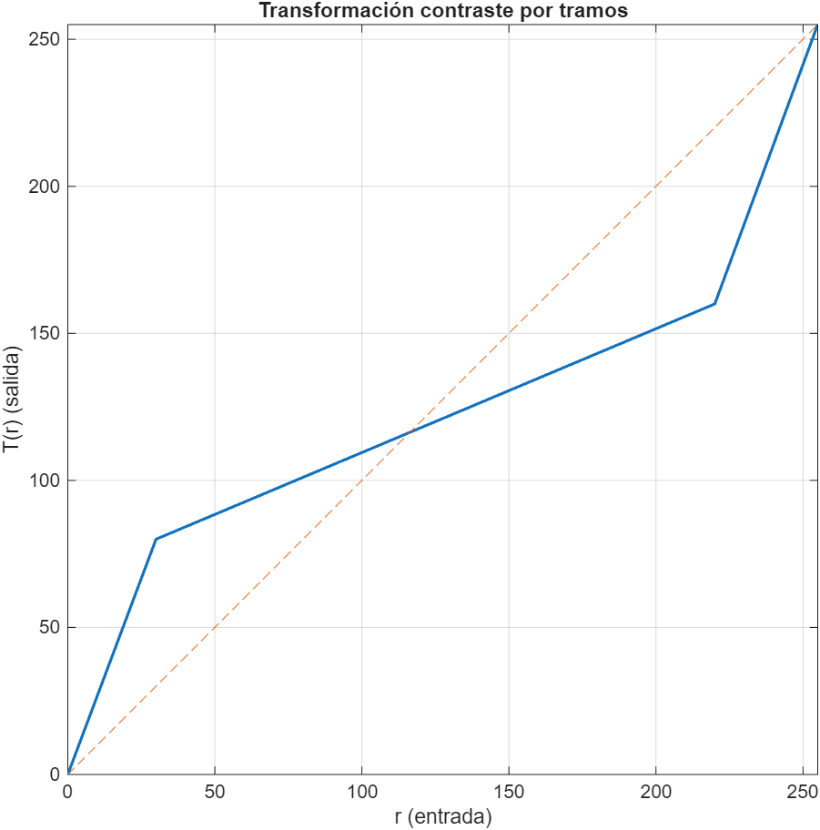 |
|    |  |  |

> Podemos ver que la reversión es completa y no hay perdida aparente.
