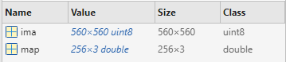
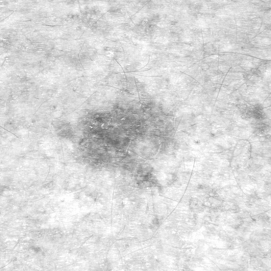
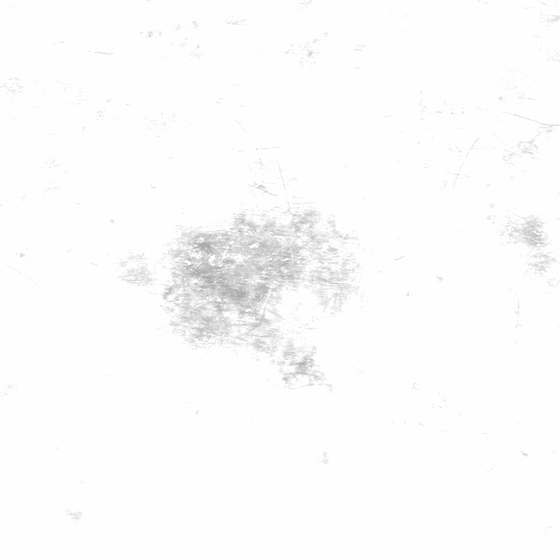
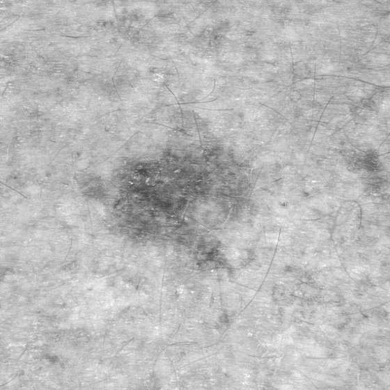
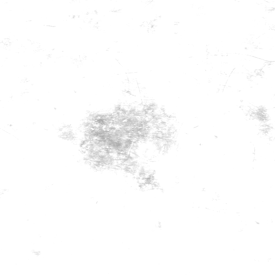
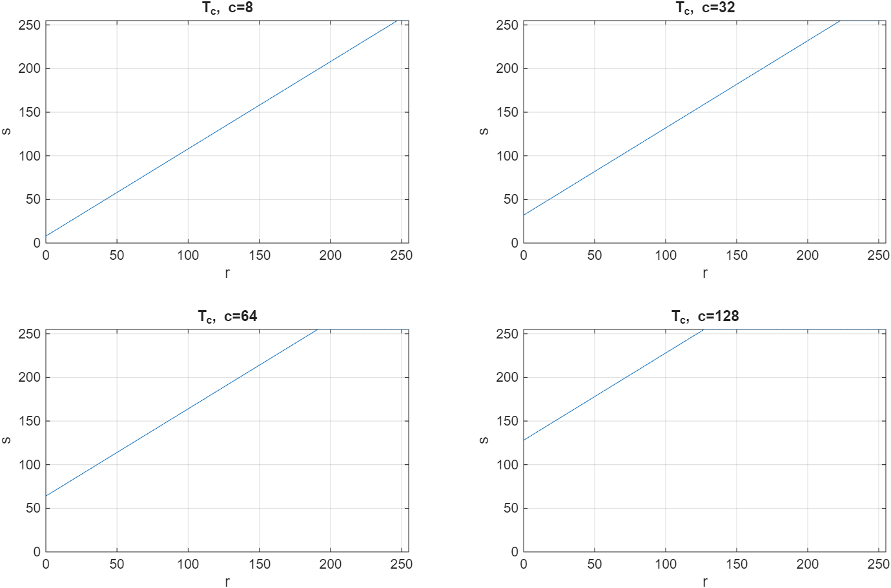

## Aplicación de operadores puntuales

Estrategias para la realización de operaciones puntuales: 1. Modificación directa de los píxeles de la imagen (imagen de entrada es true-color) 2. Modificación del vector de valores de la imagen (imagen de entrada es true-color) 3. Modificación de la VLT (Video Lookup Table) (imagen de entrada es indexada)

## Realizar estas tres aproximaciones y observar los resultados

``` splus
% Cargar imagen
ima = imread("Imagenes_P2\Skin_gray_bw_560.tif");
imshow(ima, []); title('Skin bw')
```

**Results:**

 

En MatLab vemos que se trata de una imágen indexada, ya que map contiene datos, coordenadas que apuntan a la tabla de colores (VLT/LUT). Podemos ver que el numero de niveles son 256x3, pero programáticamente podríamos extraerlo:

``` splus
L = size(map,1) %num de filas de la LUT
```

```         
L =

   256
```

**Implementar las transformaciones:**

``` splus
% Vector de valores/niveles y despazamiento
r = [0:L-1];
C = [8,32,64,128];

% Modificación directa de píxeles
% (sumar c a la imagen y saturar en L-1)
for c = C
    ima_proc = min(ima + c, L-1);
    figure; imshow(ima_proc, map); title(sprintf('Pixeles (c=%d)', c));
    imwrite(ima_proc, sprintf('results/img_1a_%d.png', c));
end

% Modificación del vector de valores de la imagen (look-up de intensidades)
% (construir s=T_c(r) y reindexar ima)
for c = C
    s = min(r + c, L-1);     % LUT de intensidades
    ima_proc = s(ima + 1); % +1 por indice, el valor 0 corresponde a s(1)
    figure; imshow(ima_proc, map); title(sprintf('Valores (c=%d)', c));
    imwrite(ima_proc, map, sprintf('results/img_1b_%d.png', c));
end

% Modificación del vector de la VLT (LUT de visualización)
% Mantener imagen igual y cambiar SOLO la colormap.
% Para escala de grises: la VLT tiene filas [g g g], g en [0,1].
% Aplicar T_c a los índices r y mapear a [0,1] con división por (L-1)

for c = C
    s = min(r + c, L-1);
    Sgray = s/(L-1);
    S = [Sgray(:) Sgray(:) Sgray(:)];

    % Apply the new colormap to the processed image
    figure; imshow(ima, S); 
    title(sprintf('VLT (c=%d)', c));
    imwrite(ima, S, sprintf('results/img_1c_%d.png', c));  
end
```

|  |  |  |  |
|----|----|----|----|
|  |  |  |  |
|  |  |  |  |
|  |  |  |  |


Las transformaciones tienen un efecto considerable. A medida que aumentamos c, vamos desplazando los grises hacia arriba y de esta manera aclarando la imagen. Cuando la recta alcanza L-1 se satura en blanco.\
Las tres aproximaciones generan el mismo resultado. Esto es porque la imagen está en blanco y negro, de manera que aunque es indexada esta indexación corresponde a los valores de grises.

Para visualizar la transformación puntual que estamos aplicando a cada píxel podemos sacar las funciones de transformación:

``` splus
%% Graficar las 4 funciones T_c
figure; 
for k = 1:numel(C)
    c = C(k);
    s = min(r + c, L-1);
    subplot(2,2,k); plot(r, s, '-'); axis([0 L-1 0 L-1]); grid on;
    xlabel('r'); ylabel('s'); title(sprintf('T_c, c=%d', c));
end
```



