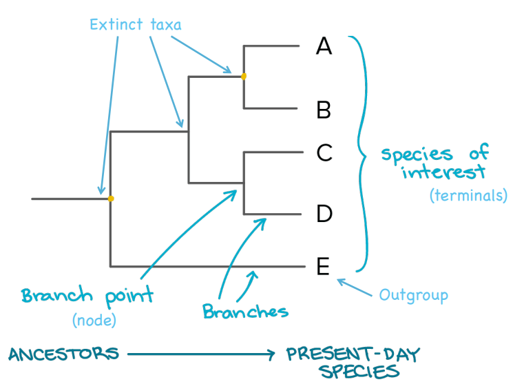
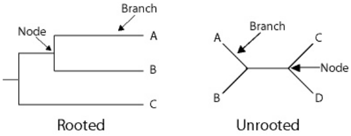
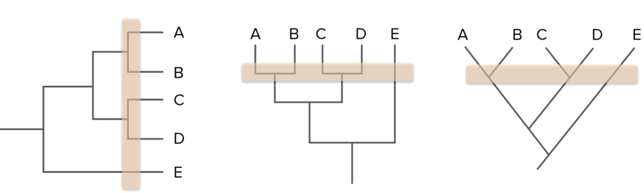
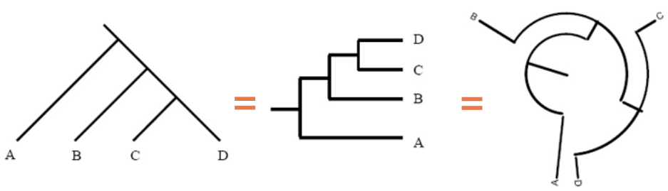
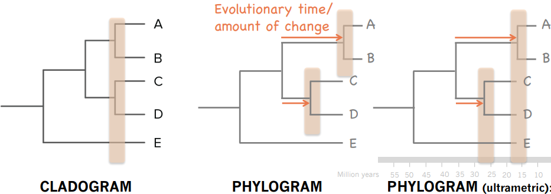

# Table of Contents
[Programa teórico](#teoria)
1. [Introducción a la filogenética](#)
2. [Alineamiento de secuencias](#alineamiento)
3. [Modelos de evolución molecular](#modelos)
4. [Métodos filogenéticos de inferencia](#metodos)
5. [Máxima parsimonia](#mp)
6. [Métodos de distancias](#distancias)
7. [Máxima verosimilitud](#mv)
8. [Inferencia Bayesiana](#bayesian)
9. [Reloj molecular relajado](#reloj)

# Programa teórico 
## Introducción a la filogenética 

### Estudios filogenéticos:
La filogenética puede ser estudiada de diversas maneras.

- Registros fósiles: 
    + *PROS*: contienen información sobre la morfología de los antepasados de las especies actuales y la cronología de sus divergencias. Esto permite datar las filogenias.
    - *CONTRAS*: utilizar registros fósiles para determinar relaciones filogenéticas puede producir **sesgos** porque:
        - pueden estar disponibles sólo para determinadas especies
        - los datos existentes de fósiles pueden estar fragmentados
        - la recolección de datos está limitada por la abundancia, hábitat, rango geográfico y otros factores
        - las descripciones de los rasgos morfológicos son a menudo ambiguas (múltiples factores genéticos).

- Datos moleculares: en la forma de secuencias de ADN o de proteínas. Debido a que los genes son el medio para registrar las mutaciones acumuladas, éstos pueden servir como "fósiles moleculares".
    + *PROS*: son más numerosos que los registros fósiles y más fáciles de obtener. Además, no hay ningún sesgo de muestreo, como el que hay en los registros fósiles reales. Por tanto, es posible construir árboles filogenéticos más precisos y robustos utilizando datos moleculares.

### Arboles filogenéticos: 
Representaciones gráficas (patrones) de las relaciones ancestro-descendientes (relaciones históricas de parentescos) entre elementos, que pueden ser especies, secuencias de genes, etc. Entender este patrón es esencial para realizar estudios comparativos de cualquier tipo, porque existen dependencias  estadísticas entre los elementos que comparten ancestros comunes.

#### Los árboles filogenéticos estan compuestos por:

- **Nodos externos** o **terminales**. 
    - Se denominan **grupos hermanos** a los nodos terminales que parten de un mismo nodo interno, es decir, dos taxones que compartan un ancestro común no compartido por ningún otro taxón.
    - El **grupo externo (outgroup)** es aquel que se encuentra más alejado y parte de una rama distinta desde la raíz. Normalmente, este outgroup se elige arbitrariamente para poder colocar la raíz donde se estima correcto.
    - Todas las especies que se desarrollan desde una rama de la raíz se denomina **grupo interno** o **ingroup**.

- **Nodos internos**: 
son hipótesis evolutivas de posibles ancestros comunes de los cuales normalemente faltan datos para confirmar o descartar la teoría.

- **Ramas** (branches) que unen los nodos. En las distintas ramas se pueden representar la transformación de caracteres que aparecen a nivel genético y que se transmiten por herencia.

- **Raiz**. Los árboles filogenéticos se pueden representar sin enraizar o enraizado. 
    - **Sin raíz**: Un árbol filogenético que no asume conocimiento de un ancestro común, solo posiciones de los taxones para mostrar sus relaciones relativas (no hay dirección de un camino evolutivo).
    - **Con raíz**: Para describir la dirección de la evolución se necesita un árbol filogenético donde todas las secuencias bajo estudio tienen un ancestro o nodo raíz común *(más informativo)*.
    

#### Representación de los arboles:
Hay varias formas de representar los árboles filogenéticos.
Los distintos elementos no tienen un orden concreto; da igual si en un árbol los nodos terminales están en distinto orden mientras que las ramas sigan el mismo camino.

#### Tipos de arboles:

1. **Cladogramas (CLADOGRAM)** used in cladistics BUT a cladogram is not an evolutionary hypothesis since it does not contain information about how ancestors and descendants are related or how much descendants have changed through time. They are a SIMPLISTIC REPRESENTATION (OK for morphological matrices).

2. **Filogramas (PHYLOGRAM)**: a branching tree where the branch lengths indicate the amount of **evolutionary change** inferred from the analysis.
Tienen la ventaja de mostrar tanto las relaciones evolutivas como la información sobre el tiempo relativo de divergencia de las ramas.

3. **PHYLOGRAM (ultrametric) or CRONOGRAM**: ages assigned to each node using molecular clocks. Representan la relación de los elementos de forma
temporal.

<!-- lo de arriba es para quitar las lineas de la tabla
El inicio de lo de abajo es para que no haya header :) -->
>|   |   |   |
>|---|---|---|
>| [phyl(o) gr. 'raza', 'estirpe'] |   |                                          |
>| [klad(o) gr. 'rama']            | + | [-gram-ma gr.  'representación gráfica'] |
>| [khron(o) gr. 'tiempo']         |   |                                          |

#### Politomías:

## Alineamiento de secuencias 
## Modelos de evolución molecular 
## Métodos filogenéticos  de inferencia 
## Máxima parsimonia (MP) 
## Métodos de distancias 
## Máxima verosimilitud (ML) 
## Inferencia Bayesiana 
## Reloj molecular relajado 

