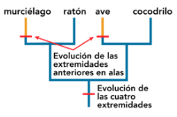

# Table of Contents
1. [Introducción a la filogenética](#intro)
    1. [Estudios filogenéticos](#estudios)
    2. [Arboles filogenéticos](#arboles)
        1. [Partes de un árbol filogenético](#partes)
        2. [Representación de los arboles](#rep)
        3. [Tipos de arboles](#tipo)
        4. [Agrupamientos](#anatomia)
        5. [Politomías](#politomia)
    3. Conceptos básicos
        1. [Homología](#homol)
        2. [Homoplasia](#homoplasia)
        3. [Fenotipo vs moléculas](#fenotipo-molec)
2. [Alineamiento de secuencias](#alineamiento)
3. [Modelos de evolución molecular](#modelos)
4. [Métodos filogenéticos de inferencia](#metodos)
5. [Máxima parsimonia](#mp)
6. [Métodos de distancias](#distancias)
7. [Máxima verosimilitud](#mv)
8. [Inferencia Bayesiana](#bayesian)
9. [Reloj molecular relajado](#reloj)
10. [What do we need to build a phylogenetic tree](#summary)

# Introducción a la filogenética 

## Estudios filogenéticos: 
La filogenética puede ser estudiada de diversas maneras.

- Registros fósiles: 
    + *PROS*: contienen información sobre la morfología de los antepasados de las especies actuales y la cronología de sus divergencias. Esto permite datar las filogenias.
    - *CONTRAS*: utilizar registros fósiles para determinar relaciones filogenéticas puede producir **sesgos** porque:
        - pueden estar disponibles sólo para determinadas especies
        - los datos existentes de fósiles pueden estar fragmentados
        - la recolección de datos está limitada por la abundancia, hábitat, rango geográfico y otros factores
        - las descripciones de los rasgos morfológicos son a menudo ambiguas (múltiples factores genéticos).

- Datos moleculares: en la forma de secuencias de ADN o de proteínas. Debido a que los genes son el medio para registrar las mutaciones acumuladas, éstos pueden servir como "fósiles moleculares".
    + *PROS*: son más numerosos que los registros fósiles y más fáciles de obtener. Además, no hay ningún sesgo de muestreo, como el que hay en los registros fósiles reales. Por tanto, es posible construir árboles filogenéticos más precisos y robustos utilizando datos moleculares.

## Arboles filogenéticos: 
Representaciones gráficas (patrones) de las relaciones ancestro-descendientes (relaciones históricas de parentescos) entre elementos, que pueden ser especies, secuencias de genes, etc. Entender este patrón es esencial para realizar estudios comparativos de cualquier tipo, porque existen dependencias  estadísticas entre los elementos que comparten ancestros comunes.

### Partes de un árbol filogenético: 

#### **Nodos externos** o **terminales**. 
- Se denominan **grupos hermanos** a los nodos terminales que parten de un mismo nodo interno, es decir, dos taxones que compartan un ancestro común no compartido por ningún otro taxón.
- El **grupo externo (outgroup)** es aquel que se encuentra más alejado y parte de una rama distinta desde la raíz. Normalmente, este outgroup se elige arbitrariamente para poder colocar la raíz donde se estima correcto.
- Todas las especies que se desarrollan desde una rama de la raíz se denomina **grupo interno** o **ingroup**.

#### **Nodos internos**: 
Son hipótesis evolutivas de posibles ancestros comunes de los cuales normalemente faltan datos para confirmar o descartar la teoría.

#### **Ramas** (branches) que unen los nodos. 
En las distintas ramas se pueden representar la transformación de caracteres que aparecen a nivel genético y que se transmiten por herencia.

#### **Raiz**. 
Los árboles filogenéticos se pueden representar sin enraizar o enraizado. 
- **Sin raíz**: Un árbol filogenético que no asume conocimiento de un ancestro común, solo posiciones de los taxones para mostrar sus relaciones relativas (no hay dirección de un camino evolutivo).
- **Con raíz**: Para describir la dirección de la evolución se necesita un árbol filogenético donde todas las secuencias bajo estudio tienen un ancestro o nodo raíz común *(más informativo)*.

### Representación de los arboles: 
Hay varias formas de representar los árboles filogenéticos.
Los distintos elementos no tienen un orden concreto; da igual si en un árbol los nodos terminales están en distinto orden mientras que las ramas sigan el mismo camino.

### Tipos de arboles: 

1. **Cladogramas (CLADOGRAM)** used in cladistics BUT a cladogram is not an evolutionary hypothesis since it does not contain information about how ancestors and descendants are related or how much descendants have changed through time. They are a SIMPLISTIC REPRESENTATION (OK for morphological matrices).

2. **Filogramas (PHYLOGRAM)**: a branching tree where the branch lengths indicate the amount of **evolutionary change** inferred from the analysis.
Tienen la ventaja de mostrar tanto las relaciones evolutivas como la información sobre el tiempo relativo de divergencia de las ramas.

3. **PHYLOGRAM (ultrametric) or CRONOGRAM**: ages assigned to each node using molecular clocks. Representan la relación de los elementos de forma
temporal.

<!-- lo de arriba es para quitar las lineas de la tabla
El inicio de lo de abajo es para que no haya header :) -->

>|   |   |   |
>|---|---|---|
>| [phyl(o) gr. 'raza', 'estirpe'] |   |                                          |
>| [klad(o) gr. 'rama']            | + | [-gram-ma gr.  'representación gráfica'] |
>| [khron(o) gr. 'tiempo']         |   |                                          |

### Anatomy of the phylogenetic tree / Agrupamientos: 

- **Monophyly / grupo monofilético**: 
(los que nos interesan en filogenia)
Un conjunto de taxones que comparten una sinapomorfía, es decir, que contiene un ancestro y todos sus descendientes, formando así un solo grupo evolutivo = un clado.

- **Paraphyly / grupo parafilético**: Un conjunto de taxones con una simplesiomorfía en común, incluye el antecesor común más reciente y algunos de sus descendientes, pero no a todos.

- **Polyphyly / grupo polifilético**: Un grupo de taxones agrupados por la presencia de un carácter homoplásico. Es un grupo en el que el antecesor común más reciente, y quizá también algunos de sus descendientes, no son miembros de este grupo, es decir, un grupo con miembros de líneas evolutivas separadas.

> [**Grupos y caracteres que se apoyan**](#homol)

### Politomías: 
 - **Dicotomía**: Cuando todas las ramas en un árbol filogenético se bifurcan. Los árboles filogenéticos se consideran resueltos cuando sus ramas se distribuyen dicotómicamente.
- **Politomía**: si de un nodo surgen más de dos ramas (descendientes). Los árboles no resueltos presentan politomías.

---
_Conceptos básicos:_ 
---

## Homología 
La homología es la relación que existe entre dos partes orgánicas diferentes de dos organismos distintos cuando sus determinantes genéticos tienen el mismo origen evolutivo, es decir, cuando un mismo órgano tiene diversas formas y funciones.

*El mismo organo diversas formas y funciones. Semejanza en la estructura debido a la herencia común.*

Los caracteres que se estudian en filogenia deben ser **homólogos**. Se compara la semejanza de una estructura debido a la herencia común.

> Las alas de las aves y las de los murciélagos son **análogas** — es decir, sus orígenes evolutivos son independientes, pero se parecen superficialmente porque evolucionaron para realizar la misma función. Las analogías son el resultado de la **evolución convergente** o **paralelismo**..

> Por lo tanto, es interesante que mientras las alas de las aves y de los murciélagos son análogas como alas, como miembros anteriores son homólogas. Las aves y los murciélagos no heredaron las alas de un antepasado común alado, pero sí heredaron las extremidades anteriores de un antepasado común con extremidades anteriores.

En genética y biología molecular, también existe **homología en las secuencias**. Los caracteres o estados son homólogos si derivan del mismo carácter en el ancestro común más cercano. Se distinguen dos tipos: la ortología y la paralogía.

*A gene that has diverged as a result of a speciation event is called an ortholog. Orthologs will generally retain the same function after the speciation event—this is how ‘transfer of annotation’ is possible.  But they may not have the same name. If two genes diverge as a result of a gene duplication event, they are called paralogs. Generally, paralogs will take on a different-but-related gene function, while their cousins—the orthologs—will retain the same function through the course of evolution.*

### Genes Ortólogos 
Son semejantes por pertenecer a dos especies que tienen un antepasado común. Requiere que se haya producido especiación. En la imagen son el conjunto de hemoglobinas beta y alfa de los grupos.

### Genes Parálogos
Son aquellos que se encuentran en el mismo organismo y cuya semejanza revela que uno procede de la duplicación del otro (y si hay posterior mutación, puede adquirir funciones diferentes del gen original). La especiación no es necesaria, la paralogía puede producirse solo en los individuos de una misma especie.

---
_Note:_
Idealmente se deben comparar caracteres **ortólogos** para hacer las reconstrucciones filogenéticas.

---

### Tipos de homología: 
Clasificaciones de las propiedades de organismos basándose en similitudes derivadas.

*Tipos de homología en el árbol filogenético. El carácter A es plesiomórfico al estar en el ancestro. El carácter C es apomórfico al ser una novedad evolutiva. En los nodos terminales, el carácter A se considera simplesiomórfico al estar compartido por los descendientes y ser un carácter ancestral. Por el contrario, el carácter C en los nodos terminales es sinapomórfico por ser un carácter novedoso y estar compartido en el ancestro en el que surgió y sus descendientes. Los caracteres B, D y E son autopomorfos por estar presentes en un único nodo terminal.*

Se distinguen dos tipos de estados en los caracteres homólogos:

**_Plesiomorfía_** (ancestral character state) se refiere al estado ancestral (o primitivo) de un carácter que comparten distintas especies por heredarlo del antepasado común; en el ejemplo se presenta en los ancestros y los grupos externos.

- **Simplesiomorfía** [Homología ancestral compartida - e.g. cuatro patas (tetrápodos)] se refiere a una plesiomorfía (carácter ancestral) compartida por dos o más taxa. They do not need to be associated with monophyletic groups, could be paraphyletic or polyphyletic groups.

**_Apomorfía_** (derived character state) es un carácter novedoso evolutivamente y se dice que es derivado, ya que deriva de otro rasgo perteneciente a un taxón ancestral filogenéticamente próximo.

- **Sinapomorfía** [Homología derivada compartida - e.g. vision binocular (humano y mono)] una apomorfía (carácter exclusivo) compartida por un ancestro común y todos sus descendientes. Only synapomorphic character states are expected to be associated with *monophyletic groups* = clades.

- **Autapomorfía** [Homología derivada exclusiva - e.g. bipedismo (humano)] es un carácter novedoso y único de un taxón que no aparece en el antepasado, por lo que no lo comparte con ningún otro.

<!-- lo de arriba es para quitar las lineas de la tabla
El inicio de lo de abajo es para que no haya header :) -->

>|   |   |   |
>|---|---|---|
>| [*sýn-* gr. 'con', 'unión'] |   | [*morph* gr. 'forma'] |
>| [*plesio-* gr. 'cercano'] | + |  |
>| [*aut(o)*- gr. 'que actúa por sí mismo'] | | [*-ía* gr. 'cualidad'] |
>|[*apó-* gr. 'a partir de' (derivado, novedoso)] |  |  |

> **Grupos y caracteres que se apoyan**: los grupos monofiléticos presentan sinapomorfía, los grupos parafiléticos presentan simplesiomorfía, y los grupos polifiléticos homoplasia.

Para determinar qué estados son plesiomórficos y cuales apomórficos (es decir, polarizar los estados), es necesario orientar un árbol en el tiempo o enraizarlo. 
Para ello, se asigna una posición en el árbol donde se sitúa el hipotético antecesor común del grupo de organismos a estudiar (**grupo interno** o *ingroup*). 
Se pueden utilizar varios criterios, entre ellos la **comparación con el grupo externo** o outgroup es el más utilizado. 
De todos los caracteres presentes en un grupo monofilético, aquel que se encuentre en su grupo hermano, corresponderá al carácter plesiomórfico, mientras que el que se encuentre exclusivamente en el grupo interno será el apomórfico.

## Homoplasia 
La homoplasia es una falsa homología, descubierta como tal a posteriori.  
La homoplasia se refiere a la aparición de características similares en especies que no comparten un ancestro común reciente. Estas similitudes son el resultado de la **evolución convergente** o **paralela**, donde diferentes especies desarrollan rasgos similares de manera independiente como una adaptación a condiciones ambientales similares o a desafíos evolutivos parecidos.

- *Ejemplos* de homoplasia:
    - Las alas de las mariposas y las de las aves son un ejemplo. Ambas sirven para volar, pero las estructuras y su origen son completamente diferentes. Una está soportada por exoesqueleto de quitina y la otra por un endoesqueleto óseo.
    - La presencia de espinas en cactus y en ciertas plantas suculentas africanas es otro ejemplo de homoplasia.

> La **analogía**, por otro lado, se refiere específicamente a la función o el rol de una característica, más que a su origen evolutivo. Dos estructuras son análogas cuando desempeñan funciones similares, pero no necesariamente comparten un origen evolutivo común. A menudo, las estructuras análogas son también homoplásicas, pero no siempre es el caso.
> - Las alas de los murciélagos y las alas de las aves son análogas porque ambas se utilizan para volar, aunque tienen orígenes evolutivos diferentes.
> - Las aletas de los pingüinos y las aletas de los delfines son estructuras análogas utilizadas para nadar.
> 
> En resumen, la homoplasia se centra en el origen evolutivo de las similitudes entre especies, mientras que la analogía se centra en la función de las características similares. Una estructura puede ser homoplásica y análoga al mismo tiempo si se desarrolló independientemente en diferentes linajes y cumple una función similar.

Hay 3 tipos de homoplasia en función de la causa que produce la homoplasia: 

- La **convergencia** cuando la similitud de carácter se produce en grupos filogenéticamente lejanos. Se da cuando dos estructuras similares han evolucionado independientemente a partir de estructuras ancestrales distintas y por procesos de desarrollo diferentes.

- Se considera que el **paralelismo** cuando la similitud de carácter se produce en grupos filogenéticamente cercanos y anidados en un mismo clado;involucra patrones de desarrollo similares en líneas evolutivas diferentes, pero próximas. La diferencia con la convergencia es que en el paralelismo, hay un ancestro que no presenta un carácter y dos descendientes directos sí presentan esa novedad evolutiva, mientras que en la convergencia los descendientes con carácter no tienen el mismo ancestro común directo.

    > No obstante, en la práctica, la distinción entre convergencia y paralelismo es un tanto arbitraria porque no existe una regla exacta para limitar la antigüedad del antepasado común.

- **Reversión** cuando un carácter se transforma en otro evolutivamente anterior, i.e. un organismo adquiere un carácter de sus antepasados más lejanos. Esto implica que uno o más caracteres adquiridos previamente se han eliminado y se han vuelto a los más anteriores.

## Fenotipo vs moléculas 
### Carácteres fenotípicos:
Tradicionalmente se han empleado para establecer las relaciones filogenéticas.

> Pros: 
- suelen ser carácteres **evolutivamente relevantes**
- caracteres complejos, **menos proclives a la homoplasia**
- son los únicos **carácteres disponibles** en algunos casos como en fósiles o especímenes raros

> Contras:
- puede haber problemas de codificación de taxones supraespecíficos como terminales (**"quimeras"**) 
- se pueden dar casos de **subjetividad** en la codificación de carácteres
- hay un número **limitado** de carácteres fenotípicos 
- podemos encontrar taxones altamente **autapomórficos** (exclusivos, debido a las  muchas posibilidades evolutivas)

### Carácteres moleculares:

> Pros: 
- son **estrictamente heredables**
- **no hay ambigüedades** en la codificación (determinar el estado de los caracteres es trivial)
- hay ciertas **regularidades en la evolución** de los carácteres moleculares
- son **robustos** frente a la distancia evolutiva
- son muy **abundantes** 
- ofrecen información temporal: **reloj molecular**

> Contras:
- son más proclives a la **homoplasia** al tener solo 4 nucleótidos y 20 aminoácidos
- la **evolución** de estos carácteres es **compleja**
- los **árboles de genes** no siempre coinciden con los **árboles de especies**
- la determinación de la **homología** puede ser difícil por duplicación o pérdida de genes y alineamientos

*Anásisis separados*

Se suelen utilizar multitud de **genes separados** y analizarlos aparte. El consenso de análisis separados es una estimación conservadora de la filogenia.

> *Conflicto entre caractres*: 
> - Algunos métodos filogenéticos sólo se pueden aplicar a ciertos tipos de datos. 
> - A nivel de especies, la concatenación de genes diferentes puede ser inapropiada si se da: 
>   - Transferencia horizontal de genes, hibridación
>   - Duplicación de genes, o 
>   - Coalescencia más profunda que el tiempo de divergencia.

*Análisis combinados*  
El conflicto entre caracteres se *resuelve* teniendo en cuenta:
- toda la **evidencia** disponible 
- realizando análisis combinados: diferentes tipos de datos proporcionan información a diferentes **niveles** filogenéticos. 
- La **señal** filogenética aumenta debido a la congruencia entre caracteres de diferentes conjuntos de datos.

---
Es importante que el conjunto de datos sea lo más completo posible. Es necesario hacer un muestreo de taxones (incluyendo los grupos externos) y genes razonable y justificado.

---

# Alineamiento de secuencias 
Decidir qué caracteres investigar, y cómo codificarlos, es un primer paso crucial en cualquier análisis filogenético.

## Caracteres y estado del caracter
**Caracteres** son características del individuo que creemos que van a ser heredadas. Cuantos más caracteres estudiemos de cada individuo mejor. 
Ej. un carácter que hayas adquirido a lo largo de tu vida no es heredable, en principio, por ej. el tamaño del cuádriceps no sería una buena referencia. 

**Estado de carácter** es el valor específico que toma ese carácter en determinado taxón o especie. 
Ej. carácter: ojo; estado: (numero de ojos) tener 8 ojos.

Un árbol filogenético se construye partiendo de la comparación de atributos (caracteres) que presentan variación entre los organismos objeto de estudio. 
Un árbol se puede inferir a partir de diversos tipos de caracteres (morfológicos, moleculares, etológicos, ecológicos, biogeográficos, etc.), cuyas diferentes manifestaciones se denominan estados de carácter. 
Existen dos tipos de caracteres en función de su *origen*: los *homólogos* y los *homoplásicos*.

### Tipos de caracteres
- Sitios **invariables**: que no cambian en los distintos taxones. 
- Sitios **filogenéticamente neutrales**: que son autapomorfías (solo cambia en un taxón). 
- Sitios **filogenéticamente informativos**: son comunes por pares (permiten dicotomía), son sinapomorfías.

### Estados de un caracter
- **Binarios 0/1** (presentes o ausentes) [0 , 1]
- **Multiestado** o **binarios V/S** (transversiones o transiciones)
- **Discretos** o **continuos**: 
    - Discretos: Ej. Número de dedos
    - Continuos: Ej. Diferencia de longitud (%) entre el dedo medio y los otros; diferencia entre la longitud del pico. La codificación de caracteres continuos no se pueden incluir fácilmente en las matrices de caracteres, por lo que se debe realizar una categorización arbitraria. Idealmente, se deben buscar divisiones naturales, es decir, estados discretos de un carácter de variación continua.
    
    

### Ponderación de los caracteres
Se puede emplear un valor relativo de los diferentes caracteres y transformaciones como indicadores de las relaciones filogenéticas entre taxones. Se puede realizar una ponderación uniforme, que minimiza los supuestos del análisis, o una ponderación diferencial, en la que no todas las características de un organismo tienen el mismo valor como evidencias filogenéticas.

#### Poderación *a priori*
En la ponderación a priori de caracteres morfológicos, los taxónomos pueden tener muchas razones para asumir que diferentes caracteres tienen diferente importancia filogenética. Pero eso tiene dos problemas: 
- diferentes opiniones expertas y, en caso de acuerdo, 
- el peso proporcional que se le da a cada carácter. 
Se introduce precisamente el tipo de subjetividad que el análisis cladístico pretende evitar.

#### Ponderación *a posteriori*
El método más utilizado y aplicado, también llamado **ponderación implícita** la primera vez que un carácter cambia de estado en un árbol, este cambio de estado recibe el peso «1»; los cambios posteriores son menos «costosos» y reciben pesos menores a medida que la tendencia de los caracteres a la homoplasia se hace más evidente. Los árboles que maximizan la función cóncava de homoplasia resuelven el conflicto de caracteres a favor de los caracteres que tienen más homología (menos homoplasia) e implican que el peso medio de los caracteres sea lo más alto posible.

Goloboff reconoce que los árboles con los pesos medios más elevados son los que más «respetan» los datos: un peso medio bajo implica que la mayoría de los caracteres están siendo «ignorados» por los algoritmos de construcción de árboles.

Aunque originalmente se propuso con una ponderación severa de k=3, Goloboff prefiere ahora concavidades más «suaves» (por ejemplo, k = 12), que han demostrado ser más eficaces en casos simulados y del mundo real.

$F =Σfi, fi = k/k+(s-m)$

m = minimum number of steps 
s = number of steps observed 
k = concavity constant, 1-100

(s-m) mide el número extra de cambios (homoplasia)

Un valor de k próximo a 0 prácticamente elimina del análisis los caracteres más homoplásicos. Por contra, valores elevados ponderan negativamente de forma muy suave los caracteres homoplásicos.

morfología: k=5-16  
secuencias nucleotídicas: k>15

#### Secuencias de ADN
Generalmente, se toma la tasa de sustitución como medida de la fiabilidad de la información filogenética del marcador. Se entiende entonces homoplasia como saturación 

$Homoplasia = Saturación$

 *Las **transversiones** evolucionan lentamente y aumentan su frecuencia a medida que pasa el tiempo. Las **transiciones** se saturan a partir de cierta distancia filogenética, perdiéndose su señal.*

Hacer una transición es más difícil que una transversion, por ello si una transición ocurre es más importante, i.e. las transiciones (S) son más costosas 
que las transversiones (V)

- *Peso de los caracteres*: Debido a cómo se forman los aminoácidos, los cambios en la tercera posición son menos importantes (tienen menos peso) que los de la primera.

# Modelos de evolución molecular 

# Métodos filogenéticos  de inferencia 

# Máxima parsimonia (MP) 

# Métodos de distancias 
# Máxima verosimilitud (ML) 
# Inferencia Bayesiana 
# Reloj molecular relajado 

# What do we need to build a phylogenetic tree 

1. What **taxa**? - Your decision, but don’t be biased!
- Impact of the **outgroup** taxa selection:

- Impact of the **ingroup** taxa selection:

2. Data / Markers:

- What type of **data**? - Your decision, but based on what is available!
- How many **markers**? - Budget! …also, PCR success…as many as possible

    Variability vs. Conservation: Depending on your question, but most (small scale) phylogenetic studies now in *metazoans* use:
    - Ribosomal genes (18S, 28S, 16S, ITS1&2) which are more conserved
    - Protein coding genes (COI, COB, ALG11, etc) which are more variable

    **Do your research… and check ncbi first to see what is available already**

4. What [**alignment program**](#alineamiento)? - Muscle? MAFFT?

5. What [**model of evolution**](#modelos)? - jModelTest
Not all genes evolve (mutate) at the same pace and in the same manner.
Their mutation rates depend on many parameters:
    - GC genome content
    - Genome size
    - Generation time
    - Expression levels (usage of the gene)
    - Protein coding genes
    - Position in the genome
    - Linkage disequilibrium
    - etc

    Each gene will have its own substitution model. These substitution models differ in terms of the parameters used to describe the rates at which one nucleotide replaces another during evolution.
    
    

[jModelTest](https://github.com/ddarriba/jmodeltest2) 
    is a tool to carry out statistical selection of best-fit models of nucleotide substitution. It implements five different model selection strategies: hierarchical and dynamical likelihood ratio tests (hLRT and dLRT), Akaike and Bayesian information criteria (AIC and BIC), and a decision theory method (DT).

6. What [**phylogenetic method**](#metodos)? - Your decision…mine is always ML + BI

- Statistical phylogenetics
- Probabilistic methods
- Society for Systematic

    Biology

- Cladistics-
- Parsimony
- Willi Hennig Society

    Distance vs discrete data  
    (distance vs MP, ML, Bayesian)

    Or

    MP vs model-based methods  
    (MP vs distance, ML, Bayesian)

- DISTANCE METHODS

- **MAXIMUM PARSIMONY**

    The assumption is that the ‘true’ tree will contain the least number of mutations possible i.e., the most parsimonious solution.

    Given a set of sequences (partial evidence) we need to find ancestral sequences, build a rooted tree, and estimate the smallest number of changes contained in the branches

    It poses an impossible computational problem (no algorithm known) and therefore all models use simplified versions

    **Weighted parsimony**: different scoring for each change (transition/transversion) and different scoring for each position
    
    
    

- **MAXIMUM LIKELIHOOD**

    Likelihood: the probability of producing the observed data by a model given the model parameters, LD=Pr(X|Θ)
    - X: data already aligned, each site mutates independently
    - Θ: parameters of the model (topology, model of substitution)

    In big datasets the computation is extremely difficult and long, BUT it is one of the most powerful methods because:
    - it uses models of substitution (evolutionary models)
    - it corrects multiple substitutions
    - it allows estimation of branch length (=amount of change from ancestor)
    - fixing all but one parameter it allows finding the max. likelihood for that parameter

    

- **Problems with maximum likelihood (and parsimony)**
    1. _**Long branch attraction**_: is a phenomenon when **rapidly evolving lineages** are inferred to be closely related,regardless of their true evolutionary relationships
    

- **BAYESIAN INFERENCE**

    Reverend Thomas Bayes 1763: inverse probability 
    > Based on Bayes' theorem, the bayesian approach combines the prior probability of a tree P(A) with the likelihood of the data (B) to produce a posterior probability distribution on trees P(A|B).

    Likelihood gives you the probability of the data given the hypothesis and Bayesian gives you the probability of the hypothesis given the data 
    
    &nbsp;&nbsp;&nbsp;&nbsp;&nbsp;&nbsp;&nbsp;&nbsp;&nbsp;&nbsp;&nbsp;&nbsp;&nbsp;&nbsp;&nbsp;&nbsp; ⇩
    
    **Posterior probabilities** 
    
    &nbsp;&nbsp;&nbsp;&nbsp;&nbsp;&nbsp;&nbsp;&nbsp;&nbsp;&nbsp;&nbsp;&nbsp;&nbsp;&nbsp;&nbsp;&nbsp; ⇩ 
    
    **It uses MCMC (Markov chain-Montecarlo) algorithms**

- **How does it work?**
    - Start somewhere, that somewhere will have a likelihood and a prior
    - Randomly propose a new state (maybe adjust one branch length), if the change has a better likelihood x prior, the chain goes there
    - Calculate the posterior probability ratio between the current and previous state. It should be between 0 and 1
    - Choose a random number between 0 and 1 and if that number has a better likelihood than the ratio of states, the change is accepted (sometimes if slightly worse as well)
    - That is how the chain crosses likelihood valleys
    
    
    

7. How to **assess confidence**? Evaluating support.
- Bremer support: difference in the branch lengths when clades are removed (only in parsimony) ~ over 70%
- Jacknife: probability of a clade observed in all the trees (parsimony) ~ over 70%
- Bootstrap: probability of a clade observed in all the trees (ML) ~ over 70%
- Posterior probability: probability of a clade being assigned under the conditions sampled (BI) ~ over 0.95
- Convergence: assessing whether all chains (MCMC) converged in the same solution (BI)

WE NEED TO READ A LOT!
