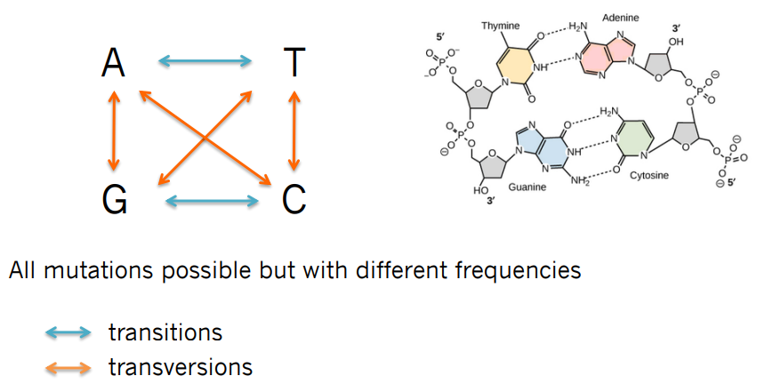
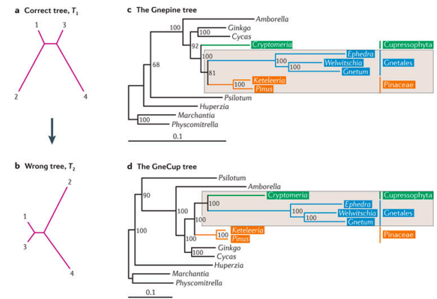

# Table of Contents
[Programa teórico](#teoria)
1. [Introducción a la filogenética](#intro)
    1. [Estudios filogenéticos](#estudios)
    2. [Arboles filogenéticos](#arboles)
        1. [Partes de un árbol filogenético](#partes)
        2. [Representación de los arboles](#rep)
        3. [Tipos de arboles](#tipo)
        4. [Agrupamientos](#anatomia)
        5. [Politomías](#politomia)
    3. Conceptos básicos
        1. [Homología](#homol)
        2. [Homoplasia](#homoplasia)
        3. [Fenotipo vs moléculas](#fenotipo-molec)
2. [What do we need to build a phylogenetic tree](#summary)
2. [Alineamiento de secuencias](#alineamiento)
3. [Modelos de evolución molecular](#modelos)
4. [Métodos filogenéticos de inferencia](#metodos)
5. [Máxima parsimonia](#mp)
6. [Métodos de distancias](#distancias)
7. [Máxima verosimilitud](#mv)
8. [Inferencia Bayesiana](#bayesian)
9. [Reloj molecular relajado](#reloj)

# Programa teórico 
## Introducción a la filogenética 

### Estudios filogenéticos: 
La filogenética puede ser estudiada de diversas maneras.

- Registros fósiles: 
    + *PROS*: contienen información sobre la morfología de los antepasados de las especies actuales y la cronología de sus divergencias. Esto permite datar las filogenias.
    - *CONTRAS*: utilizar registros fósiles para determinar relaciones filogenéticas puede producir **sesgos** porque:
        - pueden estar disponibles sólo para determinadas especies
        - los datos existentes de fósiles pueden estar fragmentados
        - la recolección de datos está limitada por la abundancia, hábitat, rango geográfico y otros factores
        - las descripciones de los rasgos morfológicos son a menudo ambiguas (múltiples factores genéticos).

- Datos moleculares: en la forma de secuencias de ADN o de proteínas. Debido a que los genes son el medio para registrar las mutaciones acumuladas, éstos pueden servir como "fósiles moleculares".
    + *PROS*: son más numerosos que los registros fósiles y más fáciles de obtener. Además, no hay ningún sesgo de muestreo, como el que hay en los registros fósiles reales. Por tanto, es posible construir árboles filogenéticos más precisos y robustos utilizando datos moleculares.

### Arboles filogenéticos: 
Representaciones gráficas (patrones) de las relaciones ancestro-descendientes (relaciones históricas de parentescos) entre elementos, que pueden ser especies, secuencias de genes, etc. Entender este patrón es esencial para realizar estudios comparativos de cualquier tipo, porque existen dependencias  estadísticas entre los elementos que comparten ancestros comunes.

#### Partes de un árbol filogenético: 

- **Nodos externos** o **terminales**. 
    - Se denominan **grupos hermanos** a los nodos terminales que parten de un mismo nodo interno, es decir, dos taxones que compartan un ancestro común no compartido por ningún otro taxón.
    - El **grupo externo (outgroup)** es aquel que se encuentra más alejado y parte de una rama distinta desde la raíz. Normalmente, este outgroup se elige arbitrariamente para poder colocar la raíz donde se estima correcto.
    - Todas las especies que se desarrollan desde una rama de la raíz se denomina **grupo interno** o **ingroup**.

- **Nodos internos**: 
son hipótesis evolutivas de posibles ancestros comunes de los cuales normalemente faltan datos para confirmar o descartar la teoría.

- **Ramas** (branches) que unen los nodos. En las distintas ramas se pueden representar la transformación de caracteres que aparecen a nivel genético y que se transmiten por herencia.

- **Raiz**. Los árboles filogenéticos se pueden representar sin enraizar o enraizado. 
    - **Sin raíz**: Un árbol filogenético que no asume conocimiento de un ancestro común, solo posiciones de los taxones para mostrar sus relaciones relativas (no hay dirección de un camino evolutivo).
    - **Con raíz**: Para describir la dirección de la evolución se necesita un árbol filogenético donde todas las secuencias bajo estudio tienen un ancestro o nodo raíz común *(más informativo)*.
    

#### Representación de los arboles: 
Hay varias formas de representar los árboles filogenéticos.
Los distintos elementos no tienen un orden concreto; da igual si en un árbol los nodos terminales están en distinto orden mientras que las ramas sigan el mismo camino.

#### Tipos de arboles: 

1. **Cladogramas (CLADOGRAM)** used in cladistics BUT a cladogram is not an evolutionary hypothesis since it does not contain information about how ancestors and descendants are related or how much descendants have changed through time. They are a SIMPLISTIC REPRESENTATION (OK for morphological matrices).

2. **Filogramas (PHYLOGRAM)**: a branching tree where the branch lengths indicate the amount of **evolutionary change** inferred from the analysis.
Tienen la ventaja de mostrar tanto las relaciones evolutivas como la información sobre el tiempo relativo de divergencia de las ramas.

3. **PHYLOGRAM (ultrametric) or CRONOGRAM**: ages assigned to each node using molecular clocks. Representan la relación de los elementos de forma
temporal.

<!-- lo de arriba es para quitar las lineas de la tabla
El inicio de lo de abajo es para que no haya header :) -->

>|   |   |   |
>|---|---|---|
>| [phyl(o) gr. 'raza', 'estirpe'] |   |                                          |
>| [klad(o) gr. 'rama']            | + | [-gram-ma gr.  'representación gráfica'] |
>| [khron(o) gr. 'tiempo']         |   |                                          |

#### Anatomy of the phylogenetic tree / Agrupamientos: 

- **Monophyly / grupo monofilético**: un clado que contiene un ancestro y todos sus descendientes, formando así un solo grupo evolutivo.

- **Paraphyly / grupo parafilético**: es similar,pero excluye a algunos de los descendientes que han sufrido cambios significativos.

- **Polyphyly / grupo polifilético**: grupo con miembros de líneas evolutivas separadas, conteniendo así grupos de especies con distintos ancestros comunes.

#### Politomías: 
 - **Dicotomía**: Cuando todas las ramas en un árbol filogenético se bifurcan. Los árboles filogenéticos se consideran resueltos cuando sus ramas se distribuyen dicotómicamente.
- **Politomía**: si de un nodo surgen más de dos ramas (descendientes). Los árboles no resueltos presentan politomías.

### Conceptos básicos 
---
### Homología 
La homología es la relación que existe entre dos partes orgánicas diferentes de dos organismos distintos cuando sus determinantes genéticos tienen el mismo origen evolutivo, es decir, cuando un mismo órgano tiene diversas formas y funciones.

*El mismo organo diversas formas y funciones. Semejanza en la estructura debido a la herencia común.*

---
_Note:_
Los caracteres que se estudian en filogenia deben ser **homólogos**. Se compara la semejanza de una estructura debido a la herencia común.

---

> La **analogía**, por el contrario, es una estructura semejante a otra o que tiene la misma función, pero cuyo desarrollo embrionario y origen son diferentes. No se presentan en un antepasado común (como en el caso de los caracteres homólogos), sino que son fruto de **convergencia evolutiva**.

En genética y biología molecular, también existe **homología en las secuencias**. Se distinguen dos tipos: la ortología y la paralogía.

#### Genes Ortólogos
Son semejantes por pertenecer a dos especies que tienen un antepasado común. Requiere que se haya producido especiación.

#### Genes Parálogos
Son aquellos que se encuentran en el mismo organismo y cuya semejanza revela que uno procede de la duplicación del otro (y puede adquirir funciones diferentes del gen original). La especiación no es necesaria, la paralogía puede producirse solo en los individuos de una misma especie.

---
_Note:_
Idealmente se deben comparar caracteres **ortólogos** para hacer las reconstrucciones filogenéticas.

---

### Homoplasia 

### Fenotipo vs moléculas 

## What do we need to build a phylogenetic tree 
1. What **taxa**? - Your decision, but don’t be biased!
- Impact of the **outgroup** taxa selection:

- Impact of the **ingroup** taxa selection:

2. Data / Markers:

- What type of **data**? - Your decision, but based on what is available!
- How many **markers**? - Budget! …also, PCR success…as many as possible

    Variability vs. Conservation: Depending on your question, but most (small scale) phylogenetic studies now in *metazoans* use:
    - Ribosomal genes (18S, 28S, 16S, ITS1&2) which are more conserved
    - Protein coding genes (COI, COB, ALG11, etc) which are more variable

    **Do your research… and check ncbi first to see what is available already**

4. What [**alignment program**](#alineamiento)? - Muscle? MAFFT?

5. What [**model of evolution**](#modelos)? - jModelTest
Not all genes evolve (mutate) at the same pace and in the same manner.
Their mutation rates depend on many parameters:
    - GC genome content
    - Genome size
    - Generation time
    - Expression levels (usage of the gene)
    - Protein coding genes
    - Position in the genome
    - Linkage disequilibrium
    - etc

    Each gene will have its own substitution model. These substitution models differ in terms of the parameters used to describe the rates at which one nucleotide replaces another during evolution.
    
    

[jModelTest](https://github.com/ddarriba/jmodeltest2) 
    is a tool to carry out statistical selection of best-fit models of nucleotide substitution. It implements five different model selection strategies: hierarchical and dynamical likelihood ratio tests (hLRT and dLRT), Akaike and Bayesian information criteria (AIC and BIC), and a decision theory method (DT).

6. What [**phylogenetic method**](#metodos)? - Your decision…mine is always ML + BI

- Statistical phylogenetics
- Probabilistic methods
- Society for Systematic

    Biology

- Cladistics-
- Parsimony
- Willi Hennig Society

    Distance vs discrete data  
    (distance vs MP, ML, Bayesian)

    Or

    MP vs model-based methods  
    (MP vs distance, ML, Bayesian)

- DISTANCE METHODS

- **MAXIMUM PARSIMONY**

    The assumption is that the ‘true’ tree will contain the least number of mutations possible i.e., the most parsimonious solution.

    Given a set of sequences (partial evidence) we need to find ancestral sequences, build a rooted tree, and estimate the smallest number of changes contained in the branches

    It poses an impossible computational problem (no algorithm known) and therefore all models use simplified versions

    **Weighted parsimony**: different scoring for each change (transition/transversion) and different scoring for each position
    
    
    

- **MAXIMUM LIKELIHOOD**

    Likelihood: the probability of producing the observed data by a model given the model parameters, LD=Pr(X|Θ)
    - X: data already aligned, each site mutates independently
    - Θ: parameters of the model (topology, model of substitution)

    In big datasets the computation is extremely difficult and long, BUT it is one of the most powerful methods because:
    - it uses models of substitution (evolutionary models)
    - it corrects multiple substitutions
    - it allows estimation of branch length (=amount of change from ancestor)
    - fixing all but one parameter it allows finding the max. likelihood for that parameter

    

- **Problems with maximum likelihood (and parsimony)**
    1. _**Long branch attraction**_: is a phenomenon when **rapidly evolving lineages** are inferred to be closely related,regardless of their true evolutionary relationships
    

- **BAYESIAN INFERENCE**

    Reverend Thomas Bayes 1763: inverse probability 
    > Based on Bayes' theorem, the bayesian approach combines the prior probability of a tree P(A) with the likelihood of the data (B) to produce a posterior probability distribution on trees P(A|B).

    Likelihood gives you the probability of the data given the hypothesis and Bayesian gives you the probability of the hypothesis given the data 
    
    &nbsp;&nbsp;&nbsp;&nbsp;&nbsp;&nbsp;&nbsp;&nbsp;&nbsp;&nbsp;&nbsp;&nbsp;&nbsp;&nbsp;&nbsp;&nbsp; ⇩
    
    **Posterior probabilities** 
    
    &nbsp;&nbsp;&nbsp;&nbsp;&nbsp;&nbsp;&nbsp;&nbsp;&nbsp;&nbsp;&nbsp;&nbsp;&nbsp;&nbsp;&nbsp;&nbsp; ⇩ 
    
    **It uses MCMC (Markov chain-Montecarlo) algorithms**

- **How does it work?**
    - Start somewhere, that somewhere will have a likelihood and a prior
    - Randomly propose a new state (maybe adjust one branch length), if the change has a better likelihood x prior, the chain goes there
    - Calculate the posterior probability ratio between the current and previous state. It should be between 0 and 1
    - Choose a random number between 0 and 1 and if that number has a better likelihood than the ratio of states, the change is accepted (sometimes if slightly worse as well)
    - That is how the chain crosses likelihood valleys
    
    
    

7. How to **assess confidence**? Evaluating support.
- Bremer support: difference in the branch lengths when clades are removed (only in parsimony) ~ over 70%
- Jacknife: probability of a clade observed in all the trees (parsimony) ~ over 70%
- Bootstrap: probability of a clade observed in all the trees (ML) ~ over 70%
- Posterior probability: probability of a clade being assigned under the conditions sampled (BI) ~ over 0.95
- Convergence: assessing whether all chains (MCMC) converged in the same solution (BI)

WE NEED TO READ A LOT!

## Alineamiento de secuencias 

## Modelos de evolución molecular 
## Métodos filogenéticos  de inferencia 
## Máxima parsimonia (MP) 
## Métodos de distancias 
## Máxima verosimilitud (ML) 
## Inferencia Bayesiana 
## Reloj molecular relajado 

[def]: images/treeparts.png