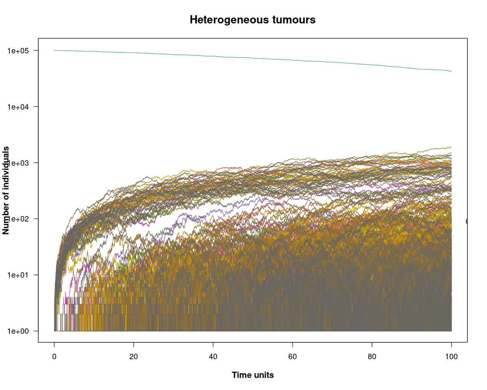

## High or low intratumor heterogeneity
Find settings of parameters that produce the scenarios you want. Of course, you do not want one simulation, nor two or three. 
You ideally run, say, 100 or 1000 replicates of each scenario and you’d be able to say things like “In 90% of our replicates there is this much intra-tumor heterogeneity”.

Define what the things you simulate or try to see are. For example:
- what is intratumor heterogeneity?
- How do we define and compute it?
- The papers by [Diaz-Colunga and Diaz-Uriarte, 2021](https://journals.plos.org/ploscompbiol/article?id=10.1371/journal.pcbi.1009055), and [Diaz-Uriarte and Vasallo, 2019](https://journals.plos.org/ploscompbiol/article?id=10.1371/journal.pcbi.1007246), define some of these things. You might want to look at them (including their supplementary material)

You will need to sample from the simulations. 
OncoSimulR allows you to sample in different ways. 
Use the one that matters for your scenario (e.g., single cell or whole-tumor, or bulk sequencing)

El objetivo aquí es dar una serie de recetas para:
- quieres alta heterogeneidad tumoral: haz esto (o "no es posible")
- quieres alta heterogeneidad tumoral con un número muy alto de clones: haz lo otro
- quieres baja heterogeneidad pero tiempos hasta la sustitución muy largos: haz lo de más allá, etc

---


### **Definition of Intratumor Heterogeneity (ITH)**
"*Cancer is the result of a gradual accumulation of somatic genetic mutations. While most of the acquired mutations are putatively neutral and have no significant effect on a cell’s phenotype, some confer a selective advantage to the host cell; they are known as driver mutations. Consequently, individual tumors are heterogeneous and typically consist of multiple populations of cells (subclones), each harboring a distinct set of driver mutations and possessing a distinct phenotype, a phenomenon known as intra-tumor heterogeneity (ITH). Detecting ITH helps identify the key events initiating the development of the disease or leading to metastasis, and allows for the determination of a tumor’s subclonal composition.*" (Khakabimamaghani *et al.*, 2019)

> In other words:
>
> Tumours are highly heterogeneous ecosystems with a mixture of cancerous and non-cancerous sub-populations of cells. These cells are in constant competition for oxigen,  space, growth-factors and other nutrients and limited resources. Intratumor heterogeneity (ITH) refers to the genetic, epigenetic, and phenotypic diversity observed within tumor cell populations in a single patient. This diversity results from mutations, epigenetic changes, selection pressures, and other factors during tumor evolution.
>
> Current explanations of intra-tumour heterogeneity include:
> - evolutionary neutrality: *"This neutral theory claims that the overwhelming majority of evolutionary changes at the molecular level are not caused by selection acting on advantageous mutants, but by random fixation of selectively neutral or very nearly neutral mutants through the cumulative effect of sampling drift (due to finite population number) under continued input of new mutations"*  (Kimura, 1991)
> - niche specialisation: The process by which a species becomes better adapted, by natural selection, to the specific characteristics of a particular habitat.
> - non-equilibrium dynamics
> - frequency-dependent selection: a situation where fitness is dependent upon the frequency of a phenotype or genotype in a population.
> 
> It remains an open problem to identify which, or how many, of these mechanisms are at work in any given neoplasm.

**Importance of ITH:**
This heterogeneity has consequences for diagnosis, treatment and disease progression.
- **High ITH**: Associated with treatment resistance, immune evasion, and poor prognosis.
- **Low ITH**: Often seen in tumors with dominant clones and more straightforward evolutionary trajectories.

---

### **Measuring ITH**

To define or compute ITH in a simulation:
1. **Genetic Diversity Metrics:**
   - **Shannon Diversity Index**: Measures the proportion of clones and their diversity.
   - **Simpson’s Diversity Index**: Emphasizes the dominance of certain clones.
   - **Richness**: Counts the number of distinct clones.
   
2. **Clonal Abundance:**
   - Analyze the proportions of clones in the population (dominant clone vs. minor clones).

3. **Homozygosity and Heterozygosity:** 
   - In OncoSimulR, homozygosity/heterozygosity can be tracked explicitly based on specific mutations in tumor suppressors and oncogenes.

---

### **Modeling High and Low ITH in OncoSimulR**

1. **High ITH:**
   - **Parameters:**
     - **Weak Selection, Strong Mutation (WSSM)**:
       - **Mutation rate (\(mu\))**: High values (e.g., \(10^{-4}\) or \(10^{-5}\)).
       - **Fitness landscape**: Neutral or shallow gradients between genotypes.
       - **Population size**: Large.
       - **Sampling model**: Single-cell sampling to capture clonal diversity.
   - **Setup:**
     ```R
     fe_high_ith <- allFitnessEffects(noIntGenes = rep(0.01, 50)) # Weak selection
     high_ith_sim <- oncoSimulIndiv(fe_high_ith,
                                    mu = 1e-4, 
                                    model = "McFL", # Moran or Wright-Fisher
                                    initSize = 1e5,
                                    finalTime = 100,
                                    onlyCancer = FALSE))
     ```
   - **Expected Results:** Many small clones with varying mutations. No single dominant clone.
   - **Results**:
      ```R
      # Break down of results:
      high_ith_sim
      ```
      ```
      Individual OncoSimul trajectory with call:
       oncoSimulIndiv(fp = fe_high_ith, model = "McFL", mu = 1e-04, 
          initSize = 1e+05, finalTime = 100, onlyCancer = FALSE)
      
        NumClones TotalPopSize LargestClone MaxNumDrivers MaxDriversLast NumDriversLargestPop
      1      3779       101771        42398             0              0                    0
        TotalPresentDrivers FinalTime NumIter HittedWallTime HittedMaxTries     errorMF minDMratio
      1                   0       100   54933          FALSE          FALSE 0.001658369   199.6077
        minBMratio OccurringDrivers
      1        200                 
      
      Final population composition:
                   Genotype     N
      1                     42398
      2                   1   805
      3                1, 2     0
      4         1, 2, 3, 31     0
      5         1, 2, 3, 32     0
      6             1, 2, 4    69
      7          1, 2, 4, 9     2
      8         1, 2, 4, 38     0
      9         1, 2, 4, 40     1
      ...
      ```
      ```R
      # Visualization:
      plot(high_ith_sim, show = "genotypes", type = "line",
           ylab = "Number of individuals", main = "Heterogeneous tumours",
           font.main=2, font.lab=2, cex.main=1.4, cex.lab=1.1, las = 1)
      ```
      


2. **High ITH with Many Clones:**
   - Increase the number of genes or loci under consideration and their mutation rates.
   - Example:
     ```R
     fe_many_clones <- allFitnessEffects(epistasis = c("A:B" = 0.2, "B:C" = -0.1), 
                                         geneToModule = c("A" = "Gene1", 
                                                          "B" = "Gene2", 
                                                          "C" = "Gene3"))
     many_clones_sim <- oncoSimulIndiv(fe_many_clones,
                                       mu = 1e-4, 
                                       initSize = 1e6,
                                       model = "Bozic")
     plotClonalEvolution(many_clones_sim)
     ```

3. **Low ITH with Long Time to Substitution:**
   - **Parameters:**
     - **Strong Selection, Weak Mutation (SSWM)**:
       - **Mutation rate (\(mu\))**: Low values (\(10^{-8}\)).
       - **Fitness landscape**: High selection coefficients (dominant genotypes).
       - **Population size**: Small or medium.
       - **Sampling model**: Whole-tumor bulk sampling.
   - **Setup:**
     ```R
     fe_low_ith <- allFitnessEffects(noIntGenes = rep(0.2, 10)) # Strong selection
     low_ith_sim <- oncoSimulIndiv(fe_low_ith,
                                   mu = 1e-8,
                                   initSize = 1e4,
                                   model = "McFL")
     plotClonalEvolution(low_ith_sim)
     ```
   - **Expected Results:** A dominant clone, slow emergence of new clones.

---

### **Sampling in OncoSimulR**

1. **Single-Cell Sampling:**
   - Use to capture high ITH and detect rare clones.
   ```R
   sampleSingleCells(high_ith_sim, n = 100)  # 100 single cells
   ```

2. **Whole-Tumor Sampling:**
   - Provides an overview of the entire population.
   ```R
   sampleWholeTumor(low_ith_sim)
   ```

3. **Bulk Sequencing:**
   - Simulates the typical experimental setup for tumor sequencing.
   ```R
   bulk_data <- samplePopulations(high_ith_sim, timeSample = 50)
   ```

---

### **Scenarios and Recipes**

1. **High Tumor Heterogeneity:**
   - Use high mutation rates and neutral fitness landscapes.
   - **Sampling**: Single-cell sampling.

2. **High Heterogeneity with Many Clones:**
   - Large number of interacting loci.
   - **Sampling**: Single-cell or bulk sequencing.

3. **Low Heterogeneity with Long Substitution Times:**
   - Strong selection, low mutation rates.
   - **Sampling**: Whole-tumor sampling.

---

### **Limitations of OncoSimulR**

1. **High Number of Clones:**
   - Computational burden increases significantly.
   - Simplifications in fitness landscapes might be necessary.

2. **Strong Selection, Weak Mutation with High Heterogeneity:**
   - Difficult to achieve as clones tend to be replaced by fitter clones rapidly.

3. **High Epistatic Interactions:**
   - Modeling complex interaction effects can be limited by computational power.

### References for Further Understanding
- **Papers:** Use the provided DOI references for insights into modeling strategies.
- **Documentation:** Check [OncoSimulR documentation](https://rdiaz02.github.io/OncoSimul/) for parameter specifics.

---
### References from [OncoSimulR guide](https://rdiaz02.github.io/OncoSimul/OncoSimulR.html)
This example is based on Kaznatcheev et al. ([2017](https://www.nature.com/articles/bjc20175). In this work, it is explained that the progression of cancer is marked by the acquisition of a number of hallmarks, including self-sufficiency of growth factor production for angiogenesis and reprogramming energy metabolism for aerobic glycolysis. Moreover, there is evidence of intra-**tumour heterogeneity**.

Given that some cancer cells can not invest in something that benefits the whole tumor while others can free-ride on the benefits created by them (evolutionary social dilemmas), how do these population level traits evolve, and how are they maintained? The authors answer this question with a mathematical model that treats acid production through glycolysis as a tumour-wide public good that is coupled to the club good of oxygen from better vascularisation.

The cell types of the model are:
- VOP: VEGF (over)-producers.
- GLY: glycolytic cells.
- DEF: aerobic cells that do not call for more vasculature.

On the other hand, the micro-environmental parameters of the model are:
- a: the benefit per unit of acidification.
- v: the benefit from oxygen per unit of vascularisation.
- c: the cost of (over)-producing VEGF.

Finally, depending of the parameter’s values, the model can lead to three different situations (as in other examples, the different types are one mutation away from WT):

#### 1. Fully glycolytic tumours:
If the fitness benefit of a single unit of acidification is higher than the maximum benefit from the club good for aerobic cells, then GLY cells will always have a strictly higher fitness than aerobic cells, and be selected for. In this scenario, the population will converge towards all GLY, regardless of the initial proportions (as long as there is at least some GLY in the population).

```R
# Definition of the function for creating the corresponding dataframe.
avc <- function (a, v, c) {
  data.frame(Genotype = c("WT", "GLY", "VOP", "DEF"),
             Fitness = c("1",
                         paste0("1 + ",a," * (f_GLY + 1)"),
                         paste0("1 + ",a," * f_GLY + ",v," * (f_VOP + 1) - ",c),
                         paste0("1 + ",a," * f_GLY + ",v," * f_VOP")
                         ))
                          }

# Specification of the different effects on fitness.
afavc <- allFitnessEffects(genotFitness = avc(2.5, 2, 1),
                           frequencyDependentFitness = TRUE,
                           frequencyType = "rel")
## Warning in allFitnessEffects(genotFitness = avc(2.5, 2, 1),
## frequencyDependentFitness = TRUE, : v2 functionality detected.
## Adapting to v3 functionality.
```

```R
## For real, you would probably want to run
## this multiple times with oncoSimulPop
simulation <- oncoSimulIndiv(afavc,
                           model = "McFL",
                           onlyCancer = FALSE,
                           finalTime = 15,
                           mu = 1e-3,
                           initSize = 4000,
                           keepPhylog = FALSE,
                           seed = NULL,
                           errorHitMaxTries = FALSE,
                           errorHitWallTime = FALSE)
```

```R
# Representation of the plot of one simulation as an example (the others are
# highly similar).
plot(simulation, show = "genotypes", type = "line",
     ylab = "Number of individuals", main = "Fully glycolytic tumours",
     font.main=2, font.lab=2, cex.main=1.4, cex.lab=1.1, las = 1)
```

#### 2. Fully angiogenic tumours:
If the benefit to VOP from their extra unit of vascularisation is higher than the cost c to produce that unit, then VOP will always have a strictly higher fitness than DEF, selecting the proportion of VOP cells towards 1. In addition, if the maximum possible benefit of the club good to aerobic cells is higher than the benefit of an extra unit of acidification, then for sufficiently high number of VOP, GLY will have lower fitness than aerobic cells. When both conditions are satisfied, the population will converge towards all VOP.

```R
# Definition of the function for creating the corresponding dataframe.
avc <- function (a, v, c) {
  data.frame(Genotype = c("WT", "GLY", "VOP", "DEF"),
             Fitness = c("1",
                         paste0("1 + ",a," * (f_GLY + 1)"),
                         paste0("1 + ",a," * f_GLY + ",v, " * (f_VOP + 1) - ",c),
                         paste0("1 + ",a," * f_GLY + ",v, " * f_VOP")
                         ))
                          }

# Specification of the different effects on fitness.
afavc <- allFitnessEffects(genotFitness = avc(2.5, 7, 1),
                           frequencyDependentFitness = TRUE,
                           frequencyType = "rel")
## Warning in allFitnessEffects(genotFitness = avc(2.5, 7, 1),
## frequencyDependentFitness = TRUE, : v2 functionality detected.
## Adapting to v3 functionality.
```

```R
simulation <- oncoSimulIndiv(afavc,
                           model = "McFL",
                           onlyCancer = FALSE,
                           finalTime = 15,
                           mu = 1e-4,
                           initSize = 4000,
                           keepPhylog = FALSE,
                           seed = NULL,
                           errorHitMaxTries = FALSE,
                           errorHitWallTime = FALSE)
```

```R
## We get a huge number of VOP very quickly
## (too quickly?)
plot(simulation, show = "genotypes", type = "line",
     ylab = "Number of individuals", main = "Fully angiogenic tumours",
     font.main=2, font.lab=2, cex.main=1.4, cex.lab=1.1, las = 1)
```

#### 3. Heterogeneous tumours:
If the benefit from an extra unit of vascularisation in a fully aerobic group is lower than the cost c to produce that unit, then for a sufficiently low proportion of GLY and thus sufficiently large number of aerobic cells sharing the club good, DEF will have higher fitness than VOP. This will lead to a decrease in the proportion of VOP among aerobic cells and thus a decrease in the average fitness of aerobic cells. A lower fitness in aerobic cells will lead to an increase in the proportion of GLY until the aerobic groups (among which the club good is split) get sufficiently small and fitness starts to favour VOP over DEF, swinging the dynamics back.

```R
# Definition of the function for creating the corresponding dataframe.
avc <- function (a, v, c) {
  data.frame(Genotype = c("WT", "GLY", "VOP", "DEF"),
             Fitness = c("1",
                         paste0("1 + ",a," * (f_GLY + 1)"),
                         paste0("1 + ",a," * f_GLY + ",v," * (f_VOP + 1) - ",c),
                         paste0("1 + ",a," * f_GLY + ",v," * f_VOP")
                         ))
                          }

# Specification of the different effects on fitness.
afavc <- allFitnessEffects(genotFitness = avc(7.5, 2, 1),
                           frequencyDependentFitness = TRUE,
                           frequencyType = "rel")
## Warning in allFitnessEffects(genotFitness = avc(7.5, 2, 1),
## frequencyDependentFitness = TRUE, : v2 functionality detected.
## Adapting to v3 functionality.
```

```R
# Launching of the simulation (20 times).
simulation <- oncoSimulIndiv(afavc,
                           model = "McFL",
                           onlyCancer = FALSE,
                           finalTime = 25,
                           mu = 1e-4,
                           initSize = 4000,
                           keepPhylog = FALSE,
                           seed = NULL,
                           errorHitMaxTries = FALSE,
                           errorHitWallTime = FALSE)
```

```R
# Representation of the plot of one simulation as an example (the others are
# highly similar).
plot(simulation, show = "genotypes", type = "line",
     ylab = "Number of individuals", main = "Heterogeneous tumours",
     font.main=2, font.lab=2, cex.main=1.4, cex.lab=1.1, las = 1)
```

```R
# Break down:
simulation
```
```
Individual OncoSimul trajectory with call:
 oncoSimulIndiv(fp = afavc, model = "McFL", mu = 1e-04, initSize = 4000, 
    finalTime = 25, onlyCancer = FALSE, keepPhylog = FALSE, errorHitWallTime = FALSE, 
    errorHitMaxTries = FALSE, seed = NULL)

  NumClones TotalPopSize LargestClone MaxNumDrivers MaxDriversLast NumDriversLargestPop
1         4    100763834    100760538             0              0                    0
  TotalPresentDrivers FinalTime NumIter HittedWallTime HittedMaxTries   errorMF minDMratio
1                   0      9.15   27430          FALSE          FALSE 0.1031664    590.149
  minBMratio OccurringDrivers
1   3333.333                 

Final population composition:
  Genotype         N
1                 11
2      DEF       231
3      GLY 100760538
4      VOP      3054
```

```R

```

```R

```

```R

```

```R

```
