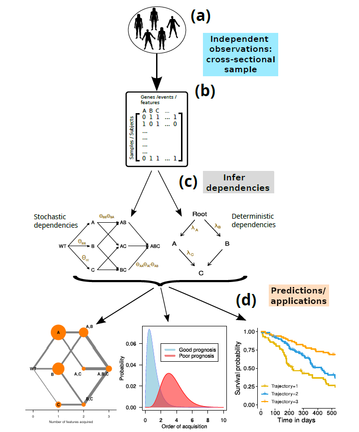
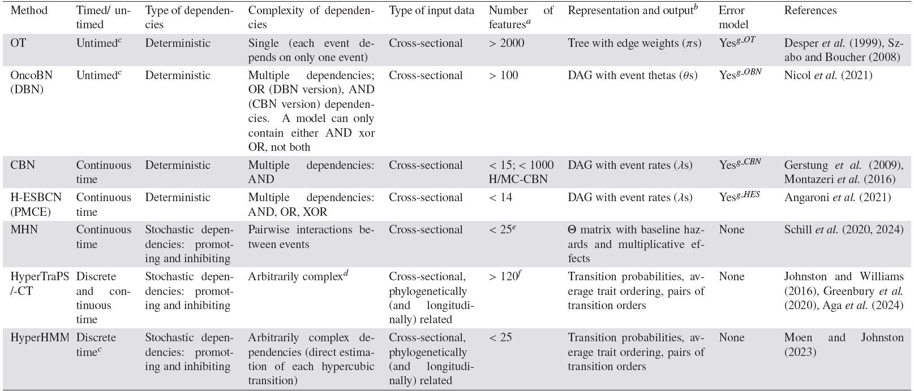

# Cancer progression models (CPM) and monotonic accumulation models
Tools that allow researchers to map out how cancer develops, step by step. 
Monotonic accumulation models try to infer the dependencies that give rise to the patterns we observe in the data. In other words, the core idea of these CPM models is to understand the tendency of an event to rely on others and how events lead to a cell to become cancerous. 

The **key idea** is that many phenomena involve the irreversible accumulation (or loss) of certain features or events, and that different events are not independent but can affect the acquisition (or loss) of other events. In other words, not just which mutations happen, but what order they happen, and the relashionships between them.

Understanding the sequence of events can help identify diagnostic targets or stratify patients for differential treatments.

### Types of CPM's
- **Deterministic models**: layout specific pathways, assuming that a mutation can only occur if certain conditions are met. A straight sequence of events.
    - Linear accumulation models: asume that one event is always directly required for the accumulation of another event.
    - Richer deterministic models: allow more complex dependencies (e.g. an event can depend on the occurrence of one among several possible previous events).
- **Stochastic models**: assume that events have inhibiting or enhancing effects on the probability of acquisition of other events. They acknowledge that there may be preferred paths, but there is room for variation and detours along the way.

We are interested in how some features or events that characterise a process accumulate (or are lost) irreversibly. Examples: 
- how mutations in driver genes accumulate during cancer progression 
- or how symptoms (fever, vomiting, anemia, . . . ) accumulate during severe malaria
- these models can be used to help identify therapeutic targets and improve evolutionary-based adaptive treatment approaches

To visualize these, we use **directed acyclic graphs (DAGs)**: visual representations that show the potential paths of mutations and the relashionships between them.

## General Challenges
Some factors that make this harder to model are:
- **Reciprocal sign epistasis (RSE)**: The effect of one mutation can change depending on the presence of other mutations. Therefore, the context is important. For example, if we have a mutation in gene A and a mutation in gene B, mutation A gives the cell an advantage, and B is harmful; but if the cell already have that mutation in gene A, getting the mutation in gene B may be beneficial... in this way, the interaction changes the effect.
- **Type of data used**: because a lot of the research relies on bulk sequencing data, and because these are taken from a whole tumour, which has a mixture of different cells, meaning that we are getting an average view of the mutation (therefore is not precise), and this can create dificulties to trace the lineage of the tumour.
    > What are these models telling us about? Individual cell levels? or a summary of the tumour?  
    > - Depends on the data and the model assumptions: for example CPMs based on bulk sequencing data give more of a general overview of the tumour
- **Broader evolutionary forces**: such as population size, rate of mutation, selective pressure within the tumour environment...
- **Frequency-dependent fitness**: it discusses how can environment influence mutations. Suggesting that a mutation success can depend on how common other mutations are in the sorrounding cells, for example.

### Challenges to traditional view:
- **Non representable fitness landscapes**: the traditional models and the traditional way of visualizing how mutations affect survival, breaks down in certain scenarios where relashionships are too dynamic, too context dependant. Some of the stochastic models are better to handle this scenarios and allow for more complicated relashionships (such as HyperTraPS or HyperHMM).
- **“Lines of descent” (LOD)**: which are the “lineages that arrive at the most populated genotype at the final time”. Focusing on LODs helps us identify the crucial steps, in order to target the key steps that shaped the tumour's development.
- **Frequency-dependent fitness -AGAIN-**: it discusses how can environment influence mutations. Suggesting that a mutation success can depend on how common other mutations are in the sorrounding cells, for example.

## Steps: 

1. (a) Features of relevance are measured on some subjects, i.e.**presence or absence** of the events of interest (e.g., mutations in genes or presence of malaria symptoms) 

2. (b)**Data** are **arranged** as a binary matrix of samples by features.
    - For cancer data, each row in (b) is a mutational profile: what mutations or genetic alterations were present in a given subject.
        > Here we only focus on data where all samples are assumed independent and each sample provides a single observation: crosssectional data. This is the standard scenario for the application of cancer progression models.

3. (c) The researcher uses a method to **infer the dependencies** in the order of accumulation of the events (or mutations) that best explains the observed data (data in (b)). There are a variety of methods, that we schematise into two groups in (c) in both figures, letters denote events or gene alterations (the column names of the matrix in
(b)):
    - Some methods (left), model **stochastic dependencies** for the transitions between the combinations of events. The parameters[^1] of this model are: interaction and spontaneous rates or transition probabilities; and it assumes that events have inhibiting or enhancing effects on the probability of acquisition of other events.
    
    - other methods (right), model **deterministic relationships** encoded as graphs. The parameters[^1] of this model are: trees/graphs, type of dependencies, and rates/conditional probabilities; and it assumes that some events are always, necessarily required for the accumulation of other events.
    
[^1]: These parameters allow that model to provide the closest match between predicted and observed frequencies of mutational profiles (the data in (b)). As an example, in brown, some of the edges annotated with possible parameters inferred.

4. (d) Once models are fitted, they can be used to obtain additional predictions or improved statistical analyses. Some uses
of cancer progression models:
    - Left: predicting the next genotype and predicting the paths of progression of the disease (conditional on the current observed state); edge weights give predicted probabilities. 
    - Centre: distribution of ordering of some feature (e.g., a mutation in a gene) between patients with different prognosis, facilitating stratification.
    - Right: patients are stratified based on evolutionary trajectory, and the survival of the different groups is compared.

## Methods overview

*Table 1: Cancer progression and monotonic accumulation models: main features. Methods ordered approximately by increasing complexity of dependencies that can be reflected.*

### Purpose, data, assumptions
#### Objective
Examine the existence of dependencies (deterministic or stochastic) between the occurrence of different irreversible events. Events which can include mutations, disease symptoms, tool use, student progress, etc. 
> If we are dealing with cancer genomic data, we are typically interested in understanding the dependencies between the different genetic alterations (e.g., mutations1 in different genes) that are accumulated, non-reversibly, during tumour progression.

#### Data
**Binary data** (or data that have been binarised): this is, therefore, a cross-sectional data set, where:
- each row of this matrix describes the state of a subject (or sample) with respect to the events, 
- each subject (or sample) is represented only once in the data, and 
- different subjects (or samples) are regarded as independent

From the data, each method will try to infer the best fitting model. By best fitting, we mean that the predicted distribution of mutational profiles is as close as possible to the observed distribution of mutational profiles in the data.

Thus, each method will find the parameters that allow that model to provide the closest match between predicted and observed frequencies of mutational profiles:
- trees/graphs, type of dependencies, and rates/conditional probabilities for models with deterministic dependencies; 
- interaction and spontaneous rates or transition probabilities for models with stochastic dependencies

#### Assumptions
These models have some common assumptions.

1. The events are gained one by one and irreversibly (thus the “monotonic accumulation”, above)

2. All the methods (exept those regarding phylogenetic information) consider each of the different subjects or samples as replicate evolutionary experiments, or independent realizations of an evolutionary process. Here, all the subjects are under the same constraints or dependencies with respect to the accumulation of the events —and the purpose of the analysis is, precisely, to understand these constraints
    > For example, for *cancer data*, we would regard all the subjects in a cross-sectional data set, corresponding to a homogeneous cancer type, as `replicate evolutionary runs` where all subjects share the same genetic constraints and dependencies

### Deterministic dependencies
The models in this section use directed acyclic graphs (DAGs) and trees to represent deterministic dependencies, or restrictions, in the accumulation of events.

> DAGs interpretation: an edge from event 𝑖 (e.g., a mutation in gene 𝑖) to event 𝑗 (e.g., a mutation in gene 𝑗 ) means that > event 𝑖 must occur before event 𝑗 can occur; 
in other words, an edge (or arrow) from 𝑖 to 𝑗 indicates a direct and necessary dependency of event 𝑗 on event 𝑖.
 
- Oncogenetic trees (OT)
- Disjunctive Bayesian Networks (DBN: OncoBN)
- Conjunctive Bayesian Networks (CBN)
- Hidden Extended Suppes-Bayes Causal Networks (H-ESBCN, PMCE)

### Stochastic dependencies
In models with stochastic dependencies, events can alter, increasing or decreasing, the probability of acquiring other events. These methods model the transitions in a hypercubic transition graph linking the genotypes; two of the models, MHN and HyperTraPS, model those transitions as a function of a (potentially) reduced number of parameters, whereas HyperHMM directly models the transitions between genotypes without expressing them as a function of a smaller number of parameters.

- Mutual Hazard Networks (MHN)
- HyperTraPS
- HyperHMM
- Other methods: TreeMHN, Hintra or REVOLVER

## Uses and entities
Uses 
- Inference
- Intervention(medical treatment)/patient stratification

Entities under study: A careful consideration of the empirical entities and the possible evolutionary assumptions will not only prevent us from endowing inferences with unsubstantiated implications, but also represents an opportunity for applying these models in novel scenarios.

#### 
    

