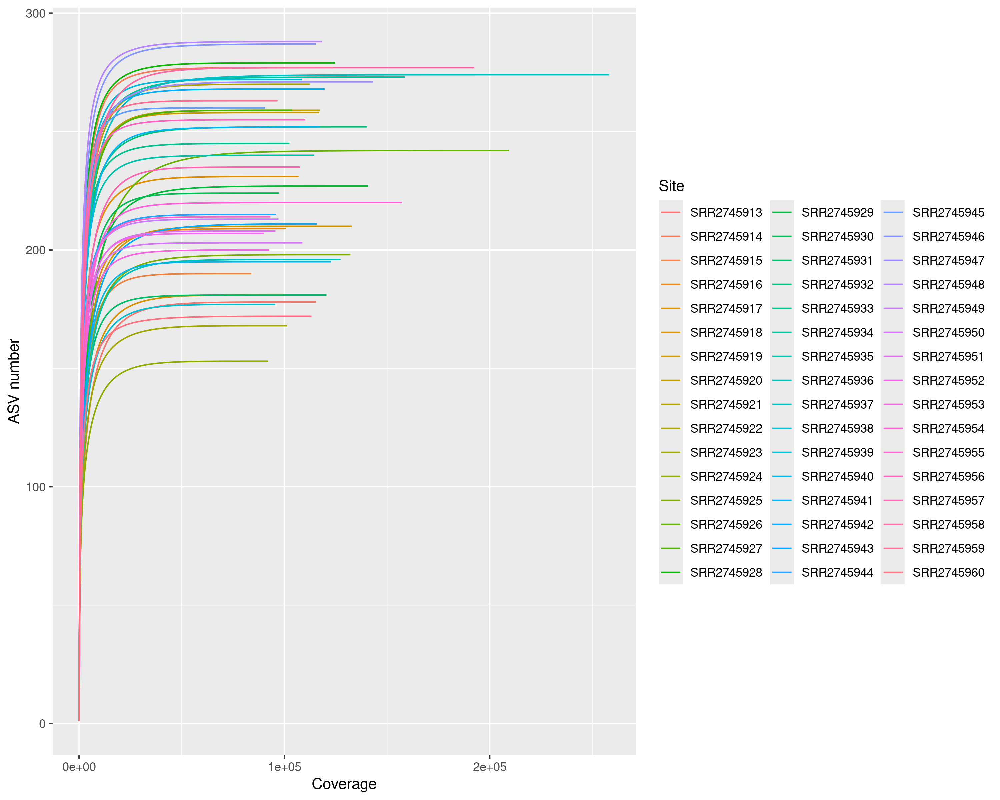
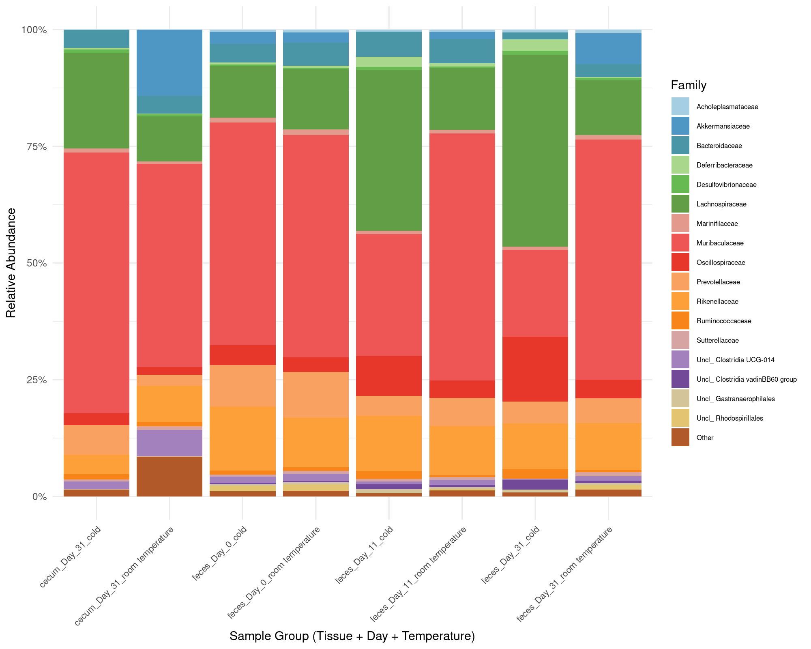
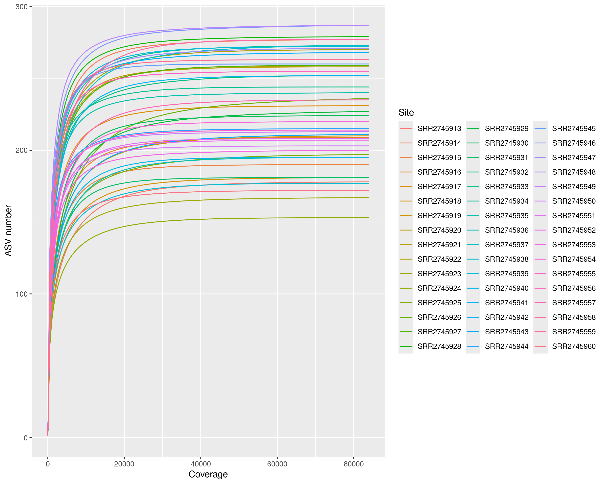
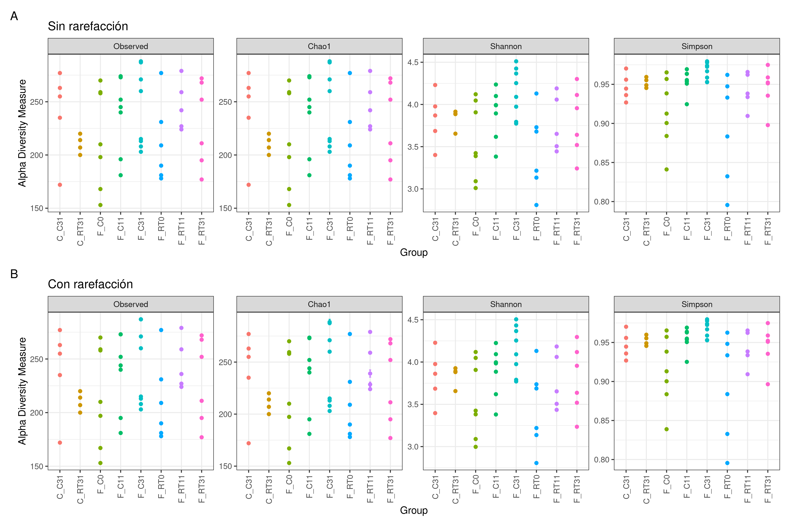
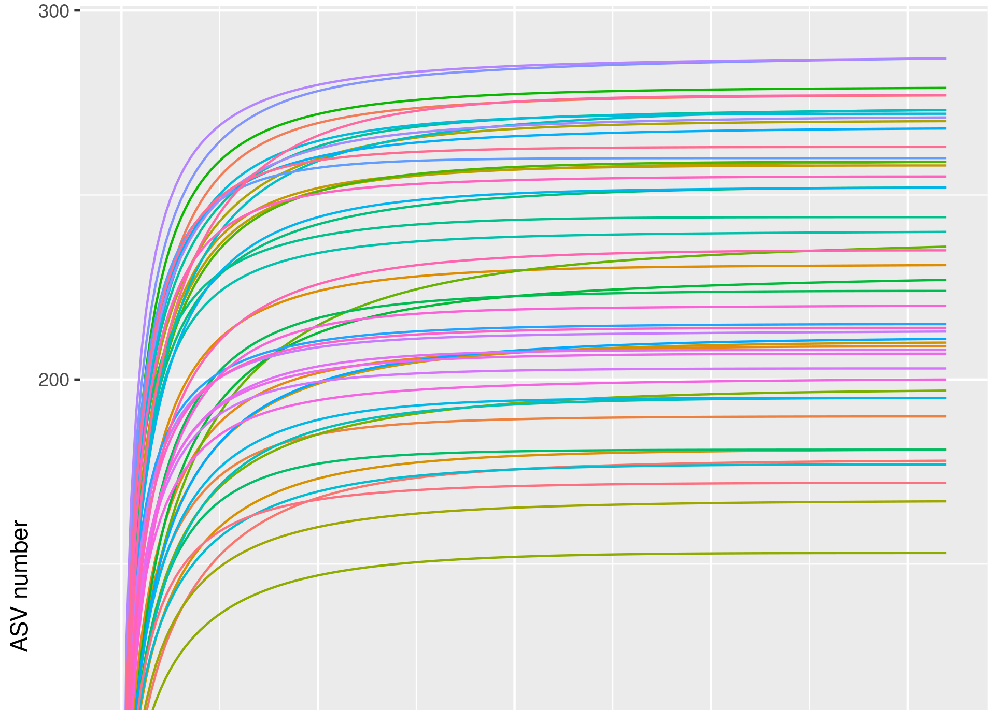

# Descripción del experimento

Analizaremos la influencia que ejerce el frío en la microbiota del intestino de ratones para así obtener una perspectiva de la interacción y coevolución de los huéspedes y la microbiota intestinal.

## Trasfondo

Las funciones microbianas en la fisiología del huésped son el resultado de la coevolución entre las comunidades microbianas y sus hospedadores. En este estudio se observa que la exposición al frío conduce a un marcado cambio en la composición de la microbiota, llamada microbiota fría.

El trasplante de la microbiota fría a ratones libres de gérmenes causa un aumento de la sensibilidad a la insulina del huésped, y lo dota de resitencia al frío. Esto impulsa el oscurecimiento de la grasa blanca, que conlleva a un mayor gasto energético y pérdida de grasa. Sin embargo, si la exposición al frío es prolongada la pérdida de peso disminuye, debido a mecanismos de adaptación que maximizan la absorción de calorías y aumentan la longitud de los intestinos, las vellosidades y las microvellosidades.

## Diseño experimental

Los ratones C57BL/6J fueron expuestos durante 31 días a frío (6°C) o a temperatura ambiente. Se recogieron heces frescas a dia 0, 11 y 31. También muestras de ciego en el día 31, que se congelaron y almacenaron inmediatamente.

El contenido de ADN bacteriano se extrajo usando el Mini Kit de ADN rápido en heces de QIAamp (Qiagen). El ADN bacteriano fue amplificado por PCR con primers bacterianos universales con código de barras dirigidos a la región variable V4 del gen 16S rRNA:

-   La secuencia del forward primer es 515F = 5′-GTGCCAGCMGCCGCGGTAA-3′(19 pares de bases)

-   La secuencia del reverse primer es 806R = 5′-GGACTACNVGGGTWTCTAAT-3′(20 pares de bases)

### Importación de datos y librerías

```{r loading_libraries , message=FALSE, cache=TRUE }
library(dada2)
library (ggplot2)
library(plotly)
library(DECIPHER) 
library(ShortRead)
library(Biostrings)
library(readr)
library("phyloseq") 
library("DESeq2")
library("tibble")  
library("dplyr")
library("tidyr")
library(openssl)
library("vegan") 
library("microbiome")
library("hrbrthemes")
library("RColorBrewer")
library("data.table")
library(digest)
library(patchwork)
library(knitr)
```

```{r loading_data}
load("ejercicioMicrobiomaPart2.RData")
```

# Procesado de lecturas usando DADA2

## Procesado de los .fastq crudos

Verificación de los fastq forward:

```{r checking_sequences , message=FALSE, cache=TRUE }
list.files(path="./fastq/", pattern =".1_1.fastq")
```

Creamos vectores con los archivos de las lecturas forward *fnFs*, reverse *fnRs* y los nombres de las muestras.

```{r selecting_files, message=FALSE, cache=TRUE}
# Archivos Forwards y Reverse
fnFs <- sort(list.files(path="./fastq", pattern=".1_1.fastq", full.names = TRUE))
fnRs <- sort(list.files(path="./fastq", pattern=".1_2.fastq", full.names = TRUE))

# Extraemos los nombres de las muestras:
sample.names <- sapply(strsplit(basename(fnFs), "\\."), `[`, 1)


cat("Lista de archivos con lecturas Forward (primeros 5):",
    paste(fnFs[1:5], collapse = "\n"), "\n\n",
    "Lista de archivos con lecturas Reverse (primeros 5):",
    paste(fnRs[1:5], collapse = "\n"), "\n\n",
    "Sample names:\n",
    sample.names)
```

## Tratado de Primers

Examinar las muestras para ver si tienen primers:

### Definir las secuencias de los primers

```{r primers, message=FALSE, cache=TRUE, eval=FALSE}
FWD <- "GTGCCAGCMGCCGCGGTAA"
REV <- "GGACTACNVGGGTWTCTAAT"

allOrients <- function(primer) {
    require(Biostrings)
    dna <- DNAString(primer)
    orients <- c(Forward = dna, 
                 Complement = Biostrings::complement(dna), 
                 Reverse = reverse(dna), 
                 RevComp = reverseComplement(dna))
    return(sapply(orients, toString))}

# Variables con un vector conteniendo las 4 posibilidades de forward y reverse
FWD.orients <- allOrients(FWD)
REV.orients <- allOrients(REV)
```

### Comprobar si los primers estan presentes en las lecturas:

```{r primer_countFunct, message=FALSE, cache=TRUE, eval=FALSE}
primerHits <- function(primer, fn) {
    # Contamos el numero de lecturas en las que aparece el primer
    nhits <- vcountPattern(primer, sread(readFastq(fn)), fixed = FALSE)
    return(sum(nhits > 0))}

# Observamos el contaje de primers para una lectura:
count <- rbind(
    FWD.ForwardReads = sapply(FWD.orients, primerHits, fn = fnFs[[5]]), 
    FWD.ReverseReads = sapply(FWD.orients, primerHits, fn = fnRs[[5]]), 
    REV.ForwardReads = sapply(REV.orients, primerHits, fn = fnFs[[5]]), 
    REV.ReverseReads = sapply(REV.orients, primerHits, fn = fnRs[[5]]))
```

```{r primer_count}
print(count)
```

Si tuvieramos que deshacernos de los primers usaríamos Cutadapt, pero en este caso no lo necesitamos porque nuestras lecturas no contienen primers.

## Filtrado de calidad de las lecturas

### Inspeccionar los perfiles de calidad

Usaremos la funcion `plotQualityProfile`, para hacer un análisis de calidad por posición y crearemos un único gráfico (con aggregate = TRUE) con los valores promedio de cada archivo.

**Lecturas Forward**

```{r forwardfilesquality, message=FALSE, cache=TRUE, eval=FALSE}
forwplot <- plotQualityProfile(fnFs[1:length(fnFs)], aggregate=TRUE) + 
                     geom_hline(yintercept=c(15,25,35),
                                color=c("red","blue","green"), linewidth=0.5)
```

```{r forwardplot}
forwplot
```

Vemos que las lecturas forward tienen una puntuación de calidad media bastante buena por lo general, en la posición 195 hay una recaída alta, pero no llega a la linea azul. Sin embargo pasada la posición **232** la calidad decae por debajo de nuestro limite de score de calidad, QS = 25 (línea azúl).

Puesto que no conviene tener esas partes de baja calidad para nuestro estudio, deberíamos cortar la parte final de las lecturas para eliminar estas zonas de baja calidad.

Por otro lado, se observa algo de baja calidad al inicio se podrían quitar bases iniciales para mejorar ésto también.

**Lecturas Reverse**

```{r reversefilesquality, warning = FALSE, message=FALSE, cache=TRUE, eval=FALSE}
revqplot <- plotQualityProfile(fnRs[1:length(fnRs)], aggregate=TRUE) + 
                     geom_hline(yintercept=c(15,25,35), 
                                color=c("red","blue","green"), size=0.5)
```

```{r reverseplot}
revqplot
```

El gráfico para las lecturas en reverse muestra una calidad general mucho más baja, que decae por debajo de la linea azúl en la posición **163**. Esto requiere que cortemos por el extremo final de las lecturas reverse antes de la posición donde decae de golpe la distribución de calidad.

Aunque hay que quitar un gran trozo de las secuencias, esto no debería suponer un problema puesto que estamos usando secuencias de 2x250 V4, con lo que las lecturas se superponen casi por completo. Es suficiente con que queden 20 pares de bases para que puedan solapar.

### Filtrado y recorte

Vamos a filtrar y recortar los fastq por calidad.

Filtramos con algunos parámetros por defecto: maxN=0 (DADA2 no requiere Ns), truncQ=0, rm.phix=TRUE.

Vamos a recortar los últimos nucleotidos de ambas lecturas para quitar el extremo final que tenía baja calidad. Estableceremos el punto de corte 3' de las lecturas forward y la reverse en 225 y 150 respectivamente con `truncLen = c(225,150)`. Y recortamos un poco los primeros nucleotdidos también con `trimLeft = c(7,5)` para quitar las lecturas bajas iniciales.

El parámetro maxEE establece el número máximo de "errores esperados" permitidos en una lectura, por lo que es mejor filtro que simplemente promediar las puntuaciones de calidad. Ya que en las lecturas reverse hay que cortar bastante, lo vamos a cambiar a un poco más laxo para éstas: `maxEE = (2,5)`.

```{r namefilterfiles, warning = FALSE, cache = TRUE}
filtFs <- file.path(".", "cutfiltered", paste0(sample.names, "_F_filt.fastq.gz"))
filtRs <- file.path(".", "cutfiltered", paste0(sample.names, "_R_filt.fastq.gz"))
names(filtFs) <- sample.names
names(filtRs) <- sample.names
```

```{r filtering, warning = FALSE, cache=TRUE, eval=FALSE}
out <- filterAndTrim(fnFs, filtFs, fnRs, filtRs, 
              maxN = 0,
              maxEE = c(2,5),
              trimLeft = c(7,5),
              truncLen = c(225,150), 
              truncQ = 0,
              rm.phix = TRUE, 
              compress = TRUE,
              multithread = TRUE)
out<- cbind(out, perc.cons = round(out[, "reads.out"]/out[, "reads.in"]*100, digits=2))
```

Observemos cuantas lecturas estamos perdiendo:

```{r totalreads Print, warning = FALSE, cache=TRUE}
head(out)
cat("Total de lecturas antes de filtrar:\n", sum(out[,1]),
  "\nTotal de lecturas despues de filtrar:\n", sum(out[,2]),
  "\nMedia de lecturas por muestra después de filtrar:\n", mean(out[, 2]))
```

Nos han quedado 6.8M de lecturas. Esto resulta en un promedio de \~142,350 lecturas por muestra. Lo cual debería ser suficiente para caracterizar la población ya que para estudios de microbioma se recomiendan entre 50,000-100,000 lecturas por muestra.

## Limpieza de replicaciones y ruido

### Calcular tasas de error

Para calcular las tasas de error se van a analizar las lecturas forward, alineandolas entre sí y mirando la probabilidad de que un nucleótido haya cambiado genuinamente y no por error. Después haremos lo mismo para las reverse. Ya que hay un rango de errores mayor en el reverse, con lo cual no sería de utilidad entrenar el modelo para ambos igual.

Con la siguiente función calculamos el número de bases a utilizar en el modelo para estimar errores. Este calculo lo hacemos en base a las lecturas totales que han sido filtradas. Algo esencial para estimar con precisión el modelo de errores de secuenciación.

```{r nbasescalc, cache = TRUE, eval=FALSE}
# Función para contar los nucleótidos
contar_nucleotidos <- function(archivos) {
  total_nucleotidos <- 0
  for (archivo in archivos) {
    fq <- readFastq(archivo)
    secuencias <- sread(fq)
    longitudes <- width(secuencias)
    total_nucleotidos <- total_nucleotidos + sum(longitudes)  }
  return(total_nucleotidos)}

nbases_filtRs <- contar_nucleotidos(filtFs)
nbases_filtFs <- contar_nucleotidos(filtRs)
```

DADA2 recomienda usar aproximadamente 1/4 de las bases para aprender el modelo de errores.

```{r nbases Results, cache = TRUE, eval=FALSE}
cat("Total de bases\n",
    "Lecturas forward (filtFs):", nbases_filtFs, "\n",
    "Lecturas reverse (filtRs):", nbases_filtRs, "\n")

nbases_learnFs = nbases_filtFs/4
nbases_learnRs = nbases_filtRs/4

cat("Bases a utilizar para estimación de errores\n",
    "Errores forward:", nbases_learnFs, "\n",
    "Errores reverse:", nbases_learnRs, "\n")
```

Aplicamos en `learnErrors` y calculamos las tasas de error:

```{r errForward_errReverse, cache = TRUE, eval=FALSE}
errF <- learnErrors(filtFs, multithread=TRUE, nbases=nbases_learnFs)
errR <- learnErrors(filtRs, multithread=TRUE, nbases=nbases_learnRs)
```

### Graficas de los modelos de error

Observaremos la calidad del alineamiento frente a la probabilidad de error para cada transición (A→C, A→G, etc.).

La linea negra representa el error estimado por el algoritmo. Mientras que la tasa de error esperada acorde al Q-score se muestra en rojo.

#### Tasa de error - Lecturas Forward

```{r ploterrorsF, message= FALSE, warning= FALSE, cache = TRUE}
plotErrors(errF, nominalQ=TRUE)
```

#### Tasa de error - Lecturas Reverse

```{r ploterrorsR, message= FALSE, warning= FALSE, cache = TRUE}
plotErrors(errR, nominalQ=TRUE)
```

Podemos ver que los resultados son muy buenos para ambas, lecturas forward y reverse, ya que la linea negra, que es el error estimado, se ajusta bien a los puntos, que son los ratios observados.

Por otro lado, el ratio de error cae ajustandose bastante a la línea roja a medida que la calidad aumenta, tal y como se espera.

### Inferencia sobre las muestras

Aplicamos el algoritmo de inferencia que corrige errores de secuenciación y elimina ruido:

```{r dadaF-R, warning=FALSE, cache=TRUE, eval=FALSE}
dadaFs <- dada(filtFs, err=errF, multithread=TRUE)
dadaRs <- dada(filtRs, err=errR, multithread=TRUE)
```

```{r save0, warning=FALSE, cache = TRUE, eval=FALSE}
save.image(file = "ejercicioMicrobiomaPart0.RData")
```

**Resultados:**

A continuación observamos los resultados de la inferencia de las dos primeras muestras de lecturas forward y reverse:

```{r dadaview, warning=FALSE, cache=TRUE}
output_dadaFs <- capture.output(dadaFs[1:2])
output_dadaRs <- capture.output(dadaRs[1:2])

cat("Resumen de inferencia\n",
    "FORWARD READS (primeras 2 muestras)\n",
    "-----------------------------------\n",
    paste(output_dadaFs, collapse = "\n"), "\n\n",
    "REVERSE READS (pimeras 2 muestras)\n",
    "-----------------------------------\n",
    paste(output_dadaRs, collapse = "\n"), "\n\n",
    "Total de muestras forward:", length(dadaFs), "\n",
    "Total de muestras reverse:", length(dadaRs))
```

Si cogemos la primera muestra forward vemos que hay una reducción de 21,643 → 388, esto significa que trás aplicar el algoritmo de DADA2, el programa identificó 388 variantes de secuencia reales (ASVs - Amplicon Sequence Variants). Estas variantes representan las secuencias biológicamente significativas después de filtrar los artefactos técnicos.

## Alineamiento

Unimos las lecturas forward y reverse para obtener las secuencias completas. Este algoritmo también calcula la frecuencia y la abundancia de ASVs por muestra.

```{r merging, message=FALSE, warning=FALSE, cache=TRUE, eval=FALSE}
mergers <- mergePairs(dadaFs, filtFs, dadaRs, filtRs, verbose=TRUE)
```

Esto resulta en una lista de dataframes por muestra. Los reads que no se han solapado bien son retirados por el algoritmo. Vamos a observar el merger data.frame de la primera muestra:

```{r mergertable, message=FALSE, warning=FALSE, cache=TRUE}
kable(head(mergers[[1]][, 2:9]), caption = "Vista de mergers columnas 2-9")
```

Con la siguiente función calculamos el porcentaje de éxito:

```{r stats, message=FALSE, warning=FALSE, cache=TRUE}
summaryMerge <- function(mergers) {
  success <- sapply(mergers, function(x) sum(x$abundance)) 
  total <- sapply(dadaFs, function(x) sum(x$denoised))
  # Calcular porcentaje de exito
  percent_merged <- round(100 * sum(success) / sum(total), 1)
  cat(paste0("Porcentaje de lecturas unidas: ", percent_merged, "%\n"))}

resultsmergers <- summaryMerge(mergers)
```

Vemos que no ha habido mucha perdida y la mayoría de las lecturas se han unido como esperabamos.

## Construir ASV

Ahora podemos contruir la tabla de variantes de secuencia de amplicones o tabla ASV (amplicon sequence variant).

```{r seqtable , warning = FALSE, cache = TRUE}
seqtab <- makeSequenceTable(mergers)
dim(seqtab)
```

Hemos obtenido una tabla con 48 filas y 7407 columnas de las ASVs, esto es lo que se llama la tabla de características (feature table).

## Pasos de filtrado de las ASVs

### Filtrado por longitud

A continuacion observamos la distribución de longitudes de las secuencias fusionadas (ASVs) en la tabla `seqtab`:

```{r inspecttable, warning = FALSE, cache = TRUE}
table(nchar(getSequences(seqtab)))
```

En la primera fila vemos las longitudes en pares de bases (bp) de las secuencias.\
En la segunda fila vemos cuántas ASVs tienen esa longitud específica.

Observamos que la mayoría de las secuencias (3514 + 3750 = 7264 de 7407, \~98%) tienen longitudes de 240-241pb, lo cual está dentro de las longitudes típicas reportadas para la región V4 que suelen estar en el rango de 240-255 pb.

Las pocas secuencias con longitudes significativamente bajas podrían ser secuencias de baja calidad o artefactos de PCR. Con lo cual vamos a filtrar por tamaño y eliminar las secuencias en menor cantidad y así mantener el rango con mayor probabilidad de ser biológicamente relevante. Filtremos y veamos la distribución después del filtrado (240-241 bp):

```{r filteringseq, warning = FALSE, cache = TRUE}
seqtab <- seqtab[,nchar(colnames(seqtab)) %in% 240:241]
table(nchar(getSequences(seqtab)))
```

### Eliminación de quimeras

Vamos a eliminar las posibles quimeras que se hayan producido durante el PCR.

```{r chimeras, warning=FALSE, cache=TRUE, eval=FALSE}
seqtab.nochim <- removeBimeraDenovo(seqtab, method="consensus", 
                                    multithread=TRUE, verbose=TRUE)
```

```{r chimerasresults, warning=FALSE, cache=TRUE }
# Porcentaje de ASVs eliminadas (quimeras)
asv_quimeras <- ncol(seqtab) - ncol(seqtab.nochim)
porcentaje_quimeras_asvs <- (asv_quimeras / ncol(seqtab)) * 100
ret_quimeras <- sum(seqtab.nochim) / sum(seqtab) * 100

cat("Dimensiones iniciales de la tabla de ASVs:\n", dim(seqtab),
    "\nDimensiones tras quitar las quimeras:\n", dim(seqtab.nochim),
    "\nPorcentaje de ASVs quiméricas eliminadas:\n", sprintf("%.1f %%\n",
                                                             porcentaje_quimeras_asvs),
    "Porcentaje de lecturas retenidas (no quiméricas):\n", sprintf("%.1f %%\n",
                                                                   ret_quimeras))
```

Estos resultados muestan que debido a una distribución desigual de abundancia (donde unas pocas ASVs dominan, mientras que la mayoría son raras) de 7,264 ASVs iniciales hemos pasado a 1,191 ASVs retenidas. Eliminando 6,073 ASVs quiméricas (83.6%), pero sin embargo perdiendo solo un \~9.4% de lecturas totales. Indicando que las secuencias quiméricas eliminadas eran numerosas en variantes pero escasas en abundancia.

### Filtrado por abundancia y prevalencia

Para quitar las ASVs menos abundantes, que representan poblaciones minoritarias que podrían no tener impacto en la comunidad, se recomienda reducir las lecturas con un numero de secuencias por debajo de la milesima parte de la media de secuencias por muestra.

El filtrado por prevalencia quita las ASVs que no aparecen en al menos 3 muestras.

La siguiente función calcula y hace estos filtrados:

```{r filtrado_abundancia}
filter_asvs_by_abundance_and_prevalence <- function(
    asv_table, min_total_abundance, min_sample_presence) 
  {
  col_abundance <- colSums(asv_table)
  col_prevalence <- colSums(asv_table > 0)
  keep_columns <- (col_abundance >= min_total_abundance) & 
                  (col_prevalence >= min_sample_presence)
  # Subconjunto del ASV table
  filtered_table <- asv_table[, keep_columns, drop=FALSE]
  return(filtered_table)}
```

Aplicamos la funcion:

```{r aplicar_filtrando_abundancia}
mean_reads <- mean(rowSums(seqtab.nochim))
min_abundance <- round(mean_reads / 1000, 0)  # umbral de abundancia
min_prevalence <- 3                           # prevalencia minima

seqtab.nochimfiltered <- filter_asvs_by_abundance_and_prevalence(
  seqtab.nochim,
  min_total_abundance = min_abundance,
  min_sample_presence = min_prevalence)
```

```{r resultados_filtrando_abundancia}
ret_filtrado <- sum(seqtab.nochimfiltered) / sum(seqtab.nochim) * 100
cat("Porcentaje de lecturas retenidas tras filtrado por abundancia y prevalencia:\n",
    sprintf("%.1f %%\n", ret_filtrado))
```

## Evaluación de lecturas

Contamos todas las secuencias que hemos ido analizando en cada paso y cuantas hemos ido perdiendo para obtener una tabla resumen:

```{r track}
# Función para contar ASVs únicas
getN <- function(x) sum(getUniques(x))

# Añadir más columnas al track
track$input <- out[, 1]
track$filtered <- out[, 2]
track$denoisedF <- sapply(dadaFs, getN)
track$denoisedR <- sapply(dadaRs, getN)
track$merged <- sapply(mergers, getN)

# Reordenar columnas y agregar post filtrado
track <- track[, c("input", "filtered", "denoisedF", "denoisedR", "merged")]
track$nonchim <- rowSums(seqtab.nochim)
track$filter2 <- rowSums(seqtab.nochimfiltered)

# Calcular porcentaje de secuencias conservadas
track$PorcTOTAL <- round(with(track, filter2 / input * 100), 2)

# Asignar nombres de fila
rownames(track) <- sample.names

print(track)
```

En la última columna se puede apreciar el porcentaje total de lecturas retenidas. Vamos a graficar los resultados de inicio y fin:

```{r plot_table_resutls, warning=FALSE, cache = TRUE}
track_long <- track %>% 
  select(input, filter2, PorcTOTAL) %>%  
  mutate(Muestra = rownames(.)) %>%
  pivot_longer(cols = c(input, filter2)) %>%
  mutate(name = factor(name, levels = c("input", "filter2")))

ggplot(track_long, aes(x = Muestra, y = value, fill = name)) +
  geom_bar(stat = "identity", position = "dodge") +
  scale_y_continuous(labels = scales::comma) +
  labs(title = "Comparación de lecturas iniciales vs finales",
       y = "Número de lecturas", 
       x = "Muestra",
       fill = "Tipo") + 
  scale_fill_discrete(labels = c("Input", "Filtrado final")) +  
  theme_minimal() +
  theme(axis.text.x = element_text(angle = 90, hjust = 1, size = 6),
        legend.position = "top")
```

Vemos que se han obtenido buenos resultados, mantenido un porcentaje alto para la mayoría de lecturas crudas. Tambien se ha observado la tabla entera con cuidado y observado que no hay caidas muy grandes asociadas con un paso concreto. Para la mayoría de lecturas retenemos un 70-80% mientras que para unas pocas lecturas reducimos a un 50-60%.

## Exportar secuencias

Vamos a codificar las secuencias con `hashes MD5` para comprimirlas y exportar las secuencias finales, ya filtradas:

```{r export_resutls, warning=FALSE, cache = TRUE}
seqtab.nochimfilteredmd5<-seqtab.nochimfiltered
sequencesfiltered<-colnames(seqtab.nochimfilteredmd5)
sequencesfilteredmd5<-md5(sequencesfiltered)
colnames(seqtab.nochimfilteredmd5)<-sequencesfilteredmd5
write.table(t(seqtab.nochimfilteredmd5), "seqtab-nochimfiltered.txt", sep="\t",
            row.names=TRUE, col.names=NA, quote=FALSE)
uniquesToFasta(seqtab.nochimfiltered, fout='rep-seqs_filtered.fna',
               ids=sequencesfilteredmd5)
```

```{r save1, warning=FALSE, cache = TRUE, eval=FALSE}
save.image(file = "1.RData")
```

# Asignación Taxonómica y Alineamiento

La libreria DECIPHER tiene muchas funciones para asignar relaciones filogenéticas y realizar asitnaciones taxonómicas para ASVs. Comenzamos con el alineando:

## Alineamiento de ASVs

Alineamos los ASVs resultantes:

```{r aligningsequences, warning=FALSE, cache=TRUE, eval=FALSE}
nproc<-4
seqs <- readDNAStringSet("./rep-seqs_filtered.fna")
alignment <- AlignSeqs(DNAStringSet(seqs), anchor=NA, processors=nproc)
writeFasta(alignment, "asvalignment.fasta")
```

## Arbol filogenético

Vamos a estimar un arbol filogenético (asv.tre) con el alineamiento que hemos producido.

```{r fasttree, warning=FALSE, cache=TRUE, eval=FALSE}
FastTree <- "/home/metag/miniconda3/bin/FastTree"
fasttree_args <- "-gtr -nt asvalignment.fasta > asv.tre"

system2(FastTree, args = fasttree_args)
```

## Asignación taxonómica con DADA2

Descargamos desde el siguiente [link](https://zenodo.org/records/4587955) los archivos de entrenamiento y asignación de especies de "Silva Project's version 138.1"

Hacemos la asignación taxonómica con la funcion `assignTaxonomy`:

```{r SILVA, warning=FALSE, cache=TRUE, eval=FALSE}
# Leemos las secuencias con la funcion dedicada `getSequences`
repseqs <-getSequences("./rep-seqs_filtered.fna")

# Generamos taxaSILVA a través de `assignTaxonomy` que es compatible con DADA
taxaSILVA <- assignTaxonomy(repseqs, 
                            "silva_nr99_v138.1_train_set.fa.gz", multithread=TRUE)
unname(head(taxaSILVA))  

# Aumentamos la resolucion a nivel de especies con `addSpecies`
taxaSILVA.plus <- addSpecies(taxaSILVA, 
                             "silva_species_assignment_v138.1.fa.gz", verbose=TRUE)
colnames(taxaSILVA.plus) <- c("Kingdom", "Phylum", "Class", 
                              "Order", "Family", "Genus","Species")

# Cambiamos los valores nulos (NA) por el ultimo nivel de asignacion añadiendo "Uncl\_"
unname(head(taxaSILVA.plus))
taxaSILVA.plus <- as.data.frame(taxaSILVA.plus) %>% mutate (
  Kingdom= if_else(is.na(Kingdom), "Unclassified", Kingdom),
  Phylum=if_else(is.na(Phylum), paste("Uncl_", Kingdom,""), Phylum),
  Class= if_else(is.na(Class),
                 if_else(grepl("Uncl_", Phylum), Phylum, paste("Uncl_", Phylum,"")), 
                  Class),
  Order= if_else(is.na(Order), 
                 if_else(grepl("Uncl_", Class), Class, 
                         paste("Uncl_", Class,"")), Order),
  Family= if_else(is.na(Family), 
                 if_else(grepl("Uncl_", Order), Order, 
                         paste("Uncl_", Order,"")), Family),
  Genus= if_else(is.na(Genus), 
                 if_else(grepl("Uncl_", Family), Family, 
                         paste("Uncl_", Family,"")), Genus),
  Species= if_else(is.na(Species), 
                 if_else(grepl("Uncl_", Genus), Genus, 
                         paste("Uncl_", Genus,"")), paste(Genus,Species, sep=" ")))

# Cambiamos los nombres de las filas con las secuencias codificadas con md5
row.names(taxaSILVA.plus) <- md5(row.names(taxaSILVA.plus))
```

```{r save2, warning=FALSE, cache = TRUE, eval=FALSE}
save.image(file = "ejercicioMicrobiomaPart2.RData")
```

# Analisis de los datos con Phyloseq

Phyloseq se basa en el objeto con el mismo nombre que contiene toda la información del experimento: las ASVs y sus abundancias, la asignación taxonómica, el arbol filogenético y la tabla de metadatos.

## Modificación de los metadatos

Sería interesante observar los cambios de la microbiota entre exposiciones agudas o prolongadas al frío. Con lo cual vamos a crear una nueva columna en los metadatos que contenga esta información. Considerando como agudo el dia 0 y prolongado los días 11 y 31. Como hay un desbalance entre la cantidad de replicas, hay que tener cuidado al analizarlos para no sesgar las estimaciones.

```{r metadata}
metadata <- read_tsv("metadata", show_col_types = FALSE)

metadata <- metadata %>%
  mutate(exposure_time = case_when(
      Collection_Day == "Day_0" ~ "Agudo",
      Collection_Day %in% c("Day_11", "Day_31") ~ "Prolongado"))
```

## Crear objeto `phyloseq`

```{r creating phyloseq}
seqs <- readDNAStringSet("./rep-seqs_filtered.fna")
TAX <- tax_table(as.matrix(taxaSILVA.plus))
asvtree <- read_tree("asv.tre")
OTU <- otu_table(t(seqtab.nochimmd5), taxa_are_rows = TRUE)
OTUFilt <- otu_table(t(seqtab.nochimfilteredmd5), taxa_are_rows = TRUE)

physeq <- phyloseq(OTU, TAX, phy_tree(asvtree),
                sample_data(metadata %>% as.data.frame() %>%
                              column_to_rownames("#SampleID")))
physeq

physeqfilt <- phyloseq(OTUFilt, TAX, phy_tree(asvtree),
                sample_data(metadata %>% as.data.frame() %>%
                              column_to_rownames("#SampleID")))
physeqfilt
```

Vemos que se obtiene el mismo resultado para physeq y physeqfilt. Esto puede deberse a que ya hemos hecho un buen filtrado por abundancia y prevalencia antes de crear el árbol.

## Resumen general

```{r summaryphyloseq, cache=TRUE}
summarize_phyloseq(physeqfilt)
```

En el resumen podemos observar lo siguiente:

| Métrica | Resultado | Observaciones |
|---------------------|------------------|----------------------------------|
| Min. número de lecturas | 83,919 | Todas las muestras tienen suficiente profundidad |
| Max. número de lecturas | 258,300 | Esto parece un buen rango, indicando que no hay outliers extremos |
| Total de lecturas | 5,730,968 | Buena cantidad de datos |
| Promedio de lecturas | \~119,395 | Apropiado para análisis |
| Mediana de lecturas | \~113,857 | Es similar al promedio, indicando una distribución equilibrada |
| Porcentaje de singletons | 0% | ️No hay singletns, se eliminaron durante el filtrado |

## Filtrado del objeto phyloseq a nivel de taxones

Con ratones libres de gérmenes y microbiota transplantada podemos observar contaminaciones de ASVs asignadas a mitocondrias que podían provenir del huésped. Vamos a mirar que reinos hay:

```{r reinos, cache=TRUE}
reinos_unicos <- unique(taxaSILVA.plus$Kingdom)
reinos_unicos
```

Vemos que solo existe el reino de Bacteria. Así que no es necesario hacer este filtrado.

## Curvas de Rarefacción

Con las curvas de rarefacción vemos si los ASVs que tenemos son representativos de toda la población. Sabemos que el promedio de lecturas es alrededor de 119,395:

```{r rarefaction curve, cache=TRUE, warning=FALSE, eval=FALSE}
rarefactioncurve <- rarecurve(as.data.frame(t(otu_table(physeqfilt))), 
                              step=300, cex=0.5, tidy=TRUE)

plotrarefaction <- ggplot(rarefactioncurve, aes(Sample, Species)) + 
  geom_line(aes(color=Site)) +
  xlab("Coverage") + ylab("ASV number")

ggsave("rarefaction_plot.png", plot = plotrarefaction, width = 10, 
                               height = 8, dpi = 300)
```

{fig-alt="Curvas de rarefacción"}

Podemos observar que las curvas llegan a una asíntota, demostrando que hay suficientes lecturas para describir la diversidad.

## Plot de taxonomía

Vamos a mirar el comportamiento de la asignacion taxonómica.

### Preparación de datos

Usando la funcion `aggregate_rare` agregamos taxones raros, que tengan baja abundancia (\<5% del total) y prevalencia por debajo del 25% para que al plotear se muestren juntos como "Other".

```{r agreggate_taxa, cache=TRUE}
# convertir valores a frecuencias
physeq.agg <- aggregate_rare(physeqfilt %>% 
                              transform(transform="compositional"), 
                              level="Family", detection =0.005, prevalence=0.25)
```

## Composición Taxonómica

Veamos la composición taxonómica acorde a la muestra, día de recogida y temperatura:

```{r taxonomyplot, , cache=TRUE, warning=FALSE, eval=TRUE}
# División por TEMPERATURA y DÍA DE RECOGIDA
getPalette <- colorRampPalette(brewer.pal(12, "Paired"))  
PhylaPalette <- getPalette(length(unique(tax_table(physeq.agg)[, "Family"])))

# Transformar y preparar los datos
plot_data <- physeq.agg %>%
  transform(transform = "compositional") %>%
  psmelt() %>%
  group_by(Day_Temp, Family) %>%
  summarise(Abundance = mean(Abundance), .groups = "drop") %>%
  # Convertir 'Family' en factor y mover "Other" al final
  mutate(
    Family = factor(
    Family, levels = c(sort(unique(Family)[unique(Family) != "Other"]), "Other")))

# Crear el gráfico
taxcompplot <- ggplot(plot_data, aes(x = Day_Temp, y = Abundance, fill = Family)) +
  geom_bar(stat = "identity", position = "fill") +
  scale_y_continuous(labels = scales::percent, name = "Relative Abundance") +
  scale_fill_manual(values = PhylaPalette, name = "Family") +
  labs(x = "Sample Group (Tissue + Day + Temperature)") +
  theme_minimal() +
  theme(
    axis.text.x = element_text(angle = 45, hjust = 1, size = 8),
    legend.position = "right",
    legend.text = element_text(size = 6))

ggsave("taxcompplot.png", plot = taxcompplot, width = 10, 
                          bg = "white", height = 8, dpi = 200)
```

{fig-alt="Composición taxonómica"}

Podemos observar cambios en varios grupos de microbiota presente en temperatura ambiente vs frío.

En condiciones de frío prolongadas (días 11 y 31) para las muestras de heces vemos una disminución drástica de Akkermansiaceae y Muribaculaceae. Las Bacteroidaceae también se ven reducidas pero a largo plazo (día 31), pero con en el caso de exposición al frío de forma más abrupta.

Por otro lado, vemos un aumento considerable, en condiciones de frío prolongadas, de Lachnospiraceae, Oscillospiraceae, y Deferribacteraceae, y en pequeño número las Ruminococcaceae y Uncl_Clostridia vandinBB60. Mientras que a temperatura ambiente sus poblaciónes se mantienen estables.

Y para las muestras del ciego, solo para condiciones de frio muy prolongadas vemos un aumento de las Prevotellaceae. Mientras que a temperatura ambiente aumentan las Uncl_Clostridia UCG y las presentes en el grupo "Otros".

Vamos a hacer un análisis más detallado de esto.

## Análisis de Diversidad

Ahora vamos estudiar la diversidad de las muestras con el alpha diversidad y la beta diversidad.

### Rarefacción

Lo primero es hacer una rarefacción con la misma profundidad. Debido a que la profundidad de secuenciación puede variar mucho entre muestras, esto causa problemas de riqueza de especies y comparabilidad. Para eso esta técnica de submuestreo equilibra las muestras al mismo numero de lecturas.

```{r rarefaction, cache=TRUE, warning=FALSE, eval=FALSE}
set.seed(1000)
physeqbacrare <- rarefy_even_depth(
  physeqfilt, sample.size = min(sample_sums(physeqfilt)), rngseed = 1000)
```

```{r rarefactionprint, cache=TRUE, warning=FALSE, eval=FALSE}
physeqbacrare
cat("\nSe han reducido las lecturas a:\n", unique(sample_sums(physeqbacrare)))
```

Observemos las curvas de rarefacción:

```{r rarefied rarefaction curve, cache=TRUE, warning=FALSE, eval=FALSE}
rarefactioncurverare <- rarecurve(as.data.frame(t(
  otu_table(physeqbacrare))), step=500, cex=0.5, tidy=TRUE)
plotrarefactionrare <- ggplot(rarefactioncurverare, aes(Sample, Species)) + 
  geom_line(aes(color=Site)) +
  xlab("Coverage") + ylab("ASV number")

ggsave("rarefcurves.png", plot = plotrarefactionrare, width = 10, 
                               height = 8, dpi = 300)
```

{fig-alt="Curvas de rarefacción reducidas"}

Ahora tenemos todas las lecturas con la misma cobertura y además vemos que todas han alcanzado la asíntota.

## Diversidad Alpha

Usamos la funcion `plot_richness` para estimar la riqueza de las muestras. Los indices que usaremos son:

1.  Observado: medimos la riqueza absoluta (taxones únicos por meustra).
2.  Chao1: estimación de la riqueza real incluyendo taxones raros (no observados).
3.  Shanon (H'): mide la diversidad de la comunidad considerando riqueza y equitatividad (distribución de abundancia entre taxones).
4.  Simpson (1-D): mide la diversidad de la comunidad haciéndo énfasis en los taxones más abundantes.

Con la siguiente función vamos a transformar los nombres de "Day_Temp" en la tabla de metadatos para que se adapten mejor a los plots:

```{r nombres, cache=TRUE}
# Función para convertir nombres largos a cortos
convert_names <- function(x) {x %>%
    gsub("feces_Day_([0-9]+)_room temperature", "F_RT\\1", .) %>%
    gsub("feces_Day_([0-9]+)_cold", "F_C\\1", .) %>%
    gsub("cecum_Day_([0-9]+)_room temperature", "C_RT\\1", .) %>%
    gsub("cecum_Day_([0-9]+)_cold", "C_C\\1", .)}

# Copia de phyloseq
physeq_short <- physeqfilt
physeq_shortRare <- physeqbacrare

# Aplicar los cambios a la copia
sample_data(physeq_short)$Day_Temp <- convert_names(
  sample_data(physeq_short)$Day_Temp)
sample_data(physeq_shortRare)$Day_Temp <- convert_names(
  sample_data(physeq_shortRare)$Day_Temp)

# Definir el orden de Day_Temp
order <- levels(factor(sample_data(physeq_shortRare)$Day_Temp))

# Aplicar este orden a ambos phyloseq objects
sample_data(physeq_short)$Day_Temp <- factor(
  sample_data(physeq_short)$Day_Temp, levels = order)
sample_data(physeq_shortRare)$Day_Temp <- factor(
  sample_data(physeq_shortRare)$Day_Temp, levels = order)
```

Calculo de riqueza y diversidad:

```{r richness, cache=TRUE, warning=FALSE, eval=FALSE}
# Seleccionar medidas de diversidad alpha
divIdx = c("Observed", "Chao1", "Shannon", "Simpson")

alphaplot <- plot_richness(physeq_short, x = "Day_Temp", measures = divIdx, 
                           color = "Day_Temp", nrow = 1) + 
    geom_point(size = 0.8) + theme_bw() + 
    theme(legend.position = "none", 
          axis.text.x = element_text(angle = 90, vjust = 0.5, hjust = 1)) + 
    labs(x = "Group", y = "Alpha Diversity Measure") +
    ggtitle("Sin rarefacción")

alphaplotrare <- plot_richness(physeq_shortRare, x = "Day_Temp", 
                               measures = divIdx, color = "Day_Temp", nrow = 1) + 
    geom_point(size = 0.8) + theme_bw() + 
    theme(legend.position = "none", 
          axis.text.x = element_text(angle = 90, vjust = 0.5, hjust = 1)) + 
    labs(x = "Group", y = "Alpha Diversity Measure") +
    ggtitle("Con rarefacción")

# Plot combinado
combined_plot <- (alphaplot / alphaplotrare) + 
  plot_annotation(tag_levels = 'A') + 
  plot_layout(guides = 'collect')

# Exportar a archivo
ggsave("alpha_diversity_plot.png", combined_plot, width = 12, height = 8, dpi = 300)
```

{fig-alt="Diversidad Alpha"}

Vemos que no hay apenas diferencias entre las muestras antes y despues de la rarefacción Esto significa que la rarefacción no ha introducido sesgos importantes en nuestros resultados. Con lo cual vamos a oservar los datos a continuación a partir del objeto `physeq_shortRare`.

Por otro lado, vemos ciertas diferencias entre las muestras de ratones expuestos a temperatura ambiente - RT(room temperature) y los expuestos a frío - C(cold). La riqueza absoluta (Observed) de las muestras de ratones expuestos a frío se ve en aumento según pasan los días. Mientras que la de ratones a temperatura ambiente aumenta el día 11 y disminuye a día 31.

El plot del índice de Shannon también muestra ciertas tendencias, pero como nos interesa la diversidad vamos a ver más en detalle estos resultados:

```{r shannon index, cache=TRUE}
shannonplot <- plot_richness(physeq_shortRare, x = "Day_Temp", measures = "shannon", 
                             color = "Day_Temp", nrow = 1) + 
    geom_boxplot() + theme_bw() + 
    theme(legend.position = "none", 
          axis.text.x = element_text(angle = 90, vjust = 0.5, hjust = 1)) + 
    labs(x = "Group", y = "Shannon Index")

shannonplot$data$Day_Temp <- factor(shannonplot$data$Day_Temp, 
                                    levels = levels(
                                      factor(sample_data(physeq_shortRare)$Day_Temp)))
shannonplot
```

A simple vista se puede apreciar que hay un aumento de diversidad según pasan los días. Pero se observa un mayor aumento de diversidad en las muestras fecales de ratones con exposición prolongada al frío (F_C11 -\> Cold/Frio, día 11; F_C31 -\> día 31) comparado con las muestras a temperatura ambiente de esos días (RT-room temperature).

## Análisis de Diversidad Beta

Ya que hemos visto que las diferencias más marcadas son en las muestras fecales, vamos a hacer un filtrado de las muestras para quitar las muestras de ciego:

```{r metadatamod2}
metadata_feces <- metadata %>% filter(source_name == "feces")

# Filtrar `phyloseq`
feces_samples <- metadata_feces$`#SampleID`
physeq_feces <- prune_samples(
  sample_names(physeq_short) %in% feces_samples, physeq_short)
```

Vamos a usar la funcion `plot_ordination` en las muestras seleccionadas para analizar la diversidad beta. En los grafos resultantes la separación de colores y grupos sera por temperatura, mientras que las formas mostrarán el tiempo de exposición corto(agudo) y prolongado:

```{r beta diversity rarefied, results='hide', message=FALSE, cache=TRUE, warning=FALSE}
ordinationbrayrare <- ordinate(physeq_feces, method="PCoA", distance="bray")
ordinationWUFrare <- ordinate(physeq_feces, method="PCoA", distance="wunifrac")
ordinationNMDSbrayrare <- ordinate(physeq_feces, method="NMDS", distance="bray")
ordinationNMDSWUFrare <- ordinate(physeq_feces, method="NMDS", distance="wunifrac")
```

```{r beta diversity render, cache=TRUE, message=FALSE}
plotordinationbrayrare<-plot_ordination(
  physeq_feces, ordinationbrayrare, 
  color="temperature", shape = "exposure_time") +
  geom_point(size=2) + stat_ellipse(aes(group = temperature), type = "t") +
  theme_bw() + labs(title = "Rarefied Bray Curtis PCoA")

plotordinationWUDrare<-plot_ordination(
  physeq_feces, ordinationWUFrare, 
  color="temperature", shape = "exposure_time") + 
  geom_point(size=2) + stat_ellipse(aes(group = temperature), type = "t") +
  theme_bw() + labs(title = "Rarefied Weighted Unifrac PCoA")

plotordinationbrayNMDSrare<-plot_ordination(
  physeq_feces, ordinationNMDSbrayrare, 
  color="temperature", shape = "exposure_time") +
  geom_point(size=2) + 
  theme_bw() + labs(title = "Rarefied Bray Curtis NMDS")

plotordinationWUDNMDSrare<-plot_ordination(
  physeq_feces, ordinationNMDSWUFrare, 
  color="temperature", shape = "exposure_time") +
  geom_point(size=2) + 
  theme_bw() + labs(title = "Rarefied Weighted Unifrac NMDS")
```

```{r beta diversity plot1, cache=TRUE, message=FALSE, warning=FALSE}
plotordinationbrayrare
```

Observamos que el Bray Curtis PCoA hay solapamiento de los grupos cold y room temperature con respecto a tiempo de exposición y temperatura. Por otro lado también vemos que tan solo un 38.7% y 11% de variabilidad está explicado en estos ejes. Esto puede ser debido a que hay algunas diferencias basadas en temperatura entre nustras muestras pero no son completamente distintas.

```{r beta diversity plot2, cache=TRUE, message=FALSE, warning=FALSE}
plotordinationWUDrare
```

En el caso del Wighted UniFrac PCoA, el primer eje explica el 80.4% de la variabilidad y aún así hay solapamiento. Esto puede indicar que la mayoría de diferencias entre las muestras están relacionadas con la filogenia y la abundancia pero no son diferencias drásticas.

```{r beta diversity plot3, cache=TRUE, message=FALSE}
plotordinationbrayNMDSrare
plotordinationWUDNMDSrare
```

En NMDS Bray vemos que los ratones cold con tiempo prolongado se agrupan hacia la derecha, lo que peude indicar un efecto acumulativo del frío con el tiempo sobre la microbiota. En NMDS Weighted UniFrac confirmamos lo anterior.

En conclusión: hay cierta separación entre los grupos de ratones expuestos a frío vs. temperatura ambiente a largo plazo. Esto implica que la temperatura afecta la composición de la microbiota fecal, y los ratones de cada grupo (frío vs. ambiente) tienen comunidades microbianas distintas, lo que podría deberse a adaptaciones metabólicas, cambios en la ingesta de alimento o respuestas fisiológicas al frío.

## Análisis de Enriquecimiento

Vamos a separar las muestras del día 0 y día 31 para ratones expuestos a frío para después hacer un analisis diferencial de abundancia con la función `DESeq2`.

```{r filter}
physeq_cold <- subset_samples(
  physeq_shortRare, temperature == "cold" & Collection_Day %in% c("Day_0", "Day_31"))
physeq_cold
```

Ya que este analisis es de abundancias relativas, vamos a realizar otro filtrado para quitar señales potencialmente irrelevantes o artefactuales:

```{r filterabundance}
filtersamp <- genefilter_sample(physeq_cold, 
                                filterfun_sample(function(x) x > 5), 
                                A = 0.5 * nsamples(physeq_cold))
physeq_cold <- prune_taxa(filtersamp, physeq_cold)
physeq_cold
```

Paso 1 del analisis: Convertir a objeto DESeq2

```{r DESeq, cache=TRUE, warning=FALSE, eval=FALSE}
cold_dds <- phyloseq_to_deseq2(physeq_cold, ~ Collection_Day)
cold_dds <- DESeq(cold_dds, test = "Wald", fitType = "parametric")
```

Paso 2: Extraer resultados con contrastes acorde al día de recogida (Collection_Day), con numerador (primer nivel) "Day_31" y denominador (grupo de referencia) "Day_0". Así podemos ver cómo cambia la microbiota en Day_31 respecto al inicio (Day_0).

```{r results}
# Extraer resultados
res_cold <- results(cold_dds, 
                    contrast = c("Collection_Day", "Day_31", "Day_0"), 
                    cooksCutoff = FALSE)

# Vamos a guardar los datos significativos solo
alpha <- 0.01
sig_cold <- res_cold[which(
  res_cold$padj < alpha & abs(res_cold$log2FoldChange) >= 1), ]
  sig_cold <- cbind(as(sig_cold, "data.frame"), # Añadimos asignación taxonómica
                    as(tax_table(physeq_cold)[rownames(sig_cold), ], "matrix"))
head(sig_cold)
```

Finalmente, hemos creado una tabla con las familias y los filos que contiene la abundancia diferencial: Valores positivos → Enriquecidas en Día 31. Valores negativos → Disminuidas en Día 31.

Vamos a visualizar estos resultados:

```{r visualizacion}
# Ordenar por Phylum y Family
sig_cold$Phylum <- factor(sig_cold$Phylum, levels = names(sort(tapply(
  sig_cold$log2FoldChange, sig_cold$Phylum, mean), decreasing = TRUE)))

sig_cold$Family <- factor(sig_cold$Family, levels = names(sort(tapply(
  sig_cold$log2FoldChange, sig_cold$Family, mean), decreasing = TRUE)))

# Gráfico
ggplot(sig_cold, aes(x = log2FoldChange, y = Family, color = Phylum)) +
  geom_point(size = 3) +
  geom_vline(xintercept = c(-1, 1), linetype = "dashed", color = c("red", "green")) +
  labs(x = "log2(Fold Change) Día 31 vs Día 0", y = "Familia", 
       title = "Enriquecimiento de Familias Bacterianas en Frío") +
  theme_bw() +
  theme(axis.text.y = element_text(face = "italic", size = 10))
```

Se puede observar que la exposición prolongada al frío (Day_31) induce cambios significativos en la microbiota fecal con un patrón claro de enriquecimiento/disminución de taxones bacterianos. Se observa una dominancia de bacterias Firmicutes y una reducción de la mayor parte de las Bacteroidotas. Esto puede indicar una adaptación hacia un perfil metabólico más eficiente en condiciones de estrés térmico.

```{r save3, warning=FALSE, cache = TRUE, eval=FALSE}
save.image(file = "ejercicioMicrobiomaPart3.RData")
```

# Cuestionario sobre los resultados obtenidos

### **Pregunta 1:** ¿Con cuántas muestras se ha realizado el estudio?

-   48 muestras
-   7686994 lecturas

### **Pregunta 2:** ¿Cuál de las condiciones experimentales que expongo abajo presenta un mayor número de réplicas?

-   Heces de ratones crecidos en frío 31 días

### **Pregunta 3:** ¿Qué parámetros habéis tenido que fijar en la función filterAndTrim?¿En qué os habéis basado a la hora de recortar las lecturas?

truncLen = c(225,150)\
trimLeft = c(7,5)\
maxEE = (2,5)\

**Explicación**

Después de analizar los perfiles de calidad de las lecturas forward y reverse. Se observa que las lecturas forward tienen una puntuación de calidad media bastante buena por lo general. Sin embargo pasada la posición 232 la calidad decae por debajo de nuestro limite de score de calidad, QS = 25 (línea azúl).

El gráfico para las lecturas en reverse muestra una calidad general mucho más baja, que decae por debajo de la linea azúl en la posición 163.

Por otro lado, se observa algo de baja calidad al inicio de ambas.

Tras probar varias medidas de filtrado y realizar el calculo de los modelos de error forward y reverse he establecido el punto de corte 3' de las lecturas forward y la reverse en 225 y 150 respectivamente con `truncLen = c(225,150)`. Y recortado un poco los primeros nucleotdidos con `trimLeft = c(7,5)` para quitar las lecturas bajas iniciales.

Tambien ajusté el parámetro maxEE que establece el número máximo de "errores esperados" permitidos en una lectura, por lo que es mejor filtro que simplemente promediar las puntuaciones de calidad. Y ya que en las lecturas reverse se ha cortado bastante, lo he cambiado a un poco más laxo para éstas: `maxEE = (2,5)`.

Con estos parametros las estimaciones de tasa de error dieron mejores resultados .

### **Pregunta 4:** ¿Qué muestra ha perdido un mayor número de secuencias tras el filtrado de quimeras?

SRR2745943 -\> Obtenido de la tabla final de resumen de datos `track`.

### **Pregunta 5:** ¿Cuántas ASVs distintas hemos encontrado tras el filtrado de quimeras?

1191. Explicado en el apartado `Eliminación de quimeras`.

### **Pregunta 6:** ¿Qué tamaño tienen las ASVs más pequeñas obtenidas tras unir los fragmentos Forward y Reverse con la función mergePairs?

218. Como se observa en la primera columna de la tabla del apartado `Filtrado por longitud`.

### **Pregunta 7:**

Tras hacer el análisis de rarefacción, ¿podemos decir que el esfuerzo de secuenciación o lo que es lo mismo, el número de secuencias obtenidas, es suficiente para explicar la diversidad de todas las muestras?¿Por qué?¿Cuál es el valor usado en el parámetro sample.size en la función de rarefacción?

-   Si, el numero de secuencias obtenidas es suficiente para explicar la diversidad porque podemos ver en el gráfico de las curvas que todas las lecturas con la misma cobertura han alcanzado la asíntota:

    {fig-alt="Curvas de rarefacción"}

-   El valor usado en el parámetro sample.size en la función de rarefacción es el resultado de unique(sample_sums(physeqbacrare)). Que es el largo al que se han reducido las lecturas, en este caso = 83,919. He usado unique como verificación de que todas las muestras tienen efectivamente el mismo número de lecturas después de la rarefacción.

### **Pregunta 8:** Si estudiamos el índice de Shannon, ¿en qué tejido, condiciones de temperatura y momento de extracción nos encontramos con una mayor diversidad media?

-   En las muestras fecales de ratones expuestos a frío del día 31.

```{r answer Q8}
shannonplot
```

### **Pregunta 9:** ¿Qué familia es la más abundante en las muestras de heces de ratones crecidos 11 días a temperatura ambiente?

-   Las Muribaculaceae como se puede observar en color rojo en la gráfica del apartado `Composición taxonómica` (también presente para responder la pregunta 10 más abajo).

### **Pregunta 10:** Conclusiones

Redacta un párrafo con las principales conclusiones que podéis extraer del estudio.

Las siguientes gráficas me han servido para un analisis general:

{fig-alt="Composición taxonómica"}

Podemos observar que a día 0 no hay mucha diferencia entre las microbiotas de ratones expuestos a condiciones distintas. Sin embargo en los dias 11 y 31 hay cambios drásticos en varios grupos de microbiota presente en temperatura ambiente vs frío.

En condiciones de frío prolongadas (días 11 y 31) vemos una disminución drástica de ciertas familias y se aprecia un aumento considerable de otras. Mientras que para las muestras de ratones a temperatura ambiente la microbiota se mantiene más estable.

En las muestras de ciego a temperatura ambiente se aprecia un aumento considerable de Akkermansiaceae y las familias que fueron incluidas en Otros como taxones raros.

{fig-alt="Diversidad Alfa"}

La riqueza absoluta (Observed) de las muestras de ratones expuestos a frío se ve en aumento según pasan los días. Mientras que la de ratones a temperatura ambiente aumenta el día 11 y disminuye a día 31.

Por otro lado, en la diversidad de Shanon se aprecia que hay un aumento de diversidad según pasan los días. Pero se observa un mayor aumento de diversidad en las muestras fecales de ratones con exposición prolongada al frío (F_C11 -\> Cold/Frio, día 11; F_C31 -\> día 31) comparado con las muestras a temperatura ambiente de esos días (RT-room temperature).