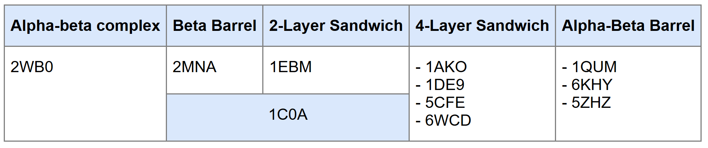

## Practice 1 A: Playing with secondary structures

1.  Enter the Google Colab Notebook that predicts proteins from a single sequence <https://colab.research.google.com/github/sokrypton/af_backprop/blob/beta/examples/AlphaFold_single.ipynb>.

2.  Construct some small proteins and compare the output. The following *cheatsheet* represents some useful statistics.

{fig-align="center" width="500"}

3.  Use 6 recycle steps to obtain diverse structures and then click in the “Animate trajectories” chunk. These are some interesting examples (IUPAC one-letter amino acid code):

+---------------------------------------------------+-------------------------------------------------------------+
| a.\                                               | b.\                                                         |
| `AAAAAAAAAAAAAAAAAAAAAAAAAAAAAAAAAAAAAAAAAAAAAA`\ | `KKKKKKKKKKKKKKKKKKKKKKKKKKKKKKKKKKKKKKKKKKKKKKKK`\         |
| {width="200"}              | {width="350"}                        |
+---------------------------------------------------+-------------------------------------------------------------+
| c.\                                               | d.\                                                         |
| `PVAVEARENGRLAVRVEGAIAVLIRENGRLVVRVEGG`\          | `PELEKHREELGEFLKKETGIAVEIRENGRLEVRVEGYTDVKIEGGTERLKRFLEEL`\ |
| {width="300"}                   | {width="200"}                             |
+---------------------------------------------------+-------------------------------------------------------------+
| e.\                                               |                                                             |
| `ACTWEGNKLTCA`\                                   |                                                             |
| {width="250"}                   |                                                             |
+---------------------------------------------------+-------------------------------------------------------------+

#### 1. Answer the following questions:

-   **Why is a poly-K more stable (dark blue) than a poly-A?**

    The reason could be due to the charged properties of the K amino acid which is clasified within the polar and charged amino acids (see Figure 2, below). This allows a poly-K to form salt bridges and hydrogen bonds with negatively charged residues that make a strong bound (possible bonds illustrated in figure 3). Furthermore, this charge would allow poly-K to repel itself and therefore twisting and binding is very unlikely.

     @stollar2020](/images/aa.png "Intermolecular interactions"){fig-align="center" width="500"}

    On the other hand, the A amino acid is aliphatic and has a small non polar methyl side chain which lacks additional stabilizing interactions. Furthermore, when the chain is long enough, twisting is likely to occur and bonds are formed.

    We noticed that when predicting poly-A sequences of smaller sizes was possible to obtain a slighty more stable structure. Concluding that the longer it is the posibility to bind with itself increases and form more unstable structures.

     @stollar2020](/images/bonds.png "Intermolecular interactions"){fig-align="center" width="500"}

-   **Could you predict the structure of a poly-V or a poly-G?**

    -   **Polyvaline (Poly-V)**

        Valine has a bulky, hydrophobic side chain (isopropyl group). Poly-V is highly prone to form β-sheets due to steric constraints (see *Figure 1*) favoring extended conformations.

        However, when performing the prediction on the Google Colab Notebook we obtained the following:

        {width="400"}

        Poly-V results in a rather stable α-helix. We think this could be due to the simulation conditions which may not be mimicking water that would trigger the hydrophobic effects in poly-V and cause them to aggregate into β-sheets.

    -   **Polyglycine (Poly-G)**

        Glycine is the simplest amino acid (no side chain, just a hydrogen atom), allowing extreme flexibility. Poly-G tends to form extended, unstructured coils in water due to its lack of steric constraints. Furthermore, it is characteristic for being able to disrupt the secondary structure. For these reasons, it is hard to predict it's structure as a Poly-G. Google Colab predicted poly-G in the following structure:

        {width="400"}

-   **What would happen if you introduce a K5W in the structure "b"? and in the "d"?**

    The result of making such modification to the poly-K doesn's affect the stability of the protein. The only observable change is that now is possible to see an aromatic ring in the fifth position of the modified-b:

    +--------------------------------------------------+--------------------------------------------------+
    | b                                                | modified-b                                       |
    +==================================================+==================================================+
    | `KKKKKKKKKKKKKKKKKKKKKKKKKKKKKKKKKKKKKKKKKKKKKK` | `KKKKWKKKKKKKKKKKKKKKKKKKKKKKKKKKKKKKKKKKKKKKKK` |
    +--------------------------------------------------+--------------------------------------------------+
    | {width="350"}             | {width="350"}              |
    +--------------------------------------------------+--------------------------------------------------+

    On the other hand, changing the K5W of the "d" structure affects the protein stability at that side, as is possible to observe at the bottom left of the following image of the modified-d:

    +------------------------------------------------------------+------------------------------------------------------------+
    | d                                                          | modified-d                                                 |
    +============================================================+============================================================+
    | `PELEKHREELGEFLKKETGIAVEIRENGRLEVRVEGYTDVKIEGGTERLKRFLEEL` | `PELEWHREELGEFLKKETGIAVEIRENGRLEVRVEGYTDVKIEGGTERLKRFLEEL` |
    +------------------------------------------------------------+------------------------------------------------------------+
    | {width="300"}                            | {width="350"}                        |
    +------------------------------------------------------------+------------------------------------------------------------+

#### 2. Now, try to create peptides with a custom motif, such as:

-   **Two helices:**

    Peptide chain: **KDQREMEQKNEQRMELKLMRGDPKEAQKMERWEQRKREMQLAEM**

    {fig-align="center" width="500"}

    We understand this task as three blocks of structures:\

    -   KDQREMEQKNEQRMELKLMR (1st helix)\
    -   GDP (seperation)\
    -   KEAQKMERWEQRKREMQLAEM (2nd helix)\
        Therefore, by using the statistics in *Figure 1* we used a mixture of aminoacids with higher tendency to form helices to obtain helix 1 and 2. These are broken down by another group of aminoacids that do not form α-helix. We adjusted these aminoacids until we obtained a rather stable structure.

-   **A four-strands beta-sheet.**

    Peptide chain: **VCWYFIVCPPYVCYFLFIIGPDVIFWAKLVPPRVCYFLFII**

    {fig-align="center" width="500"}

    In order to form four β-sheet structures we used the same principle as before, but using aminoacids with tendency to form β-sheets. The structure can be broken down into:\
    VCWYFIVC (sheet 1) - PP - YVCYFLFII (sheet 2) - GPD - VIFWAKLV (sheet 3) - PPR - VCYFLFII (sheet 4)

-   **Alpha-beta-beta-alpha.**

    Peptide chain: **KAEKREAMMQKELERHPCWFYIVCTIFYVHGDPWYFIVCTVIFWTGPAEAQKRMAEMLWAE**

    {fig-align="center" width="500"}

    The structure is broken down into:\
    KAEKREAMMQKELER (helix 1) - HP - CWFYIVCTIFYV (sheet 1) - HGP - WYFIVCTVIFW (sheet 2) - TGP - AEAQKRMAEMLWAE (helix 2) KAEKREAMMQKELER (helix 1) - HP - CWFYIVCTIFYV (sheet 1) - HGP - WYFIVCTVIFW (sheet 2) - TGP - AEAQKRMAEMLWAE (helix 2)

## Practice 1B: Protein Database

The goal of this exercise is to get familiar with protein structures and their domain organization. First just try to explore the structures and identify similarities and differences by naked eye.

### 1. Use structural databases (CATH, Scop2 or PDB) to classify the proteins.

First, describe the structure in your own words. Then, using generic terms applicable to any hierarchical classification system, classify this small dataset of structures.

#### Structures Descriptions:

-   [2MNA:](https://www.rcsb.org/structure/2MNA)\
    This is the DNA binding by the single-stranded DNA-binding protein from *Sulfolobus solfataricus*.\
    

    The structure of this protein contains a polypeptide chain that consists of beta-sheets that roll up into a small tight ball-like structure, called "**beta barrel**". It consists of 117 residues. The beta sheets seem to align into groups of 2 or 3 strands.

-   [2WB0:](https://www.rcsb.org/structure/2WB0)\
    This is the C-terminal domain of the human adenovirus 5 ssDNA binding protein.\
    

    This loose structure consists of a unique chain of 356 residues in length, forming a mixture of **alpha-beta complexes** with more alpha-helices at the beginning, followed by a mixture of beta-sheets and alpha-helices. The beta sheets align mostly into groups of 2 strands.

-   [1C0A:](https://www.rcsb.org/structure/1C0A)\
    This is the *E.Coli* aspartyl tRNA synthetase complex.\
    

    Compare to the previously discussed, this protein is rather bulky. It is composed of a large polypeptide chain consisting of 585 residues in length. The whole architecture seems to form two distinct complexes that are possibly binding to different parts of the tRNA. The small complex, consists mainly of beta-sheets rolled up, what is called a "**beta barrel**". The larger complex, contains a mixture of alpha-beta structures forming what is denominated as "sandwich" configuration. In this case we have a **2-layer sandwish**.

-   [1QUM:](https://www.rcsb.org/structure/1QUM)\
    This is the *E.Coli* endonuclease IV complex with damaged DNA.\
    

    This protein consists of a polypeptide chain of 285 residues in length, that is composed of a mixture of alpha-beta complexes. These are often seen as repeated series of an alpha-chain followed by a beta-sheet.The alpha-chains are situated at the outer part of the complex and the beta sheets in the central part, most of which are facing towards the same position, which is in the direction of the strands of DNA. This type of structures are known as "**alpha-beta barrels**".

-   [5ZHZ](https://www.rcsb.org/structure/5ZHZ):\
    This is the endonuclease IV from *Mycobacterium tuberculosis*.\
    

    This protein consists in a unique polypeptide chain 258 aminoacids long with a similar number of beta sheets and alpha helices. The beta sheets are arranged more or less into a cylindrical configuration and are surrounded by the alpha helices. A similar structure to the previous of **alpha-beta barrel**.

-   [5CFE](https://www.rcsb.org/structure/5CFE):\
    This is the *Bacillus subtilis* AP endonuclease ExoA.\
    

    This protein consists in a unique polypeptide chain 252 aminoacids long with considerably more beta sheets than alpha helices. The beta sheets are arranged into two parallel planes and are surrounded by a scarce number of alpha helices. These are forming what is known as **4-layer sandwish**.

-   [1DE9](https://www.rcsb.org/structure/1DE9):\
    This is the human APE1 endonuclease.\
    

    This protein consists in a unique polypeptide chain, 276 aminoacids long, with a considerably greater number of beta sheets than alpha helices. The beta sheets are arranged into two parallel planes and around this structure there are alpha helices. A very similar structure to the previous which consists of **4-layer sandwish**.

-   [6WCD](https://www.rcsb.org/structure/6WCD):\
    This is the *Xenopus laevis* APE2 Catalytic Domain.\
    

    It consists of a unique polypeptide chain of 355 aminoacids. It is made of alpha helices surrounding two layers of beta sheets. The structure consists of alternating alpha and beta structures, instead of continuous structures of the same type separated by loops. The crystal structure also has some ligands and an Mg atom. Same as the previous two, this is classified as a **4-layer sandwish**

-   [1AKO](https://www.rcsb.org/structure/1AKO):\
    This is the *Escherichia coli* Exonuclease III.\
    

    This protein is very similar to the previous one, but slightly smaller, with a polypeptide chain of 268 aminoacids long. Here the double layer of beta sheets are not completely surrounded by alpha helices and the structure appears to be more open. However, in terms of classification it is also a **4-layer sandwish**.

-   [6KHY](https://www.rcsb.org/structure/6KHY):\
    This is the African swine fever virus AP Endonuclease.\
    

    This protein consists of 2 identical subunits. They comprise beta sheets arranged into a cylindrical shape surrounded by alpha helices. All subunits have three Zn ions and nucleic acids attached to them. This structure is classified as an **alpha-beta barrel**.

-   [1EBM](https://www.rcsb.org/structure/1EBM):\
    This is the human 8-Oxoguanine Glycosylase.\
    

    In this case, we observe a loose structure where the main secondary structures present are the alpha helices, with a minor number beta sheets between them. These are shown together with a nucleic acid chain. This loose structure consists of a **2-layer sandwish**.

#### Classification:

> *NOTE:* This classification is based on the exploration of the structures with the naked eye and comparing with the terminology used by the structural databases (CATH, Scop2 or PDB). In these databases when you refer to 'Annotations' and observe the 'Architecture' columns this is some of the terminology used for clasification: alpha-beta complex, beta barrel, 2 and 4 layer sandwish and alpha-beta barrel, sandwish.

With all the descriptions given above we concluded the following classification based on the predominant structures of each protein:

### 2. Answer the following questions

#### a. Can you suggest the structural and evolutionary relationship between them?

When we take these 11 proteins, and we look at their classification and function on the databases we can observe that all of these proteins have some function of nucleic acid interaction. By looking in their functional annotations we see they all bind and chemically modify nucleic acid backbones (cleaving, joining, or repairing).

If we take in consideration the table that we have subdivided into 5 groups we could suggest that:

-   2WB0, 2MNA, 5ZHZ and 6KHY which are DNA BINDING PROTEINS could be evolutionary grouped together since their structure is also similar forming Alpha-beta complexes, beta barrels and Alpha-Beta Barrels.

-   Then we have the 2 and 4-layer sandwish which include the complex 1C0A, and then 1EBM, 1AKO, 1DE9, 5CFE and 6WCD. All of these proteins are functionally linked to catalysis and structurally related, therefore we could suggest another evolutionary relationship between them.

#### b. How many domains are in each protein in Scop2 and Cath? Are the numbers the same? Why/why not?

The following table shows the number of domains for each protein according to SCOP2 and CATH:

| Domains | SCOP2 | CATH |
|:-------:|:-----:|:----:|
|  2MNA   |   1   |  1   |
|  2WB0   |   3   |  2   |
|  1C0A   |   3   |  3   |
|  1QUM   |   1   |  1   |
|  5ZHZ   |   1   | n/a  |
|  5CFE   |   1   |  1   |
|  1DE9   |   1   |  2   |
|  6WCD   |   1   | n/a  |
|  1AKO   |   1   |  1   |
|  6KHY   |  n/a  |  4   |
|  1EBM   |   2   |  3   |

The number of domains are not the same for every protein in the two databases because they use different criteria for determining what is a domain. CATH defines a domain as an independent aminoacid chain with a definite function, while SCOP2 defines a domain according to its evolutionary relationships.

#### c. Which are the pros/cons of each database?

+------------+----------------------------------------------------------------------------------------------------------------------------------+------------------------------------------+
| Database   | Pros                                                                                                                             | Cons                                     |
+============+==================================================================================================================================+==========================================+
| **PDB**    | The most complete, with the larger number of proteins represented, and most diferent search options                              | More complex to use and orient yourself  |
+------------+----------------------------------------------------------------------------------------------------------------------------------+------------------------------------------+
| **SCOP2**  | Simpler to use. Very easy to find proteins by their structure or type. Easy to explore evolutionary and structural relationships | Minimal information, missing proteins    |
+------------+----------------------------------------------------------------------------------------------------------------------------------+------------------------------------------+
| **CATH**   | Simpler to use, more information than in SCOP2. Easy to explore evolutionary relationships                                       | Not so complete as PDB, missing proteins |
+------------+----------------------------------------------------------------------------------------------------------------------------------+------------------------------------------+

### References