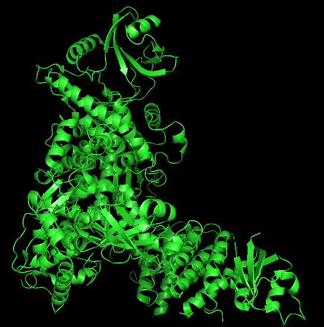
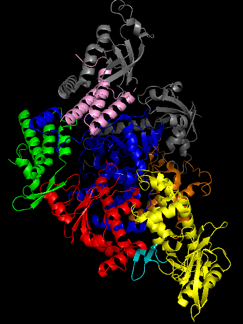
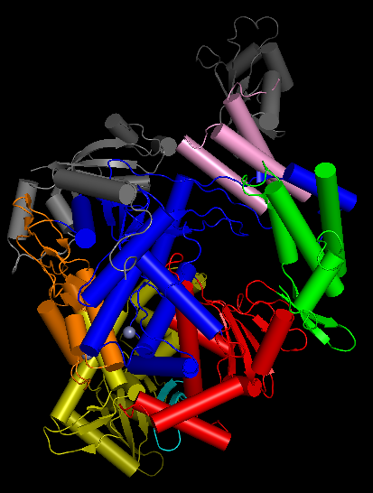
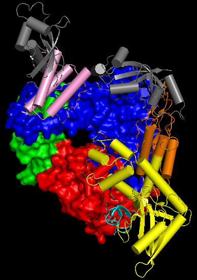
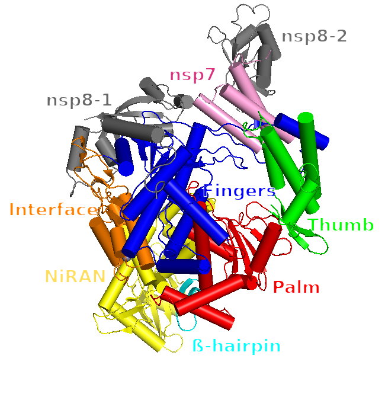
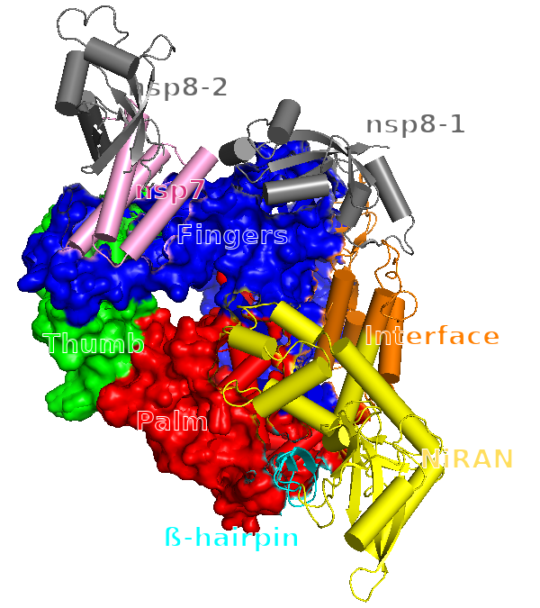
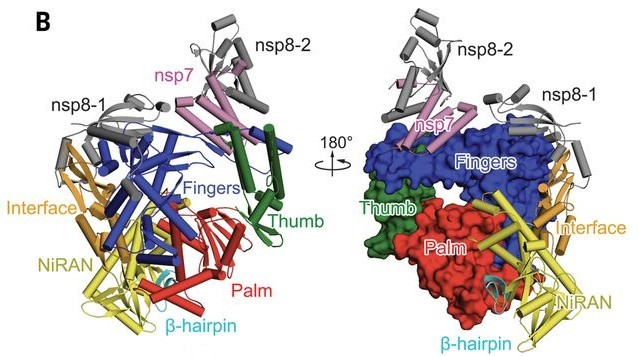

## Practice 2A: Pymol practice

#### Objectives

1.  Install PyMOL (following this [guide](https://strbio.github.io/pymol.html) or directly from the [Pymol page](https://pymolwiki.org/index.php/Biochemistry_student_intro)).
2.  Get started using PyMOL and learn the main commands.

### [Getting started](https://pymolwiki.org/index.php/Practical_Pymol_for_Beginners)

> *NOTE:* The following is the tutorial and contains the most important points and what we learned from it, if you want to jump right into the questions click [here](#questions).

------------------------------------------------------------------------

1.  Open PyMOL, use it by typing in the command line where it says `PyMOL\>`.

2.  Navigate to the directory (folder) where we want our files to be located, we can use Linux commands to navigate:

    a.  With `ls` is possible to see the files and folders that exist in the current directory
    b.  use `cd` and provide the path for your new working directory

3.  Use `fetch` to get a structure:

    a.  We are going to work with the PDB structure [6KI3](https://www.rcsb.org/structure/6ki3). Type:

    ``` pymol
    fetch 6KI3
    ```

4.  Inside PyMOL, there is a small panel at the bottom right corner, which serves as quick reference for mouse controls. Find more details [here](https://pymol.org/dokuwiki/doku.php?id=mouse).

5.  Molecules: Crystallography structures show protein oligomers and may also contain, enzyme substrates, cofactor or solvent molecules (water and ions). For most purposes, we may prefer to work only with a monomer and remove the water molecules. We could use the **H**ide menu or do it in the command line:

    ``` pymol
    hide everything, solvent  # hide all the water molecules
    show wire, solvent        # bring them back
    show nb_spheres, solvent  # alternative display
    ```

6.  Like in the example above, you can hide/show any representation for an object or selection using the following sintax:

    ``` pymol
    hide \[representation\], \[selection-name\]
    show \[representation\], \[selection-name\]
    ```

> For a more detail explanation of the Pymol selection syntax check [Pymol wiki](https://pymolwiki.org/index.php/Selection_Algebra).

7.  The undo command (also Ctrl+Z or Cmd+Z) works only with object edition (changes in the structure). However for changes in visualization or displaying features, there are only two alternatives:
    a.  Use `File > Reinitialize` to reset PyMOL to its initial state, but all work will be lost.
    b.  [**Save**](https://pymolwiki.org/index.php/Save) **your session when you reach the desired display**:\
        A PyMOL session, (.pse) file, retains the state of all the changes you've made with transitions and everything.\
        Use `File > Save Session` or `Save Session As…`
    c.  **Loading sessions** is just as easy: `File > Load` and choose your session file.
    d.  You can also **save temporal scenes** using the command [scene](https://pymolwiki.org/index.php/Scene). These work like frozen screenshots, that you keep in case you would like to come back to them, and you continue working.

### 2. Representation and color schemes.

------------------------------------------------------------------------

We can **color** the protein by secondary structure using the Menu `C`.\
Spectrum color scheme is also useful to follow the secondary structure succession. Other coloring alternatives are found [here](https://pymolwiki.org/index.php/Advanced_Coloring).

Different types of **representations** can be selected for each object or selection with the button `S` on the right panel.\
There is a wide range of options for each representation. For example, find more details about [cartoon](https://pymolwiki.org/index.php/Cartoon) style.

This can be done in the command line by typing:

``` pymol
color tv_orange, ss h
color paleyellow, ss s
color grey, ss l+
set sphere_color, tv_red
bg_color white
```

Another example to experiment with:

``` pymol
set cartoon_ring_mode, 3
set cartoon_nucleic_acid_mode, 4
cartoon oval
cartoon automatic, 6KI3 and chain A or chain B
set cartoon_ring_width, 0.2
set cartoon_ring_color, deepsalmon
set cartoon_nucleic_acid_color, deepsalmon
```

### 3. Create/Remove objects {#sec-createRemove .unnumbered}

------------------------------------------------------------------------

**Objects from structures**

1.  First you need to see the composition of your structure:

``` pymol
get_chains 6KI3

# see chain A and B
select chain A  
select chain B  
```

**Creating objects**

1.  *Option 1*. Select and create:

``` pymol
select kk, chain B or chain F or chain G or chain H
create monomer, kk
```

> With `select kk` you create a variable called kk with the selection indicated (chain B, chain F, chain G and chain H, in this case).\
> Then by using `create monomer, kk` you use the selection kk to create a new object consisting on that selection only.\
> This allows you to work on that part independently.

2.  *Option 2*. Create an object by indicating the chains directly:

``` pymol
create monomer, chain B or chain F or chain G or chain H
```

**Removing objects**

1.  Select the chains you want to remove and remove them (*more selection criteria can be found [here](https://pymolwiki.org/index.php/Selection_Algebra)*):

``` pymol
select kk, chain A or chain C or chain D or chain E
delete kk
```

You can then **remove the original object** (if you wish)

``` pymol
remove 6KI3
```

### 4. Compare structures {#sec-compare .unnumbered}

------------------------------------------------------------------------

In order to practice the way to compare structures with Pymol we used some structures related to 6KI3, which are 6KHY, 3AAM and 2NQH.

1.  In a new session, we first fetched the structures:

``` pymol
fetch 6KI3
fetch 6KHY
fetch 3AAM
fetch 2NQH
```

2.  For comparison we don’t need the DNA, so we will isolate the proteins:

``` pymol
create 6KI3_monomer, 6KI3 and chain A
create 6KHY_monomer, 6KHY and chain A
```

3.  We removed the original structures and water molecules for clarity:

``` pymol
delete 6KI3
delete 6KHY
hide everything, solvent
```

4.  Then we performed the alignment with the `align` command. This can be done by aligning each related structure to the 6KI3_monomer:

> There are many different commands to do alignments, the three more common are `super`, `align` and `cealign`, depending on the level of similarity. We will use `align`, which is quick and useful for most purposes with a clear sequence similarity.

``` pymol
align 6KHY_monomer, 6KI3_monomer
align 3AAM, 6KI3_monomer
align 2NQH, 6KI3_monomer
zoom all #to center the view of all the proteins in the new position
```

The following was the **quality assurance report** for each alignment:

``` pymol
PyMOL>align 6khy_monomer, 6ki3_monomer
 Match: read scoring matrix.
 Match: assigning 305 x 327 pairwise scores.
 MatchAlign: aligning residues (305 vs 327)...
 MatchAlign: score 1603.000
 ExecutiveAlign: 2246 atoms aligned.
 ExecutiveRMS: 133 atoms rejected during cycle 1 (RMSD=0.76).
 ExecutiveRMS: 113 atoms rejected during cycle 2 (RMSD=0.47).
 ExecutiveRMS: 76 atoms rejected during cycle 3 (RMSD=0.39).
 ExecutiveRMS: 47 atoms rejected during cycle 4 (RMSD=0.36).
 ExecutiveRMS: 28 atoms rejected during cycle 5 (RMSD=0.35).
 Executive: RMSD =    0.340 (1846 to 1846 atoms)
PyMOL>align 3aam, 6ki3
 Match: read scoring matrix.
 Match: assigning 495 x 327 pairwise scores.
 MatchAlign: aligning residues (495 vs 327)...
 MatchAlign: score 141.500
 ExecutiveAlign: 1165 atoms aligned.
 ExecutiveRMS: 48 atoms rejected during cycle 1 (RMSD=5.24).
 ExecutiveRMS: 66 atoms rejected during cycle 2 (RMSD=4.59).
 ExecutiveRMS: 53 atoms rejected during cycle 3 (RMSD=3.99).
 ExecutiveRMS: 44 atoms rejected during cycle 4 (RMSD=3.56).
 ExecutiveRMS: 42 atoms rejected during cycle 5 (RMSD=3.21).
 Executive: RMSD =    2.943 (912 to 912 atoms)
PyMOL>align 2nqh, 6ki3_monomer
 Match: read scoring matrix.
 Match: assigning 615 x 327 pairwise scores.
 MatchAlign: aligning residues (615 vs 327)...
 MatchAlign: score 122.000
 ExecutiveAlign: 875 atoms aligned.
 ExecutiveRMS: 58 atoms rejected during cycle 1 (RMSD=5.17).
 ExecutiveRMS: 68 atoms rejected during cycle 2 (RMSD=3.94).
 ExecutiveRMS: 60 atoms rejected during cycle 3 (RMSD=3.12).
 ExecutiveRMS: 37 atoms rejected during cycle 4 (RMSD=2.36).
 ExecutiveRMS: 33 atoms rejected during cycle 5 (RMSD=2.00).
 Executive: RMSD =    1.771 (619 to 619 atoms)
```

The color of each monomer was modified to facilitate visual inspection of the alignment.

To save the image we used `File > Export Image As > PNG... > ray trace with transparent background` and these are the results:

{#fig-alignment .unnumbered}

### 5. Further practice

------------------------------------------------------------------------

#### 5.1 Find what you are looking for:

Now we can play with different representations for specific residues. We will make a selection of the following catalytic residues: D231, H182, H115, E142, H218, H78, E271, H233.

``` pymol
select catalytic_res, monomer and (resi 231 or resi 182 or resi 115 or resi 142 
or resi 218 or resi 78 or resi 179 or resi 271 or resi 233)
```

Now we will indicate Pymol to show them to us with the command `show sticks`:

``` pymol
show sticks, catalytic_res
zoom catalytic_res
```

{width="300"}

There are also some interesting tricks for disclosing ligand binding or catalytic sites: More info about selection of multiple objects in Pymol [here](https://pymolwiki.org/index.php/Selection_Algebra).

#### 5.2 Highlight what you want:

You can also hide the cartoon, this can be done partially or totally and can be colored by elements.

``` pymol
hide cartoon, monomer and chain A
show sticks, chain D and resi 10
show sticks, catalytic_res
set_bond stick_radius, 0.25, catalytic_res
color red, chain D and resi 10 and elem o
```

#### 5.3 Show labels:

Use the L menu to show the labels of your object/selection

You can also use the command label to show labels

``` pymol
label [selection], [expression]
```

Labels can be formatted in different ways, for example:

``` pymol
set label_outline_color, black
set label_font_id, 10
set label_size, -2.5
set label_position,(0,0,100), resi 87
```

You can also move the labels with “Edit mode”(check link, el del profe no funciona...).

> Be careful not to pick on the molecule (UNDO still partial!)

#### 5.5 Measure distances

By selecting the top menu `Wizard > Measurement`

A new set of options opens on the side bar and the program indicates `Please click on the first atom...` this way you choose your first atom and then the second and the distance ins immediately rendered represented with a dashed line between the atoms.

Click “Done” on the right side bar once you are ready.

{width="300"}

#### 5.6 How to make a high-res picture: RAY IT!

This can be done by selecting `File > Export Image As > PNG...` or you can also do it by using command line:

``` pymol
set ray_opaque_background, on
set ray_trace_mode, 1
ray
png picture.png
```

or:

``` pymol
set ray_trace_mode, 1
png /modesto/strbio/picture.png, width=2000, height=1200, dpi=600, ray=1
```

Note that objects in a deeper position look lighter. This is the [“fog” effect](https://pymolwiki.org/index.php/Fog%20and%20https://pymolwiki.org/index.php/Depth_cue).

------------------------------------------------------------------------

### Questions {#questions .unnumbered}



*This is a **Mol\* 3D View of 6KI3**. Find more information about Mol\* in their [Documentation](https://molstar.org/viewer-docs/).*

[**1. What do you see? Try to describe the sctructure 6KI3**]{style="color: deeppink;"}

The structure consists of two separated proteins attached to what seems like two separated DNA strands with three Zn atoms in between them.\
Both proteins are conformed by eight β-sheets arranged in a cylindrical shape, moving towards the direction of the DNA. These are surrounded by more than nine α-helices that support the outer part. This type of structures are known as **Alpha-Beta Barrel**.

[**2. What are the small red dots and the big spheres when you load the structure 6KI3?**]{style="color: deeppink;"}

The small red dots are water molecules. By clicking on one of them the program displays on the terminal `` "You clicked / 6ki3/S/B/HOH`414/0" ``, indicating the structure and the exact HOH atom selected (414 in this case).\
On the other hand, the big spheres are Zinc (Zn) atoms. When clicking on them we obtain `` "You clicked /6ki3/N/B/ZN`303/ ZN" ``.

These can be hidden from the **H**ide menu or the command line as indicated on the step 5. PyMOL's selection language allows to select atoms based on identifiers and properties. Further details on the selection algebra con be found [here](https://pymolwiki.org/index.php/Selection_Algebra).

[**3. Create your own representation of the monomer ternary complex (protein + metal cofactor + DNA)**]{style="color:  deeppink;"}\
A **ternary complex** is a protein complex containing three different molecules that are bound together, in this case protein + metal cofactor + DNA.

**Method:** The following were the commands and steps we followed for recreating the monomer ternary complex.

We start from the monomer we created in [Section 3](#sec-createRemove), which has 4 chains: chain B, F, G and H (we can see that by using the `get_chains` command). Chain B corresponds to the protein and Zn ions, whereas the other 3 correspond to DNA (we just select different chains and see what parts are highlighted). Taking this into account is important for the following steps.

We will use different representations for protein and DNA, so we start by selecting the DNA and saving it into an object, in order to manipulate it separately:

``` pymol
select DNA, chain F or chain G or chain H
```

Once we have this DNA object, we can start working on it.

#### DNA representation:

By default, DNA chains are shown in a cartoon representation, but we will change it into *licorice* representation. This will allow us to see the molecular structure of DNA with much better resolution. Furthermore, the stacking between the bases and the interactions between strands will be more clear because we will perfectly see the hydrogen bonds formed between bases of opposite strands.

We will also color the DNA by element, something helpful to see at a glance what kind of interactions may exist between different atoms.\
A very important element in molecular interactions is the hydrogen, which by default is not shown. We will make them visible with `add`.

``` pymol
show licorice, DNA
hide cartoon, DNA   # to hide the DNA "border" that remains
color atomic, DNA   # color by element
color cyan, (name C* and DNA) # to change the color of 
carbons  
                              # (alpha carbons are given the 
name C*)
h_add               # to add missing hydrogens
set stick_h_scale, 1 
                    # by default hydrogens are shown as thin 
sticks, 
                    # for better visualization we set them 
to have the 
                    # same width as the rest of elements
set valence, off    # by defaul pymol shows double bonds 
(for example in 
                    # oxigen atoms), we set this off to see 
single bond
```

After all this changes, we obtain this DNA:

{width="300"}

We can see clearly the stacking between bases and their opposite positions (which allows them to form hydrogen bonds) as well as the detailed molecular structure of DNA (phosphate, base and deoxyribose).\
**This way of visualizing DNA might be of great help when analyzing catalytic centers or interactions with other parts of a protein**.

#### Protein and ions representation:

The focus here is more on aesthetics rather than providing a detailed, informative representation. We will simply change some colors to different secondary structures, maintaining the cartoon representation.\
For better visualization, we have chosen colors with high contrast between them to facilitate visual inspection of the protein. We have colored the zinc ions green, a color that catches your attention and reflects their important role in catalytic activity. It serves as a good reference for quickly locating the catalytic center at a glance.

``` pymol
color deepblue, ss h    # to color alpha helices
color warmpink, ss s    # to color beta sheets
color gold, ss l+ and not DNA and not ele h 
                        # color loops and unstructured parts 
of the protein
                        # As DNA and hydrogens are included 
in l+, 
                        # we must exclude them in the 
selection
set sphere_color, green # to change the Zn ions to green 
color
```

**Results:**


[**4. Can you range the three new structures by their similarity with 6KI3?**]{style="color: deeppink;"}

We followed the steps in [Section 4](#sec-compare) and created the aligned structures [see figure @fig-alignment]. Now let's range their similarities:

The most similar structure to *6KI3* is the **6KHY**. Visually we can see that the white (6KI3) and magenta (6KHY) structures are almost merged together in most areas. Supporting this we obtained the following structural quality assurance results:

-   The Match Align score is 1603.000 with **2246 atoms aligned**. A superior alignment will facilitate a better superposition.
-   The root-mean-squared deviation (**RMSD**) was **0.340** (1846 to 1846 atoms). This was the transformation that achieved the lowest RMSD. Note that the RMSD is an actual distance measure, not a score. The lower the RMSD, the better the alignment/superposition.

::: callout-note
In bioinformatics, the root mean square deviation of atomic positions, or simply root mean square deviation (RMSD), is the measure of the average distance between the atoms (usually the backbone atoms) of superimposed molecules. In the study of globular protein conformations, one customarily measures the similarity in three-dimensional structure by the RMSD of the Cα atomic coordinates after optimal rigid body superposition (from ["Root mean square deviation of atomic positions"](https://en.wikipedia.org/wiki/%20Root_mean_square_deviation_of_atomic_positions)).
:::

The next more similar structure to *6KI3* is the **2NQH** (in purple). Which obtained the following results:

-   Match Align: score 122.000 with **875 atoms aligned**.
-   **RMSD = 1.771** (619 to 619 atoms)

Lastly, the **3AAM**, with alignment scores as follows:

-   MatchAlign: score 141.500 with **1165 atoms aligned**.
-   **RMSD = 2.943** (912 to 912 atoms)

Although the 3AAM obtained more atoms aligned to 6KI3 than 2NQH, the relation between these atoms was closer in the 2NQH structure (RMSD = 1.771) than on the 3AAM (RMSD = 2. 943). Therefore 2NQH is more similar to 6KI3 than 3AAM.

[**5. Make a picture of the catalytic center with your custom representation, including labels**]{style="color: deeppink;"}

We are going to start from scratch, fetching the protein as we did before. We will only need the monomer, the DNA and the catalytic residues, so we select them.

``` pymol
hide everything, solvent
sele monomer, chain B or chain F or chain G or chain H 
                        # monomer selection
remove not monomer      # remove the remaining part of the 
structure
select DNA, chain F or chain G or chain H 
                        # save DNA in a separate object
select catalytic_res, monomer and (resi 231 or resi 182 or 
resi 115 or resi 142 or resi 218 or resi 78 or resi 179 or 
resi 271 or resi 233)

zoom catalytic_res      # to position the view
```

We want to represent this residues in licorice, as we did previously with DNA, in order to see a detailed structure of it. We will follow the same coloring schema as we did in the previous custom representation, but not including the hydrogens (for better visualization)

``` pymol
show licorice, catalytic_res    # by default it colors by element
color cyan, (name C* and catalytic_res) 
                                # color carbons cyan
set sphere_color, green         # set Zn ions color to green
set sphere_scale, 0.7           # to make the Zn ions smaller
set valence, 0                  # 0 is off, and 1 is on
```

As we want to focus only in the catalytic center, we will create a big contrast between it and the rest of the protein. As the rest of the protein is in a cartoon representation, we can change only aspects of this representation and not affect the catalytic center or Zn ions.

``` pymol
set cartoon_color, gray80       # a soft gray color 
set cartoon_transparency, 0.8   # to put everything in the 
background
hide cartoon, DNA               # we don't need DNA at the moment
```

With this changes, only the catalytic residues and Zn ions have color, while the rest of the protein stays at the background in a subtle way. It seems that the catalytic center is complete, but we are missing a very important part, which is the DNA. We know by searching in PDB that this protein is a nuclease (we already have a clue in the structure, which has DNA), so the catalytic center would be incomplete without a portion of DNA within it. But we have a problem here: we don't want to show DNA structure because is not important, except those parts which are near to the catalytic center. Fortunately, there is specific selection syntax that solves the problem.

``` pymol
select DNA within 5 of catalytic_res    # all atoms of DNA 
chain that are nearer than 5 Angstroms of catalytic residues
show licorice, sele                     # show as licorice
color cyan, (name C* and sele)          # color carbons cyan
```

There is another region of DNA that is selected, but is not a part of the active site, so we can select it and hide it (with hide licorice, sele).

Now we have the full active site, but if we want to analyse it we must add some labels and measurements. We would like to include the name and number of residue of each residue of the active site. For that, we can use the following syntax which includes python f-strings (pymol is very well suited for python, as its name says).

``` pymol
# we put the name only in alpha carbons (n. CA) which belongs 
to the catalytic resiudes

label (n. CA and catalytic_res), f"{resn} {resi}" 

# resn is the residue name, and resi the residue number or ID
```

Now all residues have labels, except the DNA part. For handling this we can select the DNA residue with the mouse, and type the following command.

``` pymol
label (n. P and sele), f"{resn} {resi}"
```

Is very similar to what we did with the protein residues, but with a subtle change. First of all, DNA has not alpha carbons, so we can not use that selection. We could decide to label normal C atoms, but that implies that every C atom will have a label, and we don't want that (is very messy). This is the reason why we used CA in the protein labels, because each residue has only one alpha carbon, so each residue will have only one label. The equivalent for DNA is to choose an atom which only appears once in the structure, and that atom is phosphate (P).

Once we label all labels, we can change to editing mode and change their positions for better visualization. We could change font, size and color, but we have used the default values, as seem to be valid.

The last thing would be to make some measurements. All DNA related enzymes have metal ions in its catalytic center that helps in catalysis and stability of the reaction. This metal ions (Zn in this case) coordinate with the residues of the catalytic center in a geometric way, and we can see and measure it by defining distances between Zn ions and polar atoms of nearby residues. For making measurements see the next section.

After labeling and measuring some distances we end up with this catalytic center:

{width="500"}

## PART B: Paper-style protein figure challenge

#### Introduction:

We are going to reproduce the protein as in the Figure 1B of [Gao *et al.*](https://www.science.org/doi/10.1126/science.abb7498) study. Which represents the **structure of COVID-19 virus nsp12-nsp7-nsp8 complex**.

 study](images/estudio2.jpeg){#fig-study width="450"}

To do it, we are going to use combinations of commands in pymol and manual modifications of the protein. In the following discussion, we need to have into account that the nsp12 protein corresponds to chain A of the pymol protein, the nsp7 protein to the chain C and the nsp8 protein to the chains B and D.

#### Method:

**First part:** Here we will reproduce the image on the left side of @fig-study.

First, we import the protein from PDB.

``` pymol
fetch 7BTF
```

{width="300"}

Then, we color the protein. We color first the chain A.

``` pymol
color yellow, resi 1-28 or resi 50-249 and chain A
color cyan, resi 29-50 and chain A
color orange, resi 250-365 and chain A
color blue, resi 366-581 or resi 621-679 and chain A
color red, resi 582-620 or resi 680-815 and chain A
color green, resi 816-932 and chain A
```

Second, we color the chains B, C and D.

``` pymol
color pink, chain C
color grey, chain B or chain D
```

{width="300"}

We see that in the image of the study the alpha helices seem to be straight cylinders. This is done with the following command.

``` pymol
set cartoon_cylindrical_helices, 2
```

The following command gives the approximate orientation of the protein at the top left of the Figure 1B of the study.

``` pymol
set_view (\
    -0.261560410,   -0.375177830,    0.889286518,\
     0.886667192,   -0.457407475,    0.067817472,\
     0.381323516,    0.806236744,    0.452295899,\
     0.000000000,    0.000000000, -315.140350342,\
   121.520332336,  123.266181946,  127.135742188,\
   248.459045410,  381.821655273,  -20.000000000 )
```

> We obtained this orientation by observing the structures and using the mouse controls. We turned the protein until it had the same orientation than the protein in the study. Once we were happy with the orientation, we used the command `get_view` and saved the given coordinates for future reproducibility.

{width="300"}

Upon executing the previous command, we have the image of the protein at situated on the left of @fig-study, except for the labels. We will see how the labels are inserted at a later stage.

**Second part:** Now we will see how the image to the right of @fig-study was generated.

We can start by executing all the previous commands, except for the one giving the orientation to the protein.

After that, we execute the following [`show surface`](https://pymolwiki.org/index.php/Surface) command to obtain the surface representation of the protein similar to that of the image of the study.

> The surface representation of a protein, in PyMol, shows the "Connolly" surface or the surface that would be traced out by the surfaces of waters in contact with the protein at all possible positions.

``` pymol
show surface, chain A and resi 366-932
```

Now we orient the protein like the protein of the image at the top right of Figure 1B of the study.

``` pymol
set_view (\
     0.308822215,    0.050624214,    0.949772358,\
     0.916190982,    0.252294272,   -0.311349869,\
    -0.255382478,    0.966325104,    0.031532653,\
     0.000000000,    0.000000000, -315.140350342,\
   121.520332336,  123.266181946,  127.135742188,\
   248.459045410,  381.821655273,  -20.000000000 )
```

{width="300"}

The labels of both proteins were generated selecting an atom at random close to the position where the labels need to be included, and using the following line of code:

``` pymol
label sele, '<Name of the domain or protein>'
```

After that, all the labels were modified using the following commands in order to give the same size, font and outline color than those of the study:

``` pymol
set label_outline_color, white
set label_size, 30
set label_font_id, 7
```

Finally, their color and position were modified manually. In the case of the color, the label was selected and the option `edit label` was chosen. In the case of the position, the labels were moved from their original position using 'Ctrl + mouse' while the user was in `3-button editing` mode.

The following images show a comparison between the images made with pymol (top) and the images of the study (bottom).

|  |  |
|------------------------------------|------------------------------------|
| {width="300"} | {width="277"} |

{width="577"}